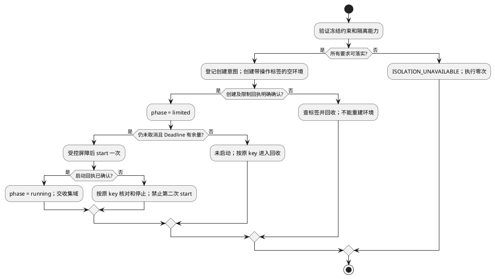

# 环境准备与运行

规范父文档：[组件设计](../../../sandbox-runtime.md)。域间结构、Port、调用次序以组件为准；本域不引用其他域建立协议。状态：候选，测试未实现/未运行。

## 场景、输入和内部设计

覆盖 L4-S03/S04/S08。调用方、前置状态与成功确认点继承组件场景；输入只来自组件受控调用，不提供独立公共执行入口。

内部结构 `PreparationWork={operationKey:Ref,required:SandboxConstraints,environmentRef:Ref|null,limitsReceiptRef:Ref|null,startReceiptRef:Ref|null}`。三个引用在机制回执确认后逐个填入；limitsReceiptRef 未确认时绝不 start。required 是共享约束的不可变值，不从当前默认配置重新生成。

核验Admission及resourceProfileRef摘要，按组件映射原样形成required，校验profile能力及limits逐字段相等→登记创建意图→创建隔离空环境→落实挂载、出口和资源硬限制→确认限额回执→再次检查取消/Deadline→一次 start。创建确认丢失按标签查询，不能创建第二环境。限额缺失或部分失败都向回收域交原 operationKey，即便 environmentRef 仍为 null。

扩展例：增加 MicroVM 机制档案，必须证明无工作负载先于限制运行，以及按标签查证创建；准备算法保持不变。无强制资源控制的本地进程档案不能注册为不可信执行。

## 流程与故障出口

## 局部 SFMEA 与验收

限制未落实就启动/创建回执丢失后再创建导致越界和孤儿，严重；启动屏障/创建后崩溃注入检测；按操作标签回收，零重启执行。 O/D 尚无实测，RPN 不计算。

域内 UT 检查字段不变量、空引用、超界及可变别名；DT（组件白盒测试）注入时钟、机制回执和事件顺序，观察实际调用次数及引用保留。对应固定输入、故障注入和期望为 L4-T05/T06/T11，见仓库 L4 验证视图。接口验收必须验证组件交换类型，不用本域另造返回结构。纯 Fake 不证明真实隔离或远程副作用。

升级复用组件私有记录/档案版本策略；未完成记录不丢弃，不将旧记录恢复为新执行。边界字段采用组件所引用的L34-SPEC-1.0.0；资源绑定和控制帧已冻结，真实机制、证据与Host持久交接继承组件运行验收条件，不以默认值跳过。
