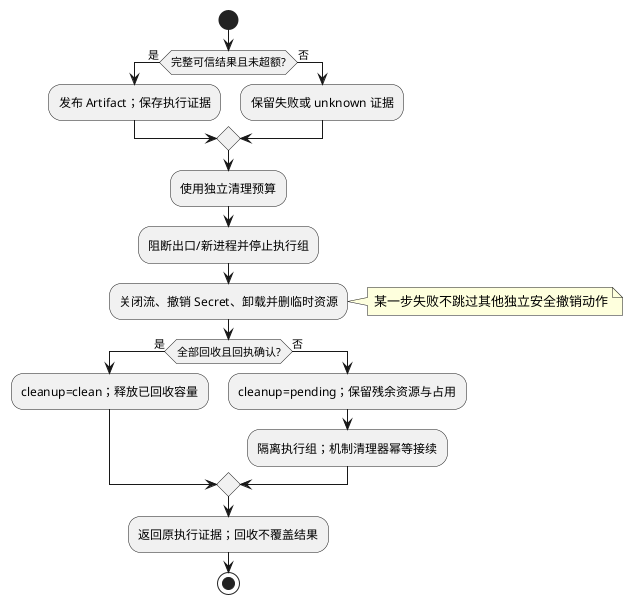

# 结果收集与回收

规范父文档：[组件设计](../../../sandbox-runtime.md)。域间结构、Port、调用次序以组件为准；本域不引用其他域建立协议。状态：候选，测试未实现/未运行。

## 场景、输入和内部设计

覆盖 L4-S04/S05/S06/S07。调用方、前置状态与成功确认点继承组件场景；输入只来自组件受控调用，不提供独立公共执行入口。

内部结构 `ReclaimWork={operationKey:Ref,phase:collecting|reclaiming|done|reclaim_pending,bytes:Count,resultRef:Artifact|null,pendingResources:Ref[],cleanupReceipt:CleanupReceipt|null}`。pendingResources 来自机制对执行组的当前回收事实，去重且有界；未知环境用隔离组 Ref 表示，禁止空数组表示成功。结果发布后 resultRef 不可被回收错误清空。

输入业务流和可信退出观察→有界收集/终帧验证→发布结果→阻断新动作和停止执行树→撤销 Lease/挂载/临时资源→机制保存清理回执。取消、超限或失联从公共回收入口进入，使用独立清理预算。失败时尽量执行所有独立撤销步骤，保留残余引用、占用与 incident；Infrastructure 清理器后续补 receipt，不再运行 workload。

扩展例：增加一种临时资源时扩展机制清理账本和资源清理处理表，验收旧记录可读；ResultCollector 不增加 OS 产品分支。

## 流程与故障出口

## 局部 SFMEA 与验收

进程组不完整终止/回收异常覆盖结果/Secret 残留，严重；终止后活动进程与 Lease 清单检测；隔离组封禁，机制清理器幂等接续。 O/D 尚无实测，RPN 不计算。

域内 UT 检查字段不变量、空引用、超界及可变别名；DT（组件白盒测试）注入时钟、机制回执和事件顺序，观察实际调用次数及引用保留。对应固定输入、故障注入和期望为 L4-T07/T10/T11/T12，见仓库 L4 验证视图。接口验收必须验证组件交换类型，不用本域另造返回结构。纯 Fake 不证明真实隔离或远程副作用。

升级复用组件私有记录/档案版本策略；未完成记录不丢弃，不将旧记录恢复为新执行。边界字段采用组件所引用的L34-SPEC-1.0.0；资源绑定和控制帧已冻结，真实机制、证据与Host持久交接继承组件运行验收条件，不以默认值跳过。
