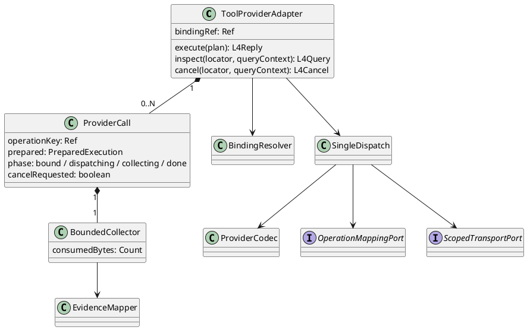

# ToolProviderAdapter 组件详细设计

状态：L4-DD-1 候选。父约束见 [L4 层](../README.md)，字段与 Port 唯一引用 [L4-DD-1](../../../contracts/l4-execution-runtime-detail.md)和 [L3-FD-2](../../../contracts/l3-tool-runtime-detail.md)。本组件封装远程或进程内 Provider 协议，不拥有工具路由、ToolCall、权限与业务重试。

## 1. 场景、适用约束和职责

覆盖 L4-S01/S02/S04/S05/S07/S08。例：command=c17 在旧路由 r3 发出创建请求，收到网络超时；保留 c17→r3，查询原请求，绝不切到 r4 重建。首版每个请求一次发送，SDK 内置执行重试关闭。受信进程内只读实现可注册；不可信插件不得作为同进程 Provider 加载。

实例按 scope+adapterBindingRef+版本装配；注册表不可变。单次调用上下文不共享可变参数。每 operation 的 Promise、取消、结果回调交给一个串行 reducer，不要求全实例串行。L1/宿主保证一次有效派发；私有映射 CAS 只防重复传输并提供核对入口。

## 2. 内部结构和跨域协议

| 功能域 | 内部协作者 | 输入→输出 | 归属 |
|---|---|---|---|
| 请求绑定与调用 | BindingResolver、ProviderCodec、SingleDispatch | ExecutionPlan→PreparedExecution→OperationMapping/原生有界响应流 | 确切目标、传输与凭证作用域 |
| 结果证据与核对 | BoundedCollector、EvidenceMapper、ReceiptInspector | 原始观察→MechanismObservation→L4Reply | 输出、错误、查询/取消证据 |

跨域仅传递 L4-DD-1 的不可变 PreparedExecution、OperationMapping 与 MechanismObservation；响应流是单消费者、有取消和容量上限的机制能力，不把 SDK 客户端交给结果域。结果域不反向触发 SingleDispatch。上述类型是组件交换标准，各功能域不得复制新 DTO。

## 3. 调用算法与确认点

1. BindingResolver 检查 scope、route.kind=provider、adapterBindingRef 和版本，验证输入大小及 Artifact 摘要。路由解析不重新选工具。
2. 根据剩余 Deadline、输入/输出限额和固定出口建立 PreparedExecution；拒绝无法关闭自动执行重试或无法限制流大小的 Adapter。
3. 查询原 OperationMapping：同键异绑定拒绝；同键同绑定只返回已有事实，不发送。新键在发送前耐久建立映射，取消先到则记录未发送失败。
4. CAS 取得本次发送机会，将 scope+operationKey 转为 Provider 请求幂等键。长度不兼容时保存一对一耐久映射，不能截断碰撞。
5. SingleDispatch 调用一次，按顺序收集并验证 response；不无限等待未知协议。发布有界 Artifact 后 EvidenceMapper 验证效果来源。
6. 保存 receipt 的证据后返回 L3。结果存储失败返回 unknown，保留已生效可能性；L1/宿主未提交时仍可由原 operationKey 查证。

阶段是本地调用栈状态，不是耐久 ToolCall 副本。phase=done 后重复同证据去重，异证据进入 Incident；cancelRequested 为正交标志，不能覆盖已收到的可信成功。网络请求已发出时 abort socket 不能声称远端 stopped。

## 4. 扩展、故障和验收

增加 Provider 时实现 ProviderCodec 的 encode、decode、mapFault 和可选 inspect/cancel 映射，注册明确的 query/cancel 能力及证据来源；装配时检查重复 adapterBindingRef、未声明限额、隐藏重试及协议版本。中央 ToolProviderAdapter 不按厂商名称增加分支。新增不同执行语义才修改上层封闭联合。

| 风险 | 局部/系统影响 | 检测、控制、恢复 | 用例 |
|---|---|---|---|
| 响应丢失后 SDK 自动重试 | 重复外部副作用，严重 | 传输计数与故障屏障；重试=0；原 key 核对 | L4-T02/T03 |
| 热更新改写旧目标 | 原授权作用于新工具，严重 | 精确版本绑定/摘要；拒绝而非降级 | L4-T08 |
| 半帧、超限或原始错误外泄 | 内存耗尽/秘密外泄，严重 | 流式限额、脱敏映射、终帧校验 | L4-T07/T09 |
| 取消覆盖迟到成功 | 用户重复执行已生效动作，严重 | 独立 effect 与 cancel 标志，保留事实 | L4-T04 |

O/D 无测量，未计算 RPN。验收使用传输 Fake、受控本地 Provider 进程和断点崩溃注入；真实远程产品认证、幂等和查证能力须独立验收。详细固定输入及层级见 [L4 验证](../../../../verification/l4-execution-runtime.md)。

## 5. 实现映射与升级

候选目录 `src/execution/provider/`：binding、dispatch、codec、evidence；公共机制复用 Infrastructure Transport/Secret/Artifact，禁止私建第二套凭据或 Artifact 存储。现有 `ReadOnlyToolProvider` 的业务读能力可适配复用；现有按工具名缓存、Provider 共用 sandbox handle 的路径未达到本设计。

升级先停止新调用并排空已知工作，保留原 route/receipt/unknown；新版本可读旧私有映射才可接管查询，否则原版本只读核对。不能把旧 Grant 当一次性 Permit；不自动迁移未完成调用重新执行。B1及B2/B4边界交接已由L34-SPEC-1.0.0冻结为resourceProfileRef、Admission与ArtifactBroker.handoff；真实存储、可信证据和Host装配仍待实现验收。
