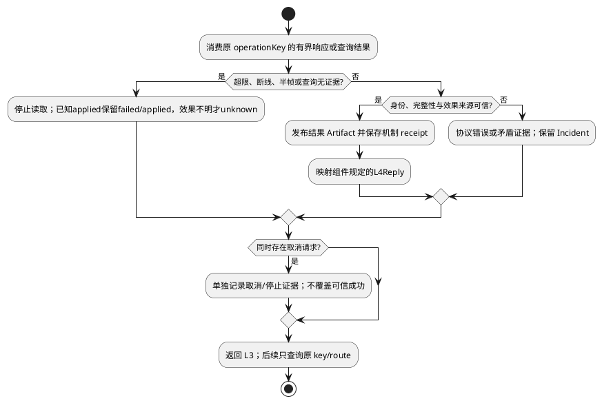

# 结果证据与核对

规范父文档：[组件设计](../../../tool-provider-adapter.md)。域间结构、Port、调用次序以组件为准；本域不引用其他域建立协议。状态：候选，测试未实现/未运行。

## 场景、输入和内部设计

覆盖 L4-S01/S04/S05/S07。调用方、前置状态与成功确认点继承组件场景；输入只来自组件受控调用，不提供独立公共执行入口。

内部结构 `ResponseWork={operationKey:Ref,bytes:Count,complete:boolean,cancelRequested:boolean,resultRef:Artifact|null,observation:MechanismObservation|null}`。bytes 从 0 按实际解码字节累加，不回绕；complete 仅由协议完整性校验置 true；Artifact 发布前 resultRef=null。单 operation 的有界队列仅一个消费者；完成/失败后清空缓冲，不销毁耐久 receipt。

原生响应→有界片段→经 schema 校验的结果→Artifact→MechanismObservation→L4Reply。超过限制立即停止读取并取消，已发送动作的 effect 没证据时 unknown。查询按旧 route/operationKey，查无记录保持 unknown；可信迟到成功可补证据，取消不覆盖它。cancel=stopped 需要 Provider 停止证明，socket 关闭只能 unknown。

扩展例：新增 Provider 的业务错误码，仅扩展私有 mapFault 和可信效果解释测试；不能让通用 EvidenceMapper 根据 HTTP 状态推断副作用。

## 流程与故障出口

## 局部 SFMEA 与验收

超大响应导致内存耗尽、错误日志泄密或取消掩盖成功，严重；字节边界/迟到回调/秘密哨兵检测；保留 receipt 并核对原操作，不重发。 O/D 尚无实测，RPN 不计算。

域内 UT 检查字段不变量、空引用、超界及可变别名；DT（组件白盒测试）注入时钟、机制回执和事件顺序，观察实际调用次数及引用保留。对应固定输入、故障注入和期望为 L4-T04/T07/T09/T12，见仓库 L4 验证视图。接口验收必须验证组件交换类型，不用本域另造返回结构。纯 Fake 不证明真实隔离或远程副作用。

升级复用组件私有记录/档案版本策略；未完成记录不丢弃，不将旧记录恢复为新执行。边界字段采用组件所引用的L34-SPEC-1.0.0；资源绑定和控制帧已冻结，真实机制、证据与Host持久交接继承组件运行验收条件，不以默认值跳过。
