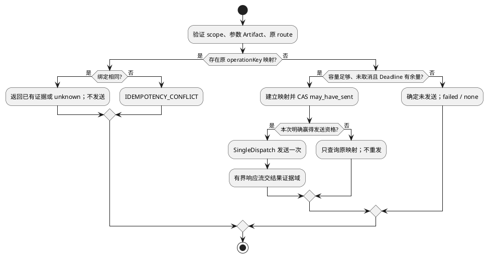

# 请求绑定与调用

规范父文档：[组件设计](../../../tool-provider-adapter.md)。域间结构、Port、调用次序以组件为准；本域不引用其他域建立协议。状态：候选，测试未实现/未运行。

## 场景、输入和内部设计

覆盖 L4-S01/S02/S08。调用方、前置状态与成功确认点继承组件场景；输入只来自组件受控调用，不提供独立公共执行入口。

内部工作结构 `DispatchWork={prepared:PreparedExecution,mapping:OperationMapping,sendWon:boolean,cancelRequested:boolean}`，仅单调用内存；sendWon 默认 false，只由本次映射 CAS 成功置 true，恢复不能重建 true。mapping 来自 scope 私有存储，prepared 的 adapterBindingRef 必须等于原 route。

顺序：Admission(planDigest)核验→读取plan.resourceProfileRef并核对digest/bytes、provider档案与limits精确相等→输入 Artifact 和路由完整性验证→按原键读取映射→构造 Provider 私有请求→持久 may_have_sent→发送一次。发送前取消产生 none；发送后任何异常交结果域判断，不能局部重试。注册 ProviderCodec 实现处理业务字段，未知工具版本拒绝。映射 CAS 结果不明时查询但不发送。

扩展例：新增支持短 operation ID 的 Provider，添加持久一对一键映射及 codec；不改公共身份或中央执行协调。

## 流程与故障出口

## 局部 SFMEA 与验收

绑定越界/键截断碰撞/隐藏重试导致错误目标或重复副作用，严重；用固定 r3/c17 和碰撞键检出；映射失败即停止发送，原操作查询。 O/D 尚无实测，RPN 不计算。

域内 UT 检查字段不变量、空引用、超界及可变别名；DT（组件白盒测试）注入时钟、机制回执和事件顺序，观察实际调用次数及引用保留。对应固定输入、故障注入和期望为 L4-T01/T02/T03/T08，见仓库 L4 验证视图。接口验收必须验证组件交换类型，不用本域另造返回结构。纯 Fake 不证明真实隔离或远程副作用。

升级复用组件私有记录/档案版本策略；未完成记录不丢弃，不将旧记录恢复为新执行。边界字段采用组件所引用的L34-SPEC-1.0.0；资源绑定和控制帧已冻结，真实机制、证据与Host持久交接继承组件运行验收条件，不以默认值跳过。
