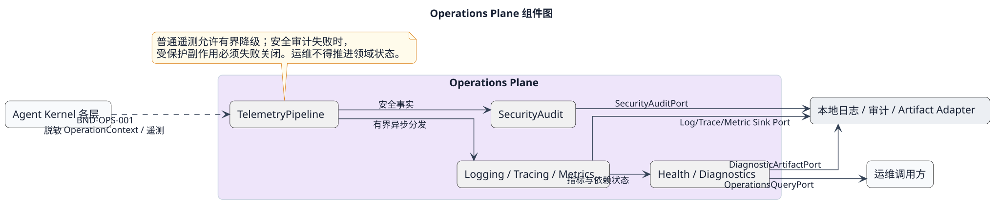

# Operations Plane 层设计

[查看 PlantUML 权威源](../../diagrams/layers/06-operations-plane-components.puml)

## 职责与边界

Operations Plane 以旁路方式接收脱敏后的日志、Trace、指标和安全事实，并提供只读健康与诊断视图。它不拥有 Run、Session、Permit、ToolCall 或 Memory 状态，也不得以遥测成功与否推进领域状态。

## 组件

| 组件 | 唯一设计 | 状态所有权 |
|---|---|---|
| TelemetryPipeline | [遥测管线](components/telemetry-pipeline.md) | 有界队列、Exporter 状态和丢弃计数 |
| Logging/Tracing/Metrics | [日志、追踪与指标](components/logging-tracing-metrics.md) | 本地遥测记录与低基数聚合 |
| Health/Diagnostics | [健康与诊断](components/health-diagnostics.md) | 健康投影与诊断包生成状态 |
| SecurityAudit | [安全审计](components/security-audit.md) | append-only 安全审计 Journal |

## 允许依赖与数据流

Kernel 各层只能通过 [`BND-OPS-001`](../../contracts/bnd-ops-001.md) 向本层单向写入；运维查询只能读取脱敏投影。TelemetryPipeline 可依赖 Infrastructure 的时钟、Artifact 和存储机制，但不能反向调用领域 Port。普通遥测失败允许安全降级；安全审计失败时，受保护副作用必须失败关闭。

## 故障隔离

- 队列、批次、文件和诊断包均有上限；Exporter 卡住不得无限反压 Run。
- Raw Token、Secret、Prompt、Memory 正文、工具参数和物理路径不得进入任何遥测制品。
- 本地审计是安全事实的权威副本；OTLP 等远程接收结果不是领域事实。

## 验证

见 [Operations Plane SFMEA](../../../verification/operations-plane.md) 和 [System SFMEA](../../../verification/system-sfmea.md)。
