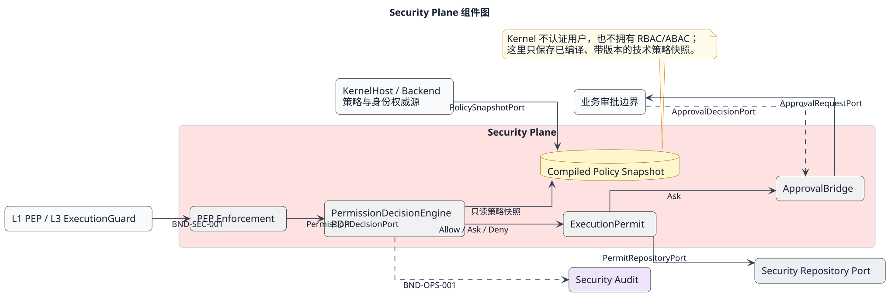
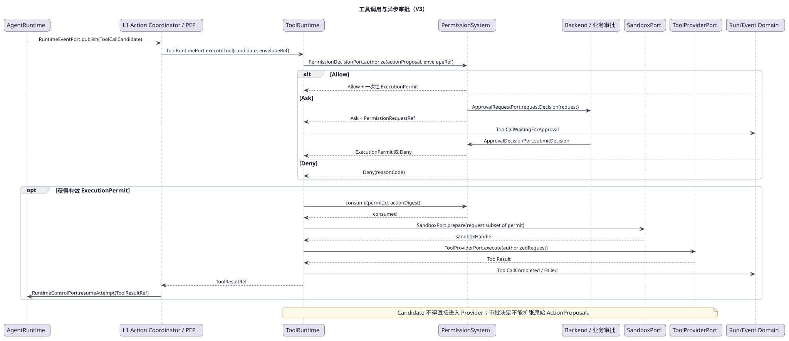

# Security Plane 层设计

[查看 PlantUML 权威源](../../diagrams/layers/03-security-plane-components.puml)

## 1. 职责与信任边界

Security Plane 对 Kernel 内受保护动作提供统一的技术判定和可验证执行授权。Backend/KernelHost 在进入 Kernel 前终止 User Token、解析 Tenant/RBAC 并编译技术策略快照；Kernel 只消费可信的 `ExecutionEnvelopeRef` 及已编译最小授权上下文，不拥有用户目录、RBAC/ABAC 权威库或业务审批规则。

决策与执行严格分离：PDP 对不可变动作提案返回 Allow、Ask 或 Deny；Allow 签发短时、作用域化、一次性 `ExecutionPermit`；L1 PEP 协调决策并只把获准动作交给执行层；真正执行点在执行前校验并原子消费 Permit。L3 ToolExecutionGuard 不进行第二次策略裁决。

## 2. 组件

| 组件 | 唯一职责 | 详细设计 |
|---|---|---|
| PermissionDecisionEngine | 基于编译策略快照作 Allow/Ask/Deny 技术判定 | [PermissionDecisionEngine](components/permission-decision-engine.md) |
| ExecutionPermit | 维护执行授权的不变量和消费状态 | [ExecutionPermit](components/execution-permit.md) |
| PEP Enforcement | 在 L1 协调判定并在真实执行点强制 Permit | [PEP Enforcement](components/pep-enforcement.md) |
| ApprovalBridge | 将 Ask 映射到 Kernel 外部技术审批通道 | [ApprovalBridge](components/approval-bridge.md) |

## 3. 允许依赖

L1 PEP 可调用 PermissionDecisionEngine 与 ApprovalBridge，并把 Permit 引用交给 L3 等受保护执行点。执行点只能调用 Permit 校验/消费能力，不能查询策略源后自行裁决。Security Plane 可读取外部已编译策略快照和耐久安全存储 Port，但不能反向调用 Backend 身份系统解释 Token。

## 4. 决策与执行流

[查看 PlantUML 权威源](../../diagrams/scenarios/06-tool-approval-sequence.puml)

1. L1 将候选动作冻结为不可变 ActionProposal，并绑定 Run、Agent、资源、动作摘要和策略版本。
2. PermissionDecisionEngine 返回 Deny、Ask 或 Allow，不执行动作。
3. Deny 形成可审计拒绝；Ask 持久化技术 PermissionRequest 并由 ApprovalBridge 异步提交外部审批；Allow 签发 Permit。
4. L1 只将带 Permit 的动作提交 L3。
5. L3 ToolExecutionGuard 在真实执行点验证绑定、有效期、策略版本和未消费状态，并原子消费一次性 Permit。
6. 校验失败、状态未知或策略版本失配一律失败关闭。

## 5. 数据、并发与故障隔离

PermissionRequest 与 ExecutionPermit 是独立聚合，不能内嵌为 Runtime 临时布尔值。Permit 消费必须支持并发竞争下只有一个成功者；决策重放以 ActionDigest 与请求标识去重。审批等待不占用同步线程或 Runtime 槽。审计写入失败时，高风险动作不得继续。

## 6. 非目标与评审边界

本层不选择业务审批人、不发送业务通知、不拥有组织角色，也不决定 Multi-agent 团队策略。本文不冻结策略语言、DTO、签名算法、错误码或存储 Schema。
