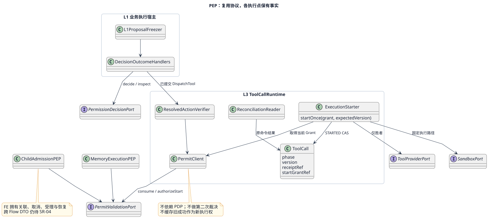
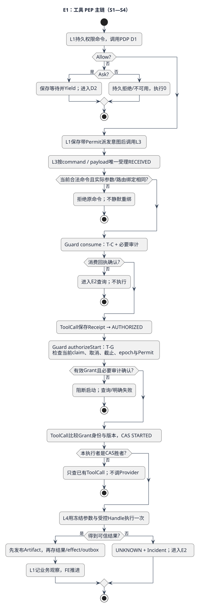
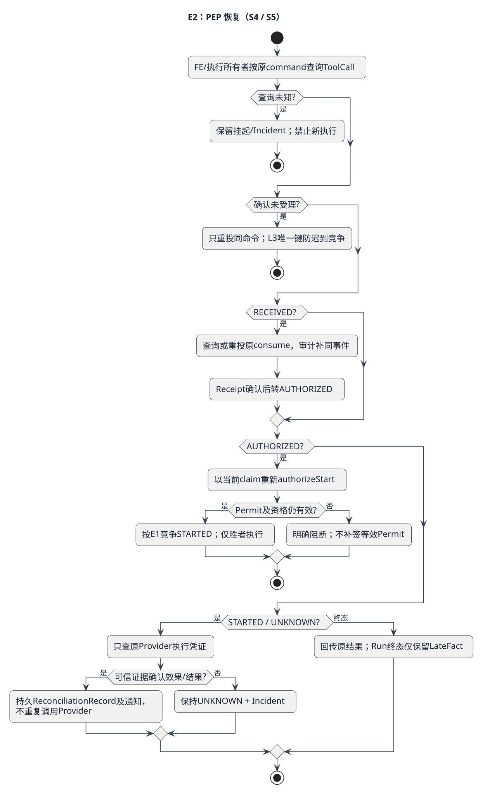
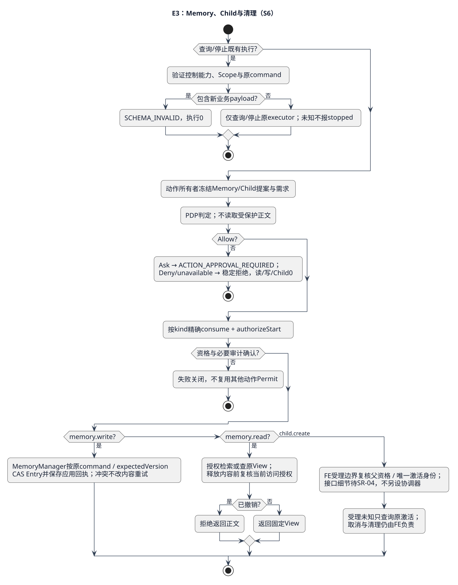

# PEP Enforcement 详细设计

PEP（Policy Enforcement Point，策略执行点）保证“获准的动作和实际执行的动作相同，且只让获准执行者启动一次”。2026-09-08 / SEC-DEC-1候选；本页细化跨组件模式，不新增PEP聚合、数据库或调度服务。

## 1. 职责、业务流程与调用者

例：PDP允许一次文件写入，两个Worker拿到同Permit。消费只有一个命令成功；同命令可查同回执，但只有ToolCall的STARTED CAS胜者能调用Provider。Permit已消费不代表文件已写入，也不能据此重试。

| 位置 | 调用方/实现方 | 负责 | 不负责 |
|---|---|---|---|
| L1前置PEP | ReAct业务Activity宿主→安全决策Port | 冻结提案、请求PDP、记录Ask/Deny/Allow及派发意图 | 不调用私有Pi工具；不拥有FE推进状态 |
| L3执行PEP | ToolCallRuntime→ToolExecutionGuard | 验实际参数/目标，consume及authorizeStart | 不读取策略源、不再做Allow/Ask/Deny |
| L4执行约束 | 内部ExecutionPlan→Provider/Sandbox Adapter | 固定资源Handle、出口、Secret和输出上限 | 不签Permit，不扩大动作目标 |
| Memory执行PEP | MemoryManager内部 | 读取授权及写入资格，命令去重/CAS；返回缓存View也检查当前访问权 | 不复用工具Permit，不让Context直接读库 |
| Child执行PEP | SessionManager Coordinator 的 Fork 安全协作接口 | 检验child.create许可与父级子集 | 不拥有 Coordinator、Barrier、Join 或资源分配系统 |

FE处理单 Flow 的 Ready/Running/Yield/Terminate 与 Activity 日志；SessionManager Coordinator 处理 Root/Child 关联及 Join。业务适配器解释权限结果。权限等待不是新增 FE 系统态。L2只产生候选，不持有 Permit 或直达 L3。

## 2. 内部结构、所有权与装配

[PlantUML源](../../../../diagrams/components/security-plane/pep-structure.puml)。Composition Root按能力装配，下面的门面可内联到既有组件，禁止为了图中名称新建微服务。

| 内部职责 | 输入→输出 | 状态所有权 |
|---|---|---|
| L1ProposalFreezer | Candidate+固定目录/参数→SecurityAction/Binding | 固定提案与权限命令归L1业务记录 |
| DecisionOutcomeHandlers | Decision/Error→业务等待、拒绝或带Permit派发意图 | allow/ask/deny/unavailable穷尽表，结果写回既有业务Activity |
| ResolvedActionVerifier | GuardInput+实际Artifact/Route→精确绑定或错误 | 纯计算，无许可缓存 |
| PermitClient | consume/authorizeStart→Receipt/Grant | 安全端拥有事实，客户端不自签、不保存权威副本 |
| ExecutionStarter | Grant+ToolCall版本→STARTED CAS胜者/已存在 | ToolCallRuntime拥有；只有胜者调用L4 |
| ReconciliationReader | 原command→权威执行状态/UNKNOWN | ToolCall/Provider拥有结果，FE保存Activity事实 |

共享的是绑定验证、Permit协议及错误语义；工具、Memory、Child的实际效果提交由各所有者处理，不能抽象成一个接受任意回调的“consumeThenExecute”公开入口。后者会让任意代码拿已消费Permit执行另一个动作。

## 3. 场景规格与主流程E1

| 场景 | 前置与触发 | 后置 | 详细流程 |
|---|---|---|---|
| PEP-S1 正常工具 | L1有固定提案与已提交权限命令 | 同动作执行至多一次，结果耐久后返回 | E1工具链与D2时序 |
| PEP-S2 拒绝/Ask/不可用 | PDP返回对应分支 | Deny/unavailable执行0；Ask等待且释放槽 | E1入口、PDP D1/D2 |
| PEP-S3 参数/目标篡改 | Allow后替换Artifact或路由 | DIGEST_MISMATCH/BINDING_MISMATCH，启动0 | E1实际绑定分支 |
| PEP-S4 取消/到期/双Worker | consume与启动之间条件变化 | 当前资格失败不启动；同ToolCall只有一个STARTED | E1启动分支、E2恢复 |
| PEP-S5 崩溃/副作用未知 | consume、STARTED或Provider之后中断 | 查原回执；STARTED不自动再发 | E2 |
| PEP-S6 Memory/Child/清理 | 各所有者内部发起受保护动作或取消 | Permit不跨kind复用；清理无新动作 | E3 |

[E1源](../../../../diagrams/components/security-plane/pep-execution.puml)。跨层顺序另见[工具审批时序](../../../../diagrams/scenarios/06-tool-approval-sequence.puml)。

1. L1只对已耐久化的候选创建权限命令，参数Artifact不可变；L1复算actionDigest，不相信模型提供的“已批准”。PDP调用遵循[安全契约](../../contracts/security-decision-contract.md)。
2. allow handler保存带Permit派发意图再调用L3；ask handler保存等待事实并Yield；deny/unavailable handler记录业务结果，禁止Runtime自主重试。重放Activity历史结果仍需访问授权，不能把历史Allow当现行执行权。
3. L3只接受受信任的已提交DispatchTool，按(scope,commandId)与完整payload摘要耐久受理RECEIVED。检查该命令是本次Run合法待执行动作；同command异载荷拒绝。
4. Guard读取固定描述与参数Artifact，校验内容摘要、版本、资源Handle和routeRef。读取参数只在受控Artifact能力范围内，不预读目标受保护内容。不一致则拒绝原命令，不重新生成摘要后复用Permit。
5. consume完成T-C和必要审计；ToolCall存Receipt转AUTHORIZED。这里尚未执行Provider。
6. authorizeStart完成T-G，复核当前claim、Run取消、全部Deadline、Permit到期/epoch/撤销及原消费绑定；失败不启动。Grant绑定executor/attempt/fence，不能被其他执行者转用。
7. ToolCall本地CAS AUTHORIZED→STARTED保存Grant，只有成功者调用一个固定L4执行计划。L4用已经校验的不可变参数字节与资源句柄，不再次从可变路径解析另一目标。Provider连接、Secret解析及Sandbox执行约束不能扩大许可。
8. 结果Artifact先发布，再保存ToolCall结果/effect/通知outbox；L1记录业务观察，再由FE推进。Provider成功但回执未知不重复执行。

## 4. 状态与线性化点

PEP无自己的持久状态机；下表追踪既有聚合状态，避免复制第二份状态。

| 所有者与前态 | 事件与守卫 | 原子事实/后态 | 禁止行为 |
|---|---|---|---|
| L1权限业务等待 | PDP Ask | 保存approvalRef、Yield | 占住Runtime同步等人 |
| PermissionRequest pending | 认证批准且未取消/到期 | approved+通知 | 直接调用Provider |
| Permit issued | consume且绑定精确相等 | consumed+Receipt+审计 | 转回issued或换command消费 |
| ToolCall received | 原消费Receipt已确认 | authorized | 立刻执行Provider |
| 安全授权 | authorizeStart且当前资格有效 | Grant+审计 | 用历史Receipt跳过新鲜度检查 |
| ToolCall authorized | Grant绑定正确且本地版本CAS胜出 | started | CAS失败者调用L4 |
| ToolCall started | 可信结果或无法确认 | succeeded/failed/unknown | 自动回到authorized重执行 |

撤销/取消在authorizeStart之前提交：新Grant=0。之后提交：该动作已取得启动资格，属于在途取消，即使网络请求尚未发出；系统不承诺此时物理效果为零。STARTED解决“谁发起”，authorizeStart解决“何时授权”，二者不等同。若要承诺取消后连已授资格但未发送的请求也不发送，需外部执行器参与新的协议，不能靠挪动一个if宣称解决。

ToolCall不得存在多个有效启动事实；Grant是一次启动资格，不是Provider exactly-once协议。结果未知时牺牲自动可用性，保留事实并核对。

## 5. 恢复与故障流程E2

[E2源](../../../../diagrams/components/security-plane/pep-recovery.puml)。

| 断点 | 恢复入口与动作 | 终止条件 |
|---|---|---|
| L1派发提交后无响应 | 查原L3 command；已受理取原Receipt，确认未受理才重投同命令 | 不创建第二toolCallId |
| consume响应丢失 | 查/重投原consume获取同Receipt；保持同binding | 未知保持挂起，不换Permit |
| AUTHORIZED崩溃 | 复核当前claim再authorizeStart；Permit过期/撤销则拒绝 | 合法STARTED或明确阻断 |
| STARTED前CAS响应丢失 | 查ToolCall；若已STARTED即只查结果 | 不根据“还未收到执行回执”重发 |
| STARTED后Provider前崩溃 | 无法证明未发出，记UNKNOWN/Incident并查询 | 可信核对或持续挂起 |
| Provider已生效丢响应 | 查询原providerRequestId/command；持久ReconciliationRecord | 只补结果，Provider次数不增加 |
| result Artifact已发布但提交失败 | 复用Artifact写原结果和outbox | 同事件去重，不调Provider |
| 审计append丢响应 | queryReceipt同auditEventId；只found可继续 | 未确认始终无新STARTED |

重启或接管只由FE/所属执行组件重建工作；PEP提供校验和查询，不自建扫描调度器。终态Run仍接收LateFact/Incident证据，但不恢复业务推进。取消清理最长30秒；未确认停止保持unknown/pending，不伪称已撤销副作用。

## 6. Memory、Child与清理E3

[E3源](../../../../diagrams/components/security-plane/pep-local-actions.puml)。

Memory write：MemoryManager固定candidateId/entry/expectedVersion，经PDP/consume/authorizeStart后用原命令执行Entry CAS。CAS失败是写冲突，消费事实保留；重算内容须新候选和新授权，不能复用Permit写修改后的Entry。同命令查应用回执，不重复增版本。

Memory read：固定source/query/version/limit，经同类型许可后检索，结果发布前检查当前访问权；回放已有MemoryView也检查当前授权，撤销后禁止返回缓存正文。不得用授权检查前的敏感正文读取来推导资源需求。首次检索和重复返回的访问检查语义沿用CD-1，不能用Ref不可猜替代授权。

Child create：安全端验证父信封与子约束求交；SessionManager Coordinator 从冻结 Fork/member 重建精确 Action/Binding，依次调用 decide、consume、authorizeStart，只把 `executionEnvelopeRef/decisionCommandId/permitRef/permitReceiptRef/startGrantRef/bindingDigest` 保存为外部引用。安全成功不直接建 Child；Coordinator 取得 StartGrant 后才提交 Child Session，再向 FE 投递 Child Flow。Ask/Deny/unavailable/撤销时 Session 写入与 FE 受理均为0；FE 受理未知由 Coordinator 查原回执。SM 拥有 Fork/Join/取消协调和清理，但不拥有 Grant/Permit 或授权状态；PEP 不增加 Barrier。具体 DTO/事务见 SessionManager 4.4。

清理：可信控制通道携带既有commandId和停止/查询操作，禁止新tool payload；停止能力限定原executor、Run和作用域。此操作不借旧业务Permit开启新执行，也不要求重新获得已撤销业务许可才能停止旧动作。

## 7. 扩展方式与可测试结构

L1结果处理使用穷尽DecisionOutcomeHandlers：allow→persistDispatch、ask→persistWait、deny→recordDenial、unavailable→recordFailure。公共前置校验复用，工具/Memory/Child的效果提交处理器由各所有者装配。新增工具Provider只注册L4 Adapter与固定描述，不修改PDP规则表或FE系统四态。

结构验收检查：所有Provider构造仅在Composition Root；L2没有ToolRuntime/Permit能力；Guard不依赖PermissionDecisionPort；只有ExecutionStarter获STARTED胜者句柄后调用L4；取消接口不能承载动作payload。用端口能力测试与代码走读验证，不能仅搜索类名就宣布无旁路。

## 8. SFMEA与验收

严重度按越权/重复副作用为高、可恢复阻塞为中；O/D待运行证据，不计算虚假RPN。

| ID / 继承用例 | 故障与影响 | 注入点和精确预期 |
|---|---|---|
| PEP-T01 / SEC-CMP-003-TC-01,03 | 无Permit/回调冒充执行权（高） | 绕L1直调L3、把approvalRef当permitRef：L4=0，安全拒绝 |
| PEP-T02 / TC-02 | 判定后换参数或目标（高） | 修改一字节/routeRef：DIGEST_MISMATCH或BINDING_MISMATCH，consume=0 |
| PEP-T03 / TC-04 | 普通日志替代安全审计（高） | Journal不可用但log可用：STARTED=0；只outbox成功也为0 |
| PEP-T04 / TC-05 | Permit跨动作复用（高） | child.create Permit用于memory.write：BINDING_MISMATCH，Entry版本不变 |
| PEP-T05 / TC-06 | 清理走私新动作（高） | cancel附tool payload：SCHEMA_INVALID，Provider=0 |
| PEP-T06 | 两Worker或两command竞争（高） | 双连接屏障：同command共用Receipt、STARTED胜者1、Provider1；异command消费胜者1 |
| PEP-T07 | 撤销、到期、接管竞态（高） | 撤销先于T-G：Grant0；T-G先：记录在途；now=expiry拒绝；旧fence拒绝 |
| PEP-T08 | STARTED窗口重复执行（高） | STARTED提交后SIGKILL，重启查询UNKNOWN，新增Provider调用0 |
| PEP-T09 | 已生效丢响应误重试（高） | FauxProvider记效果后丢响应；核对补结果，总效果数1 |
| PEP-T10 | 撤销后缓存Memory泄漏（高） | 已有View后invalidate，再读：正文返回0；没有跨scope回执 |
| PEP-T11 | Child授权变旁路调度（高） | FE取消先提交受理拒绝；受理先提交仅取消原Child；待SR-04集成 |

UT验证binding及结果表；契约验证严格字段、错误、跨Scope、过期；集成用两个SQLite连接与ManualClock/屏障验证T-C/T-G/STARTED顺序；系统用Faux Provider观察真实调用/效果计数；混沌需真实进程终止，不能仅销毁内存对象。每例保留输入、版本、屏障释放顺序、回执、计数、效果和资源清理证据。

## 9. 容量、诊断与实现状态

沿用CD-1：权限/消费/启动检查2秒，工具60秒，工具并发4、参数64KiB、输出256KiB，Permit≤30秒，审批≤Run截止且最多10分钟。全局队列/活动上限有界，参数不做散落常量。以上为设计目标，未经本轮压测。

普通日志只component/phase/result/code等受控字段，不写Prompt、参数、digest、Permit、路径；必要审计独立耐久存储。旁路/UNKNOWN出现1条立即告警；检查顺序：命令身份→ToolCall阶段→安全Receipt/Grant及审计→当前claim/epoch/截止→Provider证据。不直接改表、删消费记录或放宽策略解挂起。

当前`SqliteFlowPermits`已有部分原子消费；`PermissionApprovalService`只实现Grant判定/复核。完整PEP链仍需候选契约正式化、Decision/Approval耐久化、AuditReceipt、authorizeStart和执行端唯一启动验收。工具主链已形成详细开发评审输入，Child绑定仍待FE接口收敛。本轮仅改文档和图，未实现或测试这些运行能力。

迁移、保留与回退遵循[安全详细契约§7](../../contracts/security-decision-contract.md#7-容量版本与清理)；评审与开放项见[本轮记录](../../reviews/pep-pdp-design-2026-09-08.md)。
