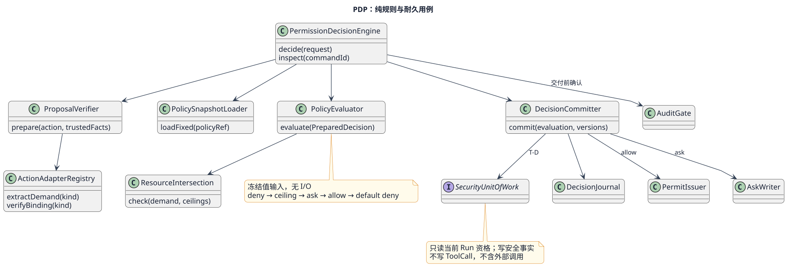
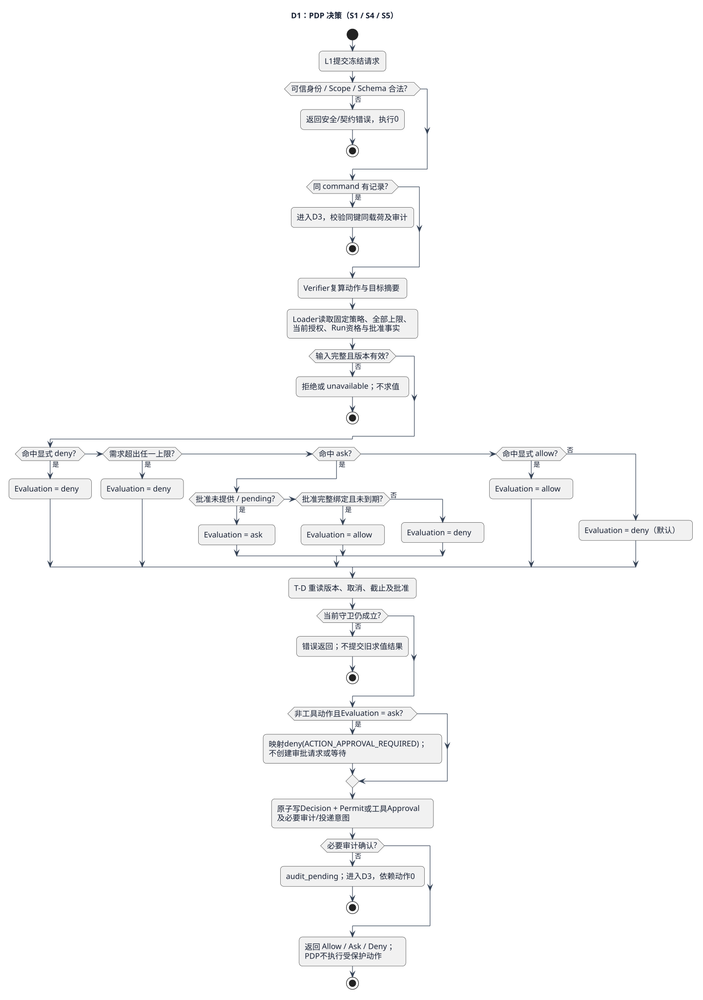
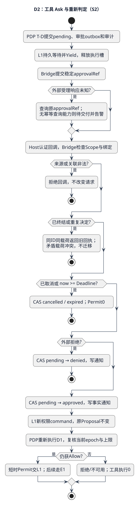
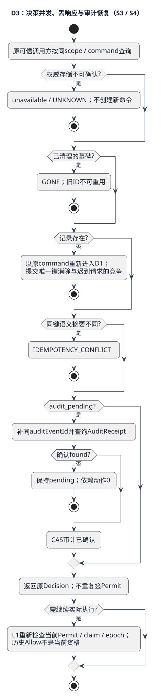

# PermissionDecisionEngine（PDP）详细设计

PDP（Policy Decision Point，策略决策点）回答“这个冻结动作是否被允许”。候选设计：2026-09-08 / SEC-DEC-1；未批准实施。公开字段沿用 [CD-1](../../../../contracts/component-development-contracts-v1.md#permission-decision-engine)，本轮细化见[安全详细契约](../../contracts/security-decision-contract.md)。

## 1. 问题、职责与外部调用场景

例：模型建议向资源R写入A。PDP允许后，实际执行参数变为B，原允许不能覆盖B。PDP只判定A，PEP在真实执行前复核A的绑定并消费Permit；批准回调、模型文字“用户已授权”和历史Allow都不能替代这一步。

PDP拥有确定性技术求值和耐久决策回执；Permit、PermissionRequest分别由各自聚合保护状态。PDP应用服务协调创建它们，纯PolicyEvaluator不做I/O。不解释Token、Tenant/RBAC、业务审批人或团队角色，不调用Provider，不消费Permit，不推进FE系统状态。

| 场景ID | 调用方与触发 | 前置条件 | 成功/拒绝后置条件 | 流程 |
|---|---|---|---|---|
| PDP-S1 | L1处理已提交的工具权限命令 | 固定目录/参数、可信Run和授权状态 | Allow+单一Permit，或明确Deny；Provider调用0 | 判定流程D1 |
| PDP-S2 | 工具命中Ask；Bridge提交批准事实 | 同动作、同epoch、有效审批请求 | 原Ask不变，新命令重新判定；批准本身不执行 | 审批流程D2 |
| PDP-S3 | 同权限命令并发、响应丢失或重启 | 同scope与语义摘要 | 同Decision/Permit；异载荷冲突 | 恢复流程D3 |
| PDP-S4 | 准备与提交之间撤销、到期、策略或审计失败 | 人工时钟/版本变化或依赖故障 | 不交付新执行权，保存可查询事实或明确错误 | D1提交守卫、D3 |
| PDP-S5 | Memory/Child内部请求权限 | 可信Space/Child子集，固定动作 | Allow返回Permit；Ask按首版限制拒绝执行 | D1，PEP执行流程E1 |

## 2. 内部结构与装配



[可编辑PlantUML](../../../../diagrams/components/security-plane/pdp-structure.puml)。这些是内部开发职责，不要求每个框都是类或独立服务。

| 协作者 | 输入→输出及责任 | 生命周期与依赖 |
|---|---|---|
| PermissionDecisionEngine | DecisionRequest→Decision/Error；组织准备、求值、提交、交付 | Composition Root装配，服务无可变领域缓存 |
| ProposalVerifier | SecurityAction/可信描述→摘要正确的PreparedAction；验证实际目标、Schema及资源需求 | 每请求纯值；读取Artifact经受控Port，不读目标正文 |
| ActionAdapterRegistry | ActionKind→对应需求提取器与绑定校验器 | 启动冻结的穷尽表，4种动作；无运行时脚本 |
| PolicySnapshotLoader | 固定policyRef→校验完整性后的快照与Ceiling | 服务级有界LRU；可缓存不可变内容，不缓存当前撤销结论 |
| PolicyEvaluator | PreparedDecision→Evaluation；无I/O、随机数、系统时钟 | 纯函数，规则优先级固定 |
| ResourceIntersection | demand、全部ceilings→满足/超界证据 | 纯函数；各集合求包含、数字求最小上限 |
| DecisionCommitter | Evaluation+冻结版本→耐久Decision/Permit/PermissionRequest | 通过安全UnitOfWork；提交时重验当前事实 |
| DecisionJournal / AuditGate | 同键查询与CAS；必要审计确认后才交付 | Repository/Audit Port；故障不能降级普通日志 |

PermitIssuer只指向ExecutionPermit.issue；AskWriter只负责创建PermissionRequest与审批outbox；二者由DecisionCommitter按结果表调用，不允许自行启动Provider。Security储存机制在Infrastructure，业务规则保留Security。审批通道由ApprovalBridge调用。

## 3. 判定算法D1



[D1源文件](../../../../diagrams/components/security-plane/pdp-decision.puml)。PDP-S1/S4/S5共享此流程；每个失败出口均不调用执行层。

1. 检查服务能力、可信Scope、严格Schema、Deadline。查同command回执；先检查同键同载荷，再返回已有结果。历史结果只能用于查询，执行仍走当前PEP。
2. ProposalVerifier加载固定版本描述及参数Artifact，复算actionDigest与targetDigest，验证binding来自可信Run。缺失或未知动作拒绝；参数变化不在这里“修好”后继续。
3. 加载policy、AuthorizationState、Run资格、必要资源上限和可选批准记录，注入nowMs。版本/epoch/Scope不一致返回STALE_SNAPSHOT/SCOPE_MISMATCH；依赖未知返回unavailable。
4. PolicyEvaluator按下面的决策表纯求值。资源需求必须满足所有Ceiling，不能挑最宽的一份。
5. DecisionCommitter开启T-D，重读授权版本、Run取消/截止和批准版本。任一前置失效则不提交准备期的Allow。事务保存Decision及Permit或工具PermissionRequest，另存必要审计和投递意图；非工具Evaluation.ask映射Decision.deny(ACTION_APPROVAL_REQUIRED)，不创建审批请求或等待。
6. 必要审计确认后返回；Allow有效期按契约最小截止，Ask交由Bridge异步投递，Deny保留脱敏原因。没有任何分支执行工具。

| 有序规则 | 守卫 | 结果/终止条件 |
|---|---|---|
| 1 显式拒绝 | denyActions含kind | Deny(EXPLICIT_DENY)，后续不执行 |
| 2 上限 | 任何必需Ceiling缺失，资源/出口/Secret集合非子集，时间/字节超限 | Deny(OUT_OF_SCOPE/LIMIT_EXCEEDED) |
| 3 请求批准 | askActions含kind，approval=null或pending | Ask(APPROVAL_REQUIRED) |
| 4 验证批准 | 命中ask，引用绑定不等、非approved或已到期 | Deny(APPROVAL_INVALID) |
| 5 解除本次Ask | 命中ask且同binding批准有效 | Allow，仅解除Ask；不能覆盖规则1/2 |
| 6 显式允许 | allowActions含kind | Allow(EXPLICIT_ALLOW) |
| 7 默认 | 其余 | Deny(DEFAULT_DENY) |

规则3只把pending解释为继续等待；denied/expired/cancelled不能重新Ask复活同请求。未命中ask但携带approvalRef时仍先校验引用归属，不允许跨scope引用探测；批准不扩大显式allow范围。

实现结构：ActionKind适配器表组织动作差异；决策规则为固定有序定义数组，每项返回continue或Evaluation；resultCommitters为allow/ask/deny穷尽表。数组启动检查唯一规则ID、固定顺序与终结default规则，测试覆盖交叠规则。一般Schema/集合前置使用直接守卫，不引入规则DSL。

复杂度：构建每份Ceiling的Set后检查需求，O(规则条目+全部资源条目)，空间同阶；遍历次数受契约上限约束，无递归求值和重试循环。批准状态只求值一次，不在求值器等待回调。

## 4. 工具审批D2


[D2时序源](../../../../diagrams/scenarios/06-tool-approval-sequence.puml)。详细分支见[审批流程](../../../../diagrams/components/security-plane/pdp-approval.puml)：



Ask提交PermissionRequest、脱敏投递数据与outbox；L1持久等待事实并让业务Activity Yield，释放执行槽。Bridge向外部提交同approvalRef，超时只查询或幂等重投原请求。

认证回调先检Scope/请求/动作/epoch，再检取消与截止，然后CAS pending→approved/denied；同externalDecisionId同内容只返回旧回执，矛盾内容冲突。Deadline恰等now时expired优先。批准通知只表达事实；L1发新权限command，PDP重新检查当前策略和资源。旧epoch的批准不用于新epoch。

审批缩小目标意味着新ActionProposal和新判定；不修改已批准提案。非工具Ask维持CD-1首版行为：ACTION_APPROVAL_REQUIRED，Memory不读/写、Child不创建；不把工具审批等待机制复制到FE内部。

## 5. 并发、持久化与恢复D3



[D3源](../../../../diagrams/components/security-plane/pdp-recovery.puml)。记录字段、唯一键、事务和审计确认点唯一维护于[契约§5](../../contracts/security-decision-contract.md#5-候选耐久结构与事务)。

| 窗口 | 权威证据与恢复动作 |
|---|---|
| 计算后、提交前崩溃 | 无Decision；同command重新加载当前输入。不能声称旧纯结果已生效 |
| 两请求同command并发 | 唯一键胜者提交；另一方读取原Decision；同键异载荷冲突，不留下第二Permit |
| Decision提交后响应丢失 | inspect/同command重投返回同Decision，不能新建permission命令绕过幂等 |
| 审计未确认 | 只补原auditEventId；不交付Permit/审批投递/Grant供依赖动作使用 |
| 审批通知丢失 | Bridge outbox重投；L1查询同approvalRef，原Ask记录不改为Allow |
| Allow后epoch变化/Permit过期 | 原回执仍是历史Allow；consume/authorizeStart拒绝新启动，不补发等效Permit |
| Attempt接管 | 安全端验证当前Attempt后重建规范事实；recovery不能自签allow，已STARTED只查询结果 |

安装、续期、失效AuthorizationState只接受Host能力；策略epoch和有效期不是同一概念。正常同epoch续期不改Run冻结版本，已撤销状态不能续期复活；远端撤销只有本地失效确认后才对本Kernel生效。具体操作沿用CD-1，不承诺远端变更瞬时传播。

## 6. 扩展实例与结构验收

当前新增工具版本通常只发布ToolDescriptor、参数Schema及Host编译上限，tool.execute适配器复用；PDP不按工具名增加分支。例：新增“导出报告”工具，需求提取器从固定描述得到目标Artifact写入和最大输出；仍走资源求交、Ask/Allow、同一Permit强制链。

未来新增独立`artifact.publish`动作需要先变更封闭ActionKind/SecurityAction与上层授权边界，再注册对应提取/绑定适配器及真实执行PEP，添加摘要和故障用例；PolicyEvaluator、DecisionCommitter及FE系统状态表保持不变。缺失适配器、重复kind、未知协议版本在装配/入口拒绝；不能注册仅有PDP而无执行强制点的动作。

结构验收：四动作表穷尽、重复注册失败；规则顺序不可由配置倒置；PDP不依赖L3/L4或Pi；PolicyEvaluator仅冻结值；Permit/Approval仍独立聚合；资源变化只修改相应适配器，禁止在中心方法复制四套流程。

## 7. SFMEA与测试设计

下表是待实现的用例，不是通过证据。严重度S按影响定性，发生率O/可检出度D无运行数据，均待评，不伪造RPN。

| ID / 继承用例 | 失效原因与系统影响 | 控制/注入/独立期望 |
|---|---|---|
| PDP-T01 / SEC-CMP-001-TC-01,06 | 规则次序或默认允许错误，越权（S高） | 固定kind=tool.execute，deny/ask/allow同时含该kind：deny、Permit0；三表空：deny；仅allow且资源满足：allow |
| PDP-T02 / TC-02 | 批准绑定被换，执行另一动作（S高） | 将approved的actionDigest改一字节：deny；保持原binding且在期内：allow；now=expiry：deny |
| PDP-T03 / TC-03 | 源超时被当允许或政策拒绝（S高） | PolicyPort抛超时：PERMISSION_UNAVAILABLE，Decision成功回执0、Permit0、Provider0 |
| PDP-T04 / TC-04 | 幂等竞争多签（S高） | 两独立连接屏障提交同command：Decision1、Permit1；改payload：IDEMPOTENCY_CONFLICT |
| PDP-T05 / TC-05 | 准备后撤销，旧Allow被提交（S高） | 暂停T-D前，另一连接invalidate；恢复：签发0；反向顺序签发1但后续启动拒绝 |
| PDP-T06 | audit outbox被误当必要Journal成功（S高） | Journal提交失败/丢响应，普通日志可用：无可用Permit；恢复只补同auditEventId |
| PDP-T07 | 宽资源覆盖窄资源（S高） | Host允许R1/R2，Run只R1，需求R2：deny；需求R1且output=最小上限：allow，+1：deny |
| PDP-T08 | Ask状态丢失占满执行槽（S中） | pending后终止进程并重启；同approvalRef恢复、Runtime槽占用0、无重复外部单 |
| PDP-T09 | 动作扩展遗漏/策略内容被替换（S高） | 少一适配器装配失败；同policyRef异内容STALE_SNAPSHOT；无Provider调用 |

UT：ManualClock、固定PreparedDecision、独立预期；契约：非法字段/重复键/错误映射/摘要固定向量；集成：本地SQLite双连接CAS及安全Journal；系统：Faux Provider精确计数、Ask恢复和取消；混沌：T-D前后SIGKILL、审计受理丢响应。拒绝路径观察“受保护正文读取数=0、新副作用数=0”，允许必要的受控参数Artifact校验。

PDP-T07的ResourceIntersection完整固定输入如下，预期为满足；将outputBytes改为1025则LIMIT_EXCEEDED，将resourceRef改为res:2则OUT_OF_SCOPE。此用例只覆盖纯资源算法，不能代替完整PDP和耐久测试。

```json
{
  "demand": {
    "actions": ["tool.execute"],
    "resources": [{"resourceRef": "res:1", "access": "write"}],
    "endpoints": [], "secretRefs": [], "durationMs": 1000, "outputBytes": 1024
  },
  "ceilings": [{
    "ceilingRef": "ceiling:1", "scopeRef": "scope:1",
    "actions": ["tool.execute"],
    "resources": [{"resourceRef": "res:1", "access": "write"}],
    "endpoints": [], "secretRefs": [], "maxDurationMs": 1000, "maxOutputBytes": 1024
  }]
}
```

完整PDP输入还必须通过至少Host/Run/Policy三份必需上限校验；仅上面一份Ceiling不得绕过PreparedDecision构造器。

容量每个上限验证L-1/L/L+1；纯求值最大合法输入10,000次测P99≤10ms目标。队列80%持续60秒、未知事实或旁路1条立即告警；普通遥测无参数/digest/Permit。按原CD-1并发档案做30分钟有界负载，保存配置版本、硬件、期望/实际计数、屏障顺序和清理证据。

## 8. 实现映射与交付边界

现有`src/security/permission-approval.ts`提供ALLOW/DENY、权限上限求交及Grant复核，人工确认返回HUMAN_CONFIRMATION_UNSUPPORTED；不能称已实现上述Ask或DecisionJournal。`src/infrastructure/adapters/sqlite-flow-permits.ts`已有部分一次消费，但没有完整本设计的耐久决策/审批/审计/authorizeStart链。

拟开发单元：`src/security/decision/`放求值器、动作适配器和应用服务；`src/contracts/`放候选契约评审后的正式类型；`src/infrastructure/adapters/`实现安全Repository与Journal；对应`test/ut`、`test/contract`、`test/integration`按PDP-Txx落地。路径为候选映射，本轮未创建源码。

纯求值与工具适配器的行为/结构规格已形成实施评审输入；完整集成仍依赖Host资源编译契约、原子资格读取和审计实现验收。Child具体绑定等待FE SR-04。五视角自审及开放项见[本轮评审](../../reviews/pep-pdp-design-2026-09-08.md)，不能沿用旧CD-1评审推定本轮已批准。
