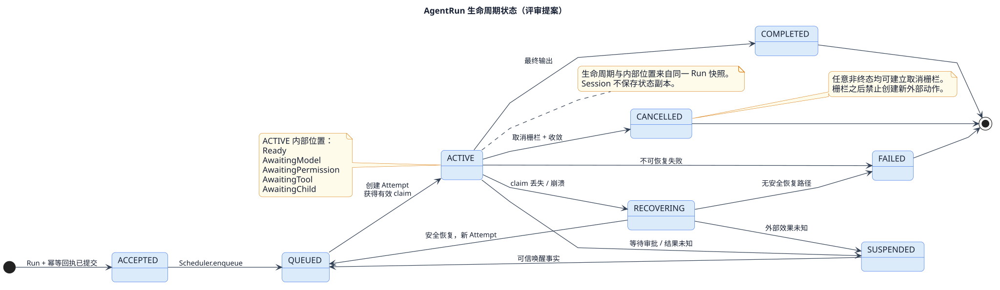
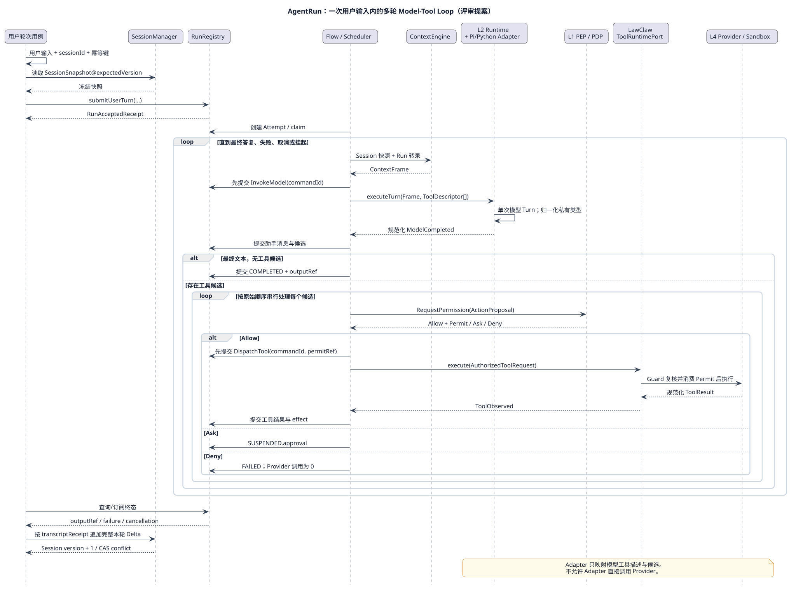

# AgentRun 单次用户交互业务流程设计

> 本文是待评审提案，不替代 [RunRegistry 组件设计](../../layers/l1-control/components/run-registry.md)、[L1/L2 边界契约](../../contracts/bnd-l12-001.md)或 [ToolCallRuntime 组件设计](../../layers/l3-tool-runtime/components/tool-call-runtime.md)。评审通过后，内容应归并到这些权威文档，本文转为评审记录。
>
> 2026-09-09：本文关于“Session关联多个Run”的提案已被 [ACR-2026-0017](../../../governance/changes/ACR-2026-0017-session-single-active-run.md)替代。当前口径为Session仅有`0..1 ActiveRunBinding`，终态Run历史归RunRegistry；本文旧段落仅保留评审轨迹，不作为实现依据。

## 1. 结论

`AgentRun` 表示一次外部用户输入触发的完整技术执行：从 Run 被受理开始，经过零到多轮模型、权限、工具、上下文更新循环，直到产生本轮最终候选答复，或进入失败、取消、等待审批、结果未知等状态。

`AgentRun` 的生命周期通常短于 `AgentSession`，但不能因此成为 `AgentSession` 内部实体。推荐语义是：

1. 应用用例在一个确定的 `SessionSnapshot@version` 上提交用户输入。
2. `RunRegistry` 创建独立 `AgentRun`，冻结 `sessionId/sessionVersion`、路由、预算、工具目录和执行信封。
3. `SessionManager` 只记录 `runId` 关联和经过确认的上下文增量，不创建或修改 Run 状态。
4. Run 完成后，应用用例把完整、已提交的本轮转录增量追加到 Session；Session 继续服务后续用户轮次。

因此，“Session 创建 AgentRun”在业务语言中可以成立，但代码和聚合所有权应表达为“会话用例基于 Session 提交一个独立 Run”，而不是 `session.createRun()` 返回并持有可变 `AgentRun`。

## 2. 设计范围

### 2.1 本文负责

- 一次用户输入到一次最终 Agent 输出的 Run 边界；
- Run 内多轮 model–tool loop 的控制流程；
- `AgentRun`、`AgentRunAttempt`、`AgentLoopStep` 和 Session 的关系；
- Pi Adapter 与 LawClaw 工具封装接口的边界；
- 取消、审批挂起、工具结果未知和进程恢复；
- 可编码的入站/出站 Port 语义与验收场景。

### 2.2 本文不负责

- 业务 Conversation、Workflow 状态和结果采纳；
- Pi 原生 Session、Message、Tool 或 Provider 的公共暴露；
- 工具 Provider、Sandbox、权限策略和长期记忆算法的内部实现；
- Multi-agent 团队编排。受限 Subagent 仍表现为 Child Run。

## 3. 生命周期与对象关系

| 对象 | 生命周期 | 权威状态 | 与其他对象的关系 |
|---|---|---|---|
| `AgentSession` | 多次用户轮次，直到归档 | 上下文增量、Artifact 索引、版本和分支血缘 | 关联多个 Run，只保存 `runId` 和已确认转录 |
| `AgentRun` | 一次用户输入到终态或可恢复挂起 | Run 状态、冻结绑定、预算、取消、事件序号和结果 | 独立聚合根，引用一个 Session 版本 |
| `AgentRunAttempt` | 一次 Worker/Runtime 物理执行 | Attempt、claim/fence 和恢复检查点 | Run 恢复时新建，不更换 `runId` |
| `AgentLoopStep` | 一次已提交的认知或动作推进 | 类型、因果命令、输入/输出引用和终态 | Attempt 内严格排序；完成后不可变 |
| `ContextFrame` | 一次模型调用 | 冻结的模型输入投影 | 可由 Session 快照和 Run 转录重建，不是聚合 |

“一轮用户对话”和“一轮模型调用”必须分开：一个 `AgentRun` 是一轮用户对话；一个 Run 内可以有多个模型调用。为了避免混淆，本文把一次 `模型调用 → 0..N 个工具结果 → 上下文提交` 称为逻辑 `LoopCycle`，但不新增一个权威领域对象。真正持久化的是有类型的 `AgentLoopStep`。



[查看可编辑 PlantUML 源](agent-run-state.puml)

### 3.1 Run 生命周期状态

| 状态 | 含义 | 是否占用执行槽 |
|---|---|---|
| `ACCEPTED` | Run、幂等回执和冻结绑定已提交 | 否 |
| `QUEUED` | 等待 Scheduler 派发 | 否 |
| `ACTIVE` | 当前 Attempt 持有有效执行资格 | 是，但等待外部动作时必须释放 |
| `SUSPENDED` | 等待人工审批或未知副作用核对 | 否 |
| `RECOVERING` | 原 Attempt 失效，正在核对安全恢复点 | 否 |
| `COMPLETED` | 最终候选输出已耐久提交 | 否 |
| `FAILED` | 不可恢复技术失败已提交 | 否 |
| `CANCELLED` | 取消栅栏建立，子任务和活动调用已处置 | 否 |

### 3.2 ACTIVE 内部执行位置

`ACTIVE` 内部位置复用显式 ReAct 迁移定义，而不是在一个中央方法中堆叠分支：

- `Ready`：可以根据已提交事实决定下一动作；
- `AwaitingModel`：一个 `InvokeModel` 命令已经提交；
- `AwaitingPermission`：工具候选已提交，等待统一权限判定；
- `AwaitingTool`：获得绑定 Permit 后，等待封装工具链返回事实；
- `AwaitingChild`：等待结构化 Child Run；
- `Suspended.approval`：等待外部审批决定；
- `Suspended.tool_unknown` / `Suspended.model_unknown`：副作用结果未知，只允许核对，不允许自动重放。

生命周期状态用于外部查询和调度；内部位置用于决定下一条命令。两者不能复制成两个互相独立的状态机，Run 快照必须能确定性投影外部生命周期状态。

## 4. 主成功流程



[查看可编辑 PlantUML 源](agent-run-sequence.puml)

### 4.1 受理

1. Gateway 接收 `SubmitUserTurn`，校验请求上下文、`sessionId`、`expectedSessionVersion`、客户端幂等键和输入引用。
2. SessionManager 返回不可变 `SessionSnapshot@version`；归档、越权或版本冲突时不创建 Run。
3. AgentRegistry 产生路由候选；受理用例冻结 `RouteSnapshot`、`ExecutionEnvelopeRef`、`ToolCatalogSnapshotRef`、预算、Deadline 和 Session 版本。
4. RunRegistry 原子写入 `AgentRun(ACCEPTED)`、命令回执和 `RunAccepted` 事件，然后通知 Scheduler。受理成功不代表执行完成。
5. Session 关联 Run 的操作与 Run 创建是两个聚合提交。若 Session 关联通知丢失，可以由稳定 `runId` 补写；不能回滚已经受理的 Run 或创建第二个 Run。

### 4.2 启动 Attempt

1. Scheduler 获取队列资格和资源预算。
2. RunRegistry 以版本检查创建 `AgentRunAttempt`，签发当前 claim/fence，并把 Run 推进到 `ACTIVE/Ready`。
3. ContextEngine 从冻结的 Session 版本、当前用户输入、Run 已提交转录和授权 MemoryView 组装 `ContextFrame`。
4. Frame 绑定 `runId`、Run version、Session version、转录头和工具目录快照；组装失败时不得用不完整上下文继续模型调用。

### 4.3 一次模型步骤

1. Flow 策略在 `Ready` 上检查取消、Deadline、上下文绑定和模型轮次预算。
2. RunRegistry 先提交 `InvokeModel(commandId, promptRef)` 和 `AwaitingModel`，再由命令派发器调用 L2。
3. L2 `AgentRuntime` 只执行一个模型 Turn。Pi Adapter 把 Kernel `ContextFrame` 和 `ToolDescriptor[]` 映射为 Pi 私有请求，并调用 Pi 的单轮流式模型接口。
4. Pi 文本增量只产生有界流事件；Pi 工具调用块只归一化为 `ToolCallCandidate`，不得执行工具。
5. 完整助手消息先写 Artifact，再以 `ModelCompleted` 事实返回 L1。L1 校验 attempt、command、sequence、大小和因果关系后提交。

### 4.4 无工具时完成

模型输出没有工具候选时：

1. 把完整助手消息追加到 Run 转录；
2. 校验最终输出大小和 Run 预算；
3. 原子提交 `COMPLETED`、`outputRef`、Run Event 和通知 Outbox；
4. 释放 Attempt/执行槽；
5. Session 用例按 `sourceRunId + transcriptReceipt` 把本轮完整转录追加到 Session。Session CAS 冲突时重载并重新选择增量，不改写 Run 终态。

### 4.5 有工具时继续 Loop

模型输出一个或多个工具候选时：

1. 完整助手消息与全部 `pendingActions` 一次提交，保留原始顺序和 `toolCallId`；
2. 首版串行处理工具候选，逐个执行“权限 → 工具 → 结果提交”，不并发扩大副作用窗口；
3. 每个成功工具结果与对应候选形成完整因果链并追加到 Run 转录；
4. 所有本轮工具候选处理完成后，ContextEngine 以已提交转录重建新 `ContextFrame`；
5. Flow 回到 `Ready`，预算允许时提交下一次 `InvokeModel`；
6. 循环直到模型返回最终文本、取消/Deadline 生效、预算耗尽或发生不可恢复错误。

## 5. 工具调用封装边界

### 5.1 唯一合法路径

```text
Pi toolCall（私有类型）
  -> PiAgentAdapter 归一化为 ToolCallCandidate
  -> RuntimeEventPort 提交 L1
  -> L1 PEP / PermissionDecisionPort
  -> ExecutionPermit
  -> ToolRuntimePort（LawClaw 封装接口）
  -> ToolExecutionGuard 消费并复核 Permit
  -> ToolProviderPort / SandboxPort
  -> 规范化 ToolResult / ToolObserved
  -> RunRegistry 提交结果
  -> 下一 ContextFrame
```

### 5.2 明确禁止

- `AgentRun`、`AgentRuntime` 或 Pi Adapter 直接调用 Pi 原生 `Tool.execute`；
- 把 Pi/Python SDK 的 Tool、Message、Event、异常或 Provider 对象暴露到 Kernel Port；
- 模型产生工具名后直接查找并调用 Provider；
- L3 在 Permit 消费时重新做一套 Allow/Ask/Deny 决策；
- 工具返回未提交时启动下一次模型调用；
- 以“只读工具”为理由自动重放结果未知的调用。

Pi Adapter 可以把 `ToolDescriptor.inputSchema` 映射成 Pi 的工具 Schema，让模型知道可用工具；这只是描述适配，不授予执行能力。若底层实际是 Python SDK，同样只允许实现一个 Adapter：Python 原生对象在 Adapter 内终止，对外仍返回 Kernel 规范 DTO，并继续走上述 `ToolRuntimePort`。

### 5.3 候选 Port 外观

下列签名用于评审操作语义，不在本文冻结具体 TypeScript 类型：

```ts
interface AgentRunApplicationPort {
  submitUserTurn(context, command): Promise<RunAcceptedReceipt>;
  getRun(context, runId): Promise<AgentRunSnapshot>;
  subscribeRunEvents(context, runId, afterSequence): AsyncIterable<AgentEvent>;
  cancelRun(context, runId, expectedVersion, reason): Promise<RunCommandReceipt>;
  resumeRun(context, runId, wakeRef): Promise<RunCommandReceipt>;
}
```

`submitUserTurn` 的成功确认点是 Run 与幂等回执已提交，不是模型开始或最终答复完成。同步 CLI 可以在该 Port 上提供一个 `submitAndWait` 薄外观，但等待逻辑不得成为 Run 聚合规则。

## 6. 核心数据与不变量

### 6.1 SubmitUserTurnCommand

| 字段 | 约束 |
|---|---|
| `commandId` | 调用幂等键；同键异载荷必须冲突 |
| `runId` | 调用方或可信入口生成的稳定技术 ID |
| `sessionId` | 已存在且当前调用方可读写的技术 Session |
| `expectedSessionVersion` | Run 冻结的历史版本；不得静默升级到最新版本 |
| `userInputRef` | 已发布且有界的用户输入 Artifact 引用 |
| `routeRequest` | Agent/能力选择条件，不包含 Provider 私有对象 |
| `budget` | 不超过 Runtime、Session 和调用方上限的交集 |
| `deadlineAt` | 绝对截止时间，不能晚于外层 Operation Deadline |
| `executionEnvelopeRef` | 已编译身份、权限和资源绑定引用 |

### 6.2 AgentRunSnapshot

至少包含 `runId`、`sessionId`、`sessionVersion`、`status`、`position`、`version`、`attemptId`、`routeSnapshotRef`、`toolCatalogSnapshotRef`、`executionEnvelopeRef`、`budget`、`usage`、`deadlineAt`、`cancelEpoch`、`transcriptHeadRef`、`pendingActions`、`waitReasonRef`、`outputRef/errorCode`。

必须保持以下不变量：

1. Run 创建后 Session 版本、路由、工具目录、预算和执行信封不被最新配置静默替换。
2. 单 Run 同时最多一个有效 Attempt claim；旧 attempt/fence 的写入被拒绝。
3. Step 与 Event 在 Run 内严格排序；重复事实不增加步骤、命令或副作用次数。
4. 每次外部模型/工具调用都先有已提交命令，再允许派发。
5. 最终输出只来自已提交的完整助手消息；流式 delta 不是终态事实。
6. 取消栅栏后不再创建模型、工具、Memory 写入或 Child Run 动作。
7. `COMPLETED`、`FAILED`、`CANCELLED` 不可逆；迟到结果只能成为 LateFact/Incident。
8. Session 不保存 Run 的活动状态副本，Run 不原地修改 Session 上下文。

## 7. 失败、取消与恢复

| 场景 | 处理 |
|---|---|
| 模型明确未执行或调用前失败 | 记录失败；是否创建新 Attempt 由恢复策略和剩余预算决定，首版自动模型重试为 0 |
| 模型结果未知 | 进入 `Suspended.model_unknown`，只允许通过原 command/provider 标识核对，不自动重调 |
| 权限 `DENY` | Run 失败，且 ToolCall/Provider 执行次数必须为 0 |
| 权限 `ASK` | 进入 `Suspended.approval` 并释放执行槽；审批通过后重新检查有效授权和 Deadline |
| 工具明确失败 | 记录 ToolCall 失败；首版把 Run 置为失败，不伪造工具结果继续推理 |
| 工具结果未知 | 进入 `Suspended.tool_unknown`；查询原 Provider 事实，无法确认时保持挂起并建立 Incident |
| 预算耗尽 | 在下一动作派发前失败；已提交的事实和用量保留 |
| 用户取消/Deadline | 先原子增加 `cancelEpoch` 并禁止新动作，再中断活动调用、取消/Join Child，最终收敛为 `CANCELLED` |
| Worker 崩溃 | claim 失效后进入 `RECOVERING`；核对命令、ToolCall 和外部效果，再用同一 `runId` 创建新 Attempt |
| Session CAS 冲突 | 不回滚 Run；Session 调用方重载后按转录收据去重追加 |

取消受理不等于外部副作用已撤销。任何已开始工具调用都必须记录真实 effect；结果未知不能被标成取消成功或未执行。

## 8. 当前实现映射与差距

### 8.1 已有可复用实现

| 设计职责 | 当前实现 |
|---|---|
| 独立 Run 对象 | `src/control/agent-run.ts` |
| Session 只关联 Run ID | `src/control/agent-session.ts`、`src/control/agent-system.ts` |
| Kernel 驱动多轮 loop | `src/control/run-flow.ts` |
| Pi 单轮 Adapter、原生类型隔离 | `src/cognitive/adapters/pi-agent-adapter.ts` |
| LawClaw 工具封装链 | `src/contracts/tool-runtime.ts`、`src/control/tool-coordinator.ts`、`src/tools/tool-runtime.ts` |
| 显式 ReAct 迁移定义 | `src/control/react-flow/flow-transitions.ts` |
| 命令先提交后派发、SQLite 恢复 | `src/control/flow-driver.ts` 与 Flow Store/Journal Adapter |

### 8.2 必须修正的设计—实现差距

1. `AgentSystem.run()` 仍同步创建并执行内存 `AgentRun`；没有持久受理回执、Attempt、挂起/恢复和事件补拉。
2. `RunFlow` 在一个进程调用栈内直接完成模型、权限和工具循环；它验证了纵切行为，但不是目标耐久控制路径。
3. 当前 `AgentLoop` 把一个模型 Turn 及其工具处理合成一个实体；目标模型需要有类型的 `AgentLoopStep`，以便工具等待和恢复能独立表达。
4. 新 Flow 路径的 `FlowContext.initial()` 当前按 `runId` 派生新 `sessionId`；这不能表达“一个 Session 关联多个用户 Run”，受理接口必须显式接收并冻结 `sessionId/sessionVersion`。
5. Pi Adapter 的单轮模型边界已符合目标；不得切换到 Pi 自带 Agent loop 或把 Pi 原生工具执行接入 Run。
6. 新 Flow 工具处理器已通过 `ToolRuntimePort` 执行，但仍需按 ToolCallRuntime 文档补齐完整 ToolCall 聚合、持久 UNKNOWN 与安全审计证据。

## 9. 扩展方式

新增一种动作类型（例如 `MemoryCandidate`）时：

1. 在规范化模型输出中增加封闭 variant；
2. 在显式迁移定义中登记源状态、事件、目标和动作；
3. 增加专用 Port/Handler，不修改 Pi Adapter 的工具执行逻辑；
4. 为候选、授权、提交和失败事实增加独立验收；
5. `RunRegistry`、通用命令派发器和状态查询外观不应增加按 Provider 名称判断的分支。

固定协议新增 variant 仍需更新类型、Schema 和穷尽校验。扩展机制的目标是让业务分派显式且可验证，不要求运行时插件化。

## 10. 验收场景

| ID | 输入/故障 | 精确预期 |
|---|---|---|
| `AR-SC-01` | 同一 Session 连续提交两个用户输入 | 两个独立 `runId`；第二 Run 冻结第一轮已提交后的 Session 版本；Session 无 Run 状态副本 |
| `AR-SC-02` | 模型第一轮请求工具，第二轮返回答案 | 模型调用 2 次、工具 Provider 1 次；工具结果提交早于第二次模型命令 |
| `AR-SC-03` | Pi 返回工具候选 | Pi 原生工具执行次数 0；候选经 L1 权限和 `ToolRuntimePort` 执行 |
| `AR-SC-04` | 权限拒绝 | Provider 调用 0，Run 进入 `FAILED`，错误可定位到 proposal/command |
| `AR-SC-05` | Permit 已消费后 Provider 成功但响应丢失 | Run 进入 `Suspended.tool_unknown`；自动执行次数 0；核对后只回收原结果 |
| `AR-SC-06` | 工具结果已提交后进程退出 | 恢复从已提交结果组装下一 Frame，不再次执行工具 |
| `AR-SC-07` | 等待审批时取消 | 执行槽释放；审批迟到不启动工具；Run 最终 `CANCELLED` |
| `AR-SC-08` | 达到 `maxTurns` | 不创建下一模型命令，Run `FAILED`，已提交转录保留 |
| `AR-SC-09` | 相同 `commandId` 重复提交相同载荷 | 返回原 Run 回执；不新增 Run、Session 关联或外部调用 |
| `AR-SC-10` | 相同 `commandId` 提交不同用户输入 | 幂等冲突；原 Run 不变 |
| `AR-SC-11` | Session 版本在 Run 执行中变化 | 当前 Run 继续使用冻结版本；完成后的 Session 追加用 CAS 明确解决冲突 |
| `AR-SC-12` | 取消后模型/工具迟到完成 | Run 终态不回退；只记录 LateFact/Incident，不产生下一动作 |

测试使用 Faux Model、Faux Tool Provider、ManualClock、可控制屏障和真实本地 SQLite 进程终止。行为验收核对状态、顺序和调用次数；结构验收禁止 L2/Pi 到 L3/L4 的直接依赖，并验证新增动作不修改中央分派器。

## 11. 评审决定与实施顺序

### 11.1 建议确认的决定

| 决定 | 建议 |
|---|---|
| Session 是否拥有/实例化 Run | 否；用例层基于 SessionSnapshot 提交独立 Run |
| 一个 AgentRun 的业务边界 | 一次用户输入到最终候选输出/失败/取消，可跨挂起与恢复 |
| Loop 所有者 | L1 Flow/Run 控制；L2/Pi 每次只执行一个模型 Turn |
| 工具执行入口 | 只能使用 LawClaw `ToolRuntimePort`，Pi/Python 原生工具仅作 Adapter 私有描述映射 |
| 多工具并发 | 首版按模型顺序串行；后续并行需单独设计预算、取消和结果顺序 |
| 工具明确失败 | 首版 Run 失败；是否把可呈现错误反馈给模型作为后续扩展决定 |

### 11.2 通过评审后的实施顺序

1. 把本文确认内容归并到 RunRegistry、SessionManager、L1/L2 和 Tool Runtime 权威文档，并更新正式状态机/时序图。
2. 冻结 `SubmitUserTurn`、Run Snapshot、事件和错误契约。
3. 让 Flow 受理显式接收 `sessionId/sessionVersion`，替换每 Run 新建 Session 的临时行为。
4. 迁移同步 `AgentSystem.run/RunFlow` 到耐久 Run/Attempt/Step 控制路径；保留同步 CLI 作为薄等待外观。
5. 补齐 ToolCall UNKNOWN、取消栅栏、恢复和 Session 增量提交测试。
6. 运行针对性测试和根目录 `npm run check`；未经单独授权不提交或推送。

## 12. 当前完成度

| 维度 | 状态 |
|---|---|
| 文档覆盖 | 已形成独立可评审流程提案 |
| 规格完整性 | 主成功、工具、取消、恢复、数据和验收已覆盖；工具失败是否反馈模型仍是明确开放项 |
| 评审状态 | 待用户/架构评审确认，未归并权威设计 |
| 实现状态 | 部分纵切与新 Flow 基础存在，但不等于本文目标已实现 |
| 验证证据 | 本轮仅做文档、源码和架构映射检查；未执行代码测试或真实外部模型/工具 |
