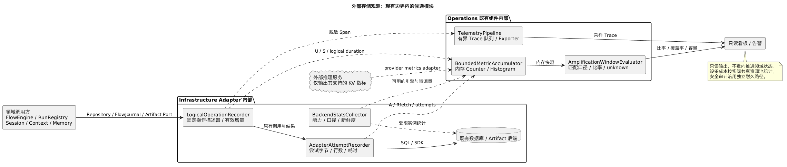

# 外部存储 I/O 监控与放大防线设计

日期：2026-09-08。状态：候选联合评审输入，关联 [ACR-2026-0016](../../../governance/changes/ACR-2026-0016-storage-io-observability.md)。本轮完成监控方案、容量模型及验收设计；尚未实现探针、运行压测或批准存储迁移。本文不是第二套组件规范；批准后按第 12 节归并到现有组件与契约。

## 1. 问题、判断与设计目标

要回答三个问题：一次业务推进究竟引起多少存储工作；大正文和后台维护是否拖慢控制操作；长上下文恢复时间花在哪里。只看磁盘利用率或数据库平均延迟无法区分原因。

例如，只新增 2 KiB 观察，却将 1 MiB 历史重写两份，应用提交量已是有效增量的 1024 倍，还没有计算 WAL、索引、副本或 compaction。即使数据库换成对象存储，全对象反复重写仍然存在。因此先固定计量口径、调用边界和增长测试，再依据证据选择优化。

需校正三个前提：

- 当前代码使用 SQLite WAL；LSM-Tree 是未来后端的一种选择。MemTable 吸收写入不等于持久提交，也不自动解决分布式 CAS 的事务、复制和尾延迟问题。LSM 大值重写确有风险，但不是所有大值负载必然失控。[RocksDB 调优指南](https://github.com/facebook/rocksdb/wiki/RocksDB-Tuning-Guide)
- 总设计中的“黑板”是 `ContextFrame + AgentEvent` 的可重建投影，不是新的共享可变数据库。正文、历史、Memory、控制事实仍各有所有者。
- 通用 FlowRun 的 `Yield` 不等同于推理服务卸载 GPU KV Cache。KV 是推理后端的派生缓存；托管模型是否暴露缓存和卸载指标必须按能力确认。自托管后端可按块分层缓存，而非每次挂起搬运整个会话。[vLLM KV Offloading 指南](https://docs.vllm.ai/en/v0.24.0/features/kv_offloading_usage/)

候选目标：控制路径成本不随正文大小线性增长；长 Run 的正常推进不反复扫描全部历史；普通遥测不产生同步存储依赖；对不可观测的物理量明确报告 unavailable，禁止显示为零。

## 2. 当前工作区证据

核对分支 `codex/arch-agent-system-v3`，HEAD `d298825537b8dc4b98c214f0031a2fa4b893bb66`。存在大量其他未提交变更；以下描述读取时工作区源码，不代表该提交已包含这些实现，也不代表生产性能结论。

| 路径与行为 | 风险与第一批观测点 |
|---|---|
| [SqliteFlowJournal](../../../../src/infrastructure/state-storage/adapters/flow-engine/sqlite-flow-journal.ts) 的 `get → history`；`assertActive → get` 被 start/complete/saveCheckpoint 使用 | 每次控制验证可能读取全部日志及 Activity 正文。记录每操作返回行数、读取字节、解析耗时、历史长度；区分正常推进与显式恢复 |
| [FlowJournalDatabase](../../../../src/infrastructure/state-storage/adapters/flow-engine/flow-journal-database.ts) 的 `history` 使用 `.all()` 并逐行 JSON.parse | 若第 k 次推进读取 O(k) 条记录，N 次累计读取 O(N²)；这是代码路径推导，非物理磁盘实测。完整历史查询也有内存峰值风险 |
| [AgentRunTransaction](../../../../src/infrastructure/state-storage/adapters/run-registry/agent-run-transaction.ts) 的 `save` 全量 stringify；`validClaim` 先 row 再 load，load 再 row | 小状态修改也可能写大快照；重复读取完整行与解析。观测 snapshot 大小、语句次数、逻辑必需字段与实际返回字节 |
| [SqliteRunCommits](../../../../src/infrastructure/state-storage/adapters/run-registry/sqlite-run-commits.ts) 更新快照并写入完整 input/decision 回执、commands、transcript | 分开记录 snapshot、receipt、event、outbox、transcript 的字节；可靠性需要的记录也计成本，不能为了降倍率直接删除回放依据 |
| [SqliteFlowArtifacts / SqliteAdapterMessages](../../../../src/infrastructure/adapters/sqlite-flow-artifacts.ts) 保存正文 TEXT；put 后 get 全量读回校验；每项上限 4 MiB | 应用读后写校验成本、去重命中后的重复读取/哈希成本；当前实现并不能直接接收几十 MiB 单对象 |
| [AgentRunDatabase](../../../../src/infrastructure/state-storage/adapters/run-registry/agent-run-database.ts) 使用同步 DatabaseSync、BEGIN IMMEDIATE、FULL、busy_timeout=5000 | 写锁等待、同步序列化和 checkpoint 可能阻塞事件循环；总事务延迟并不全是介质服务时间 |
| [Composition Root](../../../../src/application/flow-composition.ts) 把业务状态、Artifact、Adapter 消息放进 `flow.sqlite`；系统日志在同目录 `flow-system.sqlite` | 已分两个数据库文件，但默认目录未证明设备隔离，且调用仍在同一进程；“分表/分库即隔离”不能作为验收结论 |

## 3. 所有权与观测拓扑

| 数据/负载类别 | 权威所有者与访问入口 | 候选存储布局 | 要保护的指标 |
|---|---|---|---|
| control | FlowEngine 经 FlowJournal；业务 AgentRun 经 RunRegistry Repository | 小记录、版本/epoch、索引、耐久事件；系统和业务身份分别保留 | begin 等待、事务提交 p99、冲突、stale 拒绝、deadline |
| history | Session/Run 所属组件经 Repository | 追加的事件/转录与可重建摘要投影；大正文引用 | 每推进读取行数、checkpoint 后回放条数、总读取增长率 |
| artifact | ArtifactStorage，经作用域绑定的 Artifact Port | 不可变正文、分块/有界流；先支持本地文件，远端对象后端按部署需求接入 | 首字节、传输字节、有效吞吐、读取利用率、孤儿字节 |
| memory | MemoryManager 的查询/提交 Port | 索引、版本与原文引用分开计量 | 扫描/返回条数、候选与采纳字节、过滤成本 |
| kv_cache | AgentAdapter 下方的外部推理后端 | GPU/主机内存/本地 NVMe/远端缓存的能力档案 | cache hit、恢复关键路径、prefill、TTFT |
| telemetry / audit | Operations；普通遥测与耐久安全审计分离 | 有界遥测缓冲和独立导出；审计保留现有耐久语义 | 遥测开销、丢弃、采集缺口；审计提交失败 |

FlowRun 系统操作与 ReAct 租约操作分别命名和聚合，不给通用 FE 注入 Leased-CAS 业务语义。装配层绑定 `store_role` 和 `resource_pool`：前者为逻辑用途，后者为实际竞争 CPU/设备/连接的资源组。共享设备只能得到池级物理成本，不能凭比例分摊成某 Run 的实测值。

复用已有 LoggingTracingMetrics 与 TelemetryPipeline；不新增存储监控微服务或 Kernel 调度器。[拓扑及内部模块源](storage-observation.puml)：

采集器拥有计量状态，不拥有业务对象。机制健康可以作为诊断输出；本轮没有监控反向改变 FlowRun 状态的路径。限流由现有调用方/Adapter 的显式配置实施，不由告警回调直接调用领域组件。

## 4. 计量边界与放大公式

### 4.1 字节口径

每个指标以 bytes、seconds、operations、rows 为单位。JSON 使用现有序列化后的 UTF-8 字节数，二进制用实际 buffer/stream 长度；禁止用 JavaScript string.length 当字节数。哈希/序列化利用本次已有结果计数，监控不能再次 stringify 大正文或再次读取对象。

对固定业务操作集合（cohort）定义：

| 符号 | 定义及采集位置 |
|---|---|
| U | 唯一、确认已提交的业务有效变更字节；调用方操作描述器按新增事实/被替换字段的新值计一次，不含未变历史和物理副本 |
| S | 为这些已提交逻辑操作生成的一次存储变更集的字节，重试不重复；包含 snapshot、receipt、outbox 等重复表示 |
| A | 所有实际存储尝试提交的参数/载荷字节；重试、失败和部分传输计入，SQL 模板不算正文；操作方向分别累计 |
| I | 引擎确认接纳的逻辑 key/value 字节，只有后端提供明确口径时可用；不能以 A 或 SQLite changes 行数代替 |
| E | 引擎向文件层写入的字节，细分 WAL、flush、compaction、checkpoint、blob GC；必须注明互斥范围 |
| D | 操作系统观测到的设备写入字节，按整个 resource_pool 统计；不是 SSD 内部 NAND 写入量 |
| Rneed | 调用方声明的必需返回数据字节：控制操作为所需状态投影，range read 为请求区间；未知则不计算该比率 |
| Rfetch | Adapter 从数据库/对象 SDK 实际取回的载荷字节；嵌套调用、重试及校验读计入一次，未读完流只计已收字节 |
| Rused | ContextEngine 在去重/裁剪之后实际采纳的来源字节；仅用于上下文利用率，与 Rneed 含义不同 |

U 的操作定义必须固定版本：state update 计变更字段的新值；append 计新记录；artifact put 计新逻辑制品正文，不因底层 dedup 改变；删除计规范逻辑删除记录而不是删除的旧大正文。CAS conflict、幂等重复、只读操作的 U=0，单独报告次数。重试最终成功只计一个逻辑成功；回执未知时先计 A，待通过现有权威回执确认后计 U/S，未确认量单独展示。遥测不创建额外耐久去重表；跨崩溃准确去重由离线实验报告按已有回执完成，线上窗口只作趋势并注明缺口。

### 4.2 不混淆三种放大

- **表示放大** `WA_repr = S / U`：识别全量快照、多份正文和回执复制；只比较匹配的成功操作 cohort。
- **工作负载写入成本** `WA_work = A_all / U_committed`：同时反映失败、重试与无进展工作。不是纯引擎 WA；零进展窗口只报 A、失败/冲突次数和 `no_progress`，不除以零。
- **引擎写放大** `WA_engine = E / I`：只在同一引擎、相同副本范围和足够长观察窗内计算。Compaction 可能偿还过去债务，不能按单次请求归因。
- **设备端到端写成本** `WA_device = D / U`：仅在隔离压测或完整计入该设备全部逻辑业务流量时成立；共享磁盘未覆盖其他进程时标记 unavailable。不能把 E+D 相加，也不能把不同层倍率直接连乘。
- **应用读取放大** `RA_fetch = Rfetch / Rneed`：完整读 4 MiB 而只需 64 KiB，倍率为 64；缓存命中可降低设备读取，但不能掩盖解析成本。
- **上下文读取利用率** `Rused / Rfetch`：例如取回 16 MiB、采纳 1 MiB 为 6.25%。它反映过量获取，不自动等于数据库缺陷；必需授权/因果记录即使未进模型也需单列用途。
- **引擎读成本** 分别报告 block/file read 次数/查询、扫描行数/返回行数、前台/后台读字节；设备读和 SDK read 不互换。空结果以次/查询统计，避免零字节分母。
- **空间成本** `allocated_bytes / live_logical_bytes`，并列 retained history、WAL、orphan、reclaimable；文件逻辑大小、实际分配块数、对象账单容量不能互相替代。

生产按 5 分钟看趋势、1 小时看维护成本；实验按完整 cohort，从预热后固定起点到停止负载并完成约定维护排空。重启、counter reset、拓扑改变、采集超时划断窗口。副本开销由各副本互斥相加，未拿到托管数据库内部指标时只给客户端成本。SSD FTL 的放大仅在设备确实暴露 NAND/host write 计数时另外计算。

## 5. 指标、Trace 与采集实现

以下 `kernel_storage_*` 为候选内部指标名，不冒充现有 Exporter 指标。所有 Counter 在进程内先聚合，Trace 才采样。只允许固定白名单标签；禁止 runId、sessionId、tenantId、对象 ID/摘要、SQL、路径、URL、Prompt 和 KV tensor 内容成为指标标签。

| 指标 | 类型 | 主要用途 |
|---|---|---|
| `kernel_storage_operations_total` | Counter，op/outcome | 成功、conflict、timeout、error、cancelled、unknown；幂等 replay 用固定附加维度 |
| `kernel_storage_duration_seconds` | Histogram，phase | logical 总耗时；adapter；begin_wait；transaction；commit；serialize；parse。嵌套 phase 不可相加作总耗时 |
| `kernel_storage_bytes_total` | Counter，measurement/direction/purpose | measurement 为 useful/representation/attempt/returned；purpose 为 snapshot/receipt/event/outbox/transcript/artifact/verification/other |
| `kernel_storage_rows_total` | Counter，returned/scanned | 读取和扫描增长；scanned 没有引擎证据则 unavailable |
| `kernel_storage_retries_total`、`kernel_storage_conflicts_total` | Counter | 区分 expected_version、claim、busy、transport；冲突不伪装存储故障 |
| `kernel_storage_inflight`、`kernel_storage_queue_depth` | Gauge | 排队和并发；同步 SQLite 的 begin_wait 不伪装为独立 I/O 服务时间 |
| `kernel_storage_payload_bytes` | Histogram | 操作级载荷分布；按控制记录/正文分开 |
| `kernel_storage_observation_available`、`kernel_storage_observation_age_seconds` | Gauge | metric_family 能力与新鲜度，0/过期时面板显示 unknown |
| `kernel_telemetry_dropped_total`、`kernel_storage_observer_errors_total` | Counter | 观测过载、自身故障；不能依赖日志导出才能看见 |

公用标签仅保留 `backend_profile / store_role / resource_pool / op`，按每指标需要选子集。`op` 来自静态目录，未知操作归 other 并计配置错误；禁止用工作流名拼接。实例/主机身份由采集目标元数据提供，资源组为有限部署清单。启动时计算标签乘积与 histogram bucket 后的系列上限；默认预算每实例 20,000 系列、聚合内存 16 MiB，超预算拒绝该遥测配置而非动态创建系列。所有数字为候选预算，需在目标运行时实测。

耗时桶候选：0.0005、0.001、0.0025、0.005、0.01、0.025、0.05、0.1、0.25、0.5、1、2.5、5、10、30、+Inf 秒。payload 桶覆盖 1 KiB 到 64 MiB，KV 单独覆盖 GiB 档。默认 15 秒拉取、1% 正常 Trace；慢调用和失败采用独立有界 reservoir，不能承诺无限量“全部保留”。

Trace 结构：`run.resume → context.assemble → storage.logical → storage.attempt`，模型请求另挂 `model.first_content` 与后端 span link。只在允许的脱敏追踪中保留 operation/flowRun/agentRun 的不透明关联引用；两个 Run 身份由宿主映射，不能靠同字符串推断。span 记录字节、行数、版本化操作模板、attempt_index、cache tier 和稳定错误码，不记录载荷/SQL 参数/物理路径。

### 5.1 内部算法与生命周期

在各 Port 的既有 Adapter 包装层计量，不改纯业务决策函数。`OperationDescriptor` 是装配时注册的固定表，定义 op、store_role、计量版本及该操作 U/Rneed 的算法；各调用方提供已有长度或变更描述，观察器不读取业务对象正文。

1. `LogicalOperationRecorder` 在 Port 入口用单调时钟开始；拿到固定 operation descriptor 与现有关联上下文。记录一次逻辑调用，不把底层每条 SQL 都当业务推进。
2. `AdapterAttemptRecorder` 在实际 SQL/SDK 边界记录每次尝试；SQL 参数按操作模板只统计实际载荷列，每次返回行按已取得值计字节。SDK 自带重试需尝试 hook；无 hook 时仅计可见层并声明 retry_coverage=partial。
3. 成功确认后提交 U/S；冲突/超时/取消也结束 logical 计时。嵌套 SQL/校验读取属于同 operation；Port 层不再把子层字节加一次。stream 返回 handle 不结束计时，EOF/error/cancel 才结束，另记首字节。
4. `BoundedMetricAccumulator` 同步做固定次数的 counter/bucket 更新；`TelemetryPipeline` 异步接收小型 span 摘要。队列默认最多 4096 条且最多 4 MiB；任一上限先到先丢普通 Trace，指标聚合继续。不得把对象体暂存到队列。
5. `BackendStatsCollector` 用独立受限任务收集实例指标，默认 15 秒一次、2 秒 deadline；同步 SQLite 主调用线程上不执行额外全库查询。`CapabilityCatalog` 记录 metric-family 的 supported/unsupported/stale 和口径版本。
6. `AmplificationWindowEvaluator` 仅对相同 store/resource、口径与有效窗口计算比率，不平均各 Run 比率，也不平均 p99；没有分母/覆盖率则输出原因。停止阶段最多 2 秒排空普通遥测；失败仅计 drop，不改业务返回结果。

观察器抛错必须被封装层隔离，但数据库本身错误原样按现有契约传播。遥测出口标记 origin=telemetry，在存储探针中排除递归生成 span；设备总成本仍包括遥测写入。安全审计继续走原耐久通道，不进入可丢弃队列。

新增后端示例：增加 RocksDBStatsCollector 和 capability 映射、装配注册及计量契约用例；逻辑操作描述器和 WindowEvaluator 不增加 `if backend==...` 分派。首版没有公开 StorageObservationPort；上面的协作者是 Adapter/Operations 内部模块建议，不替代 BND-OPS-001。

## 6. 各后端实际能测什么

| 后端/层级 | 首要指标 | 不能伪造的部分 |
|---|---|---|
| 当前 SQLite | begin/commit/事务时间、busy 次数、SQL 调用及返回字节、page_size、DB/WAL 分配量、已执行 checkpoint 的耗时和推进量 | `.changes` 是行数，不是字节；WAL 文件增长不是累计写入字节，文件可复用。Node 当前 API 未核实有 VFS I/O 计数，故首版引擎 E/I 标 unavailable |
| SQLite 后续可选探针 | 受控 VFS/OS 观测或隔离压测中的文件/进程 I/O；已有维护动作记录 checkpoint busy/log/checkpointed frames | `PRAGMA wal_checkpoint(PASSIVE)` 仍会执行 checkpoint，不能当无副作用的监控查询高频调用；默认监控不新增 checkpoint/VACUUM |
| RocksDB 类后端 | ingest/WAL/flush/compaction/blob GC 字节，pending compaction bytes、L0 files、stall 时间、block cache、前台/后台读 | Properties 与 Statistics 按固定后端版本映射并去重；只看 compaction write 不等于全部写放大；没有 BlobDB 时不报 blob 指标 |
| 远端 SQL/KV | pool wait、事务/条件写延迟、server queue/lock、复制提交延迟、throttle、连接/网络重试 | 客户端无法推断引擎压实量或物理副本开销；由服务端 exporter/云监控提供，权限不足标 unavailable |
| 文件/对象存储 | request 次数、TTFB、range requested/served、实际 bytes、multipart/retry、checksum 时间、流内存、孤儿回收量 | SDK 参数长度不等于线上传输量；TLS/重传/服务端副本和 GC 没有证据不估成精确值 |
| 主机/设备 | read/write bytes、IOPS、await/队列、CPU/iowait、事件循环延迟、RSS、剩余空间/inode、网络吞吐/重传 | 100% disk util 不是所有 NVMe 的绝对饱和判据；需与延迟、队列和已测有效带宽联合判断 |

SQLite 的 checkpoint 会把 WAL 内容移回主文件，可能使个别 COMMIT 变慢；长读事务还可能限制 checkpoint 推进。[SQLite WAL 官方说明](https://sqlite.org/wal.html) 因此本地版先测写锁、checkpoint 和同步线程阻塞，不套用 LSM 告警。

## 7. KV Cache 与恢复关键路径

### 7.1 两种能力档案

`provider_managed`：仅采集客户端请求等待、首个内容 token、总耗时及后端实际提供的缓存 token 信息；KV 字节、GPU 利用率、offload 时间均为 unavailable。缓存 token 命中不证明发生了磁盘卸载。

`self_hosted_kv_observable`：从推理服务收集各层 hit/miss、逐段 load/store bytes/time、排队、eviction、prefetch used/wasted、prefill tokens/time、decode 首 token。能力可按指标族部分可用，版本由后端 connector 档案固定，不把某版本指标名写进 Kernel 公开 DTO。

KV 由模型版本、tokenizer、精确 token 前缀、位置/attention 配置、KV dtype/layout、并行分片、adapter/LoRA、可信安全作用域等绑定；键与校验细节归提供方。失配、过期、缺块、校验失败或权限不匹配视为 cache miss，允许在原模型语义和预算内重新 prefill。若模型版本本身不可用则失败，不能为命中缓存静默换模型。KV 不替代权威 transcript/Artifact；丢失 cache 不授权重放未知工具副作用。

### 7.2 容量与带宽下界

对普通 dense attention/GQA、单序列无共享、无量化/滑动窗口等优化的示例：

`KV bytes ≈ 2 × layers × tokens × kv_heads × head_dim × bytes_per_element`。

32 层、8 KV heads、128 head_dim、BF16 2 bytes、131072 tokens，合计 17,179,869,184 bytes，即 **16 GiB**。这是总逻辑 KV，不能再机械乘 tensor-parallel 卡数；实际分片/复制、分页和量化以引擎报告为准，MLA/混合 attention 不能套这个公式。

传 4 GiB 在 200 ms 内完成仅载荷就需要 **20 GiB/s**；16 GiB 则需 **80 GiB/s**。100 Gbit/s 链路理论约 11.64 GiB/s，4 GiB 单次传输下界约 344 ms，尚未包含队列、存储读取与 CPU→GPU。因此“几百毫秒恢复任意长上下文”不能作为无条件 SLO。

按需命中的字节 B 和同时恢复数 C 规划：`required_pool_bandwidth ≥ C × B / transfer_budget_seconds`。使用压测得到的持续有效带宽，预留控制 I/O 与维护余量，不使用厂商峰值；块并行和流水化可减少关键路径，不能省略瓶颈链路字节。

### 7.3 分解两个用户可见时间

- `resume_ready_seconds`：宿主收到有效唤醒到恢复权威状态、完成当前授权检查且可派发新模型请求。分项记录调度等待、日志回放、Context 读取/组装。
- `resume_first_content_seconds`：有效唤醒到新的首个内容 token；不把 ACK/role/heartbeat 当 token。
- `model_ttft_seconds`：模型请求发出到首个内容 token，包含提供方排队、cache load、剩余 prefill、首步 decode 与响应网络。

总时间按同一请求的关键路径追踪，不能相加各阶段 p99；GPU/CPU/存储流水线的重叠也不能重复计时。客户端缺后端 span 时将该段标为 opaque provider time，不强行归因存储。

自托管路径优先测 GPU→CPU→本地 NVMe 的命中和块复用，再评估远端层是否净获益；官方 vLLM 示例也将主机内存作为 GPU 与次级层之间的中转。[分层缓存机制](https://docs.vllm.ai/en/v0.24.0/features/kv_offloading_usage/) 选择 cache load 或 recompute 应由推理提供方依据能力和预算处理；本轮 Kernel 只观测结果，不实现新 KV 调度器。

## 8. 看板与告警

四页看板：①控制路径 p50/p95/p99、超时与写锁；②按 op/purpose 的表示/工作负载/引擎放大和每推进成本；③设备/数据库后台工作与容量；④恢复路径、cache tier、TTFT。每页同时显示采集覆盖率、数据年龄、部署配置版本与 baseline。

以下为待压测校准的候选门槛，不是已有线上 SLO：

| 信号 | 候选规则 | 响应 |
|---|---|---|
| 控制延迟 | 同负载档案下混合负载 p95 比控制独占退化 >10%，或 p99 >20 ms，持续 5 分钟且窗口 ≥1000 次 | 检查事件循环→begin_wait→commit→设备/维护；20 ms 仅本地评审目标，远端档案单定 |
| 低流量 | 不足样本不推断稳定 p99；单次超过操作 deadline 仍计超时 | 保留慢 trace，禁止因流量低把业务不可用显示为健康 |
| 无进展与冲突 | 有尝试流量而 U=0 持续 1 分钟；或 conflict/attempt >5% 持续 5 分钟 | 核对 epoch/version 与重复派发，避免把每次 conflict 都升级为数据库故障 |
| 应用放大 | 固定 op/profile 的 WA_repr 或 RA_fetch 比获准 baseline 增长 >25% 持续 15 分钟，累计 U 或 Rneed ≥1 MiB | 定位 purpose 与慢 trace；不同 op 不共用一个绝对倍率门槛 |
| LSM 维护 | pending compaction 连续 15 分钟增长且出现 write stall / 控制 SLO 违约 | 只在该后端启用；检查容量与后台带宽，不直接关耐久化 |
| SQLite 维护 | 已有 checkpoint 连续受阻、WAL 分配量增长且伴随控制延迟，或 busy 超时 | 找长事务/读取与写锁竞争；不自动执行 TRUNCATE/VACUUM |
| 资源容量 | 剩余容量 <20% 或按最近 1 小时正增长预计 <6 小时耗尽 | 容量工单和新 bulk 流量预算；同时显示历史保留/GC 债务 |
| KV 恢复 | 对指定 tokens/tier/concurrency 档案，resume_first_content 超预算且 cache load 占关键路径 | 检查 tier 命中、恢复并发与带宽，不用全局 TTFT 均值判断 |
| 观测失效 | 数据年龄 >45 秒、观察器错误或 drop >1% 持续 5 分钟 | 标记诊断可信度下降；普通遥测故障不阻塞 Run，审计仍按原规则 |

告警只是相关性线索。因果确认采用控制独占/混合负载的 A/B，保持持久性、业务正确性和请求到达率一致。人为减少负载、降低 synchronous、关闭审计得到的低延迟不能计为修复收益。

## 9. 从监控到防止后续难改

首版必须预留逻辑层，而非马上部署多种数据库：Port 计量、资源组身份、可替换 Adapter、大小/读取预算与未知指标表达。以下优化需在计量基线后分别评审：

1. **控制热路径只取必要投影。** FE 的当前状态投影可在追加事件的同一事务内更新并带最后应用 sequence；日志仍是恢复权威，投影可重建。历史 API 显式分页/流式；不能偷偷截断回放历史，也不能把进程内缓存当唯一事实。这样正常推进不需重复扫描完整历史。
2. **正文保持不可变引用。** StateStorage 保存有界元数据，Artifact 保存正文；可比较本地文件 Artifact 与当前 SQLite 实现。LSM 后端可考虑 integrated BlobDB 的 key/value separation，但需要计入 blob GC 和空间成本，不因采用它就宣称完全隔离。[RocksDB BlobDB](https://github.com/facebook/rocksdb/wiki/BlobDB)
3. **大小和增量规则进入契约。** 候选目标：单 control payload 默认 ≤16 KiB，硬上限候选 64 KiB；更大结果显式发布 Artifact，再写引用。当前 API 没有这些保证，不能直接加拒绝导致原功能消失。既有 4 MiB Artifact 限制保留为当前事实；未来大对象改有界流/分块，不只提高常数。历史采用增量追加，投影压缩按重建成本触发，不按每 token 重写全历史。
4. **对象与状态的提交窗口。** Artifact 先完成临时上传、校验并发布，再由原领域入口原子提交引用和事件。写引用前取得有截止时间的 pin/发布保护；GC 必须尊重活跃 pin 和持久引用。对象成功、状态冲突/崩溃时重试通过既有 operation ID 对账；不得提前删除可能仍被在途提交引用的对象。状态已提交而对象丢失须报完整性故障，不能伪装 cache miss。具体 pin 与 GC 事务协议为迁移前必需设计，不是本轮已实现能力。
5. **资源隔离按瓶颈升级。** 分连接/并发预算先行；同步 DB 工作若阻塞共享事件循环，后续考虑专用执行线程；大正文与控制数据同 SSD 时仍需共享池带宽和容量限制，必要时独立设备。只分表、column family、bucket 或文件路径不足以证明 CPU/磁盘/网络隔离。

控制事务内不得执行模型/对象网络 I/O，普通遥测不得与控制事实同事务；审计的原有原子/耐久需求必须另行保留。本文不批准移除完整回执、放松 fsync、删除日志或变更恢复语义。

## 10. 性能与故障验收设计

所有下列条目均为待实现/待运行用例。固定本地 Faux Provider；不调用真实付费模型。磁盘压力与空间不足仅在独立临时数据目录和受限测试卷/故障替身执行，不触碰用户工作库。

### 10.1 负载矩阵

| ID | 场景与输入 | 观察与候选验收 |
|---|---|---|
| IO-01 | 定义固定计量向量：U=2048、S=2×1048576、两次等长提交 A=4194304 | WA_repr=1024，WA_work=2048；验证失败重试不重复计 U/S，嵌套 Adapter 不重复计字节 |
| IO-02 | 控制 1 KiB 记录，1/8/32 并发；control-only，然后叠加 64 KiB/1 MiB/4 MiB Artifact、去重 put、校验读取 | 保持相同 offered control rate，分别记录成功/超时/被拒绝；按第 8 节比较 p95/p99，不能以丢请求改善延迟 |
| IO-03 | 固定每条日志 256 bytes；从 N=100、1000、10000 连续 Activity 推进，再独立执行一次恢复 | 当前全历史路径应暴露 O(N²) 累计读取趋势。优化目标：N→10N 时正常推进累计逻辑读取 ≤15 倍；同倍率超出 15 的恢复成本需单独解释，不允许把恢复扫描混入正常路径掩盖问题 |
| IO-04 | 历史正文 64 KiB/1 MiB/4 MiB，但单次只改 2 KiB；再只修改固定控制字段 | 验证 snapshot/receipt 字节随历史增长。目标：引用化后控制读取/写入不随正文大小增长；目标布局上线前不得假称已达到 |
| IO-05 | 4 MiB 对象只需 64 KiB 范围；重复完整读取 vs range；Context 16 MiB 取回、1 MiB 采纳 | 前者 RA_fetch=64，后者目标接近 1 并明确块对齐开销；Context 利用率为 6.25%，正文不进入 Trace |
| IO-06 | 当前 SQLite 长读者+持续写入+已有 checkpoint；未来 RocksDB 数据大于 block cache、持续覆盖写、GC/compaction 排空 | 延迟、WAL/维护债务和分配空间可关联；WAL 文件复用时计量不能误报零写入；只有来源充分才计算物理倍率 |
| IO-07 | 同步提交前/后故障、回执丢失、CAS 冲突、重试 1/3 次、重启 counter reset | U 最终去重，未知单列；存储正确性、唯一执行资格和 UNKNOWN_SIDE_EFFECT 行为保持；失效窗口不输出伪倍率 |
| IO-08 | 未来对象发布后、引用提交前/后崩溃；GC 与在途引用竞争；流读中取消 | 不发布悬空引用、不删除活跃 pin/权威引用；保留可查 orphan，流内存有界；实现后才验证 |
| IO-09 | Exporter 断网/阻塞 10 分钟、队列满、observer 异常、遥测自身写存储 | Run 结果不变，无递归记录；队列/聚合内存不超预算。启用监控相对禁用 p95/CPU 退化目标 ≤5%，并满足治理默认 ≤10% |
| IO-10 | KV 字节模拟 1/4/16 GiB，恢复并发 1/4/16，热/冷/50% 命中，限速链路 | 先验证排队/带宽下界及 unsupported 表达；模拟测试不能证明真实 GPU TTFT。真实后端验收另测 engine transfer/prefill 与端到端首内容 |
| IO-11 | 相同 token 前缀但权限域/模型版本/LoRA/layout 不同，缺块或损坏 | cache miss 或明确失败；禁止跨作用域命中，不能重放外部工具副作用 |
| IO-12 | 两个逻辑库同磁盘，对照不同设备/执行线程；空闲与大流量测试 | 证明池级干扰来源；共享设备物理倍率不归因到单 op；迁移前后协议与耐久设置相同 |

使用开环固定到达率，端到端延迟从计划到达时间记起，避免服务变慢后压测器自动发得更少造成“协调遗漏”。同时报告实际到达率、完成率、排队/拒绝/超时；单独固定并发测试用于容量曲线，不与开环 SLO 混算。

每档至少三次独立重复，候选预热 5 分钟、稳态 30 分钟且控制样本至少 10,000；达不到样本量标为不足。缓存热/冷和数据量超过可用缓存的场景分别报告；压实类测试在负载结束后继续观测维护排空，未排空则不能宣称稳态引擎 WA。随机种子、字节分布、读写比、操作频率、索引、压缩、持久性、连接、设备和其他负载均固定记录。

### 10.2 报告协议与证据

后续测试输出候选 `.artifacts/storage-io/report.json`（本轮未创建运行报告），至少有：schemaVersion、commit、工作区相关文件摘要、backend/runtimeVersion、hardwareProfile、dataset/seed、configHash、durability、cacheState、offered/completed/rejected/timedOut、measurementWindow、sampleCount、rawCounters、histograms、capabilities、coverage、maintenanceDrain、derivedRatios、thresholdProfile、checks、status。

status 为 pass/fail/inconclusive；缺服务端指标、指标丢失、样本不足或压实未排空只影响对应 check 的可信度，必需 check 不可用时总结果不得 pass。UTC 记录窗口，单调时钟记录持续时间；p99 从 histogram 合并而非平均分位数。运行输出与代码/配置摘要绑定，图和阈值不作为测试已通过的证据。

### 10.3 SFMEA

| 失效 | 系统影响 | 检测 | 控制/恢复 | 用例 |
|---|---|---|---|---|
| 全历史重复扫描 | CPU/内存/读取随长 Run 膨胀 | 行数/推进与 N 的增长曲线 | 保留权威日志，评审有界投影与增量读取 | IO-03 |
| 大正文与控制共享资源 | commit/恢复超时 | op 尾延迟+资源池后台负载 | bulk 并发/大小预算，必要时执行线程与设备隔离 | IO-02/06/12 |
| 重试风暴或无进展 CAS | 写入量高但业务停滞 | A、U、conflict 与 unknown | 原调用方有界退避/对账；未知副作用不盲重试 | IO-07 |
| 采集器卡住/过载 | 观测本身放大 I/O | observer errors/drop/自身成本 | 有界缓冲、过期标记、旁路失败 | IO-09 |
| 对象提交与 GC 竞争 | 恢复引用悬空 | missing/pin/orphan 计数 | pin 与引用保护；原入口对账，禁止提前 GC | IO-08 |
| KV 恢复洪峰/失配 | TTFT 飙升或错误复用 | tier load/queue/miss 与端到端 Trace | 提供方能力档案、限并发、预算内重新 prefill | IO-10/11 |

## 11. 上下层一致性与评审结论

| 上层约束及来源 | 本方案落实 | 结论与范围 |
|---|---|---|
| [总设计](../../agent-kernel-design.md) §6.1 黑板、§11 Context/Memory 所有权 | §3 不新增黑板聚合，§4 在所有者给出逻辑增量 | 一致；未改变业务数据所有权 |
| 总设计 UP-INF-001/002、UP-DEP-001/002 | §5 Adapter 探针、装配注册，Core 不导入具体后端 | 一致；新后端采集能力仍需实现验证 |
| [Infrastructure 层](../../layers/infrastructure-plane/README.md)、[StateStorage](../../layers/infrastructure-plane/components/state-storage.md)、[ArtifactStorage](../../layers/infrastructure-plane/components/artifact-storage.md) | §3/9 保持机制/领域边界和不透明引用 | 一致；跨存储 pin/GC、range 流式契约上层未细定，作为迁移前开放项 |
| [Operations 层](../../layers/operations-plane/README.md)、[BND-OPS-001](../../contracts/bnd-ops-001.md) | §5 指标旁路、有界队列、审计分离；§8 告警不调 Run | 一致；普通遥测丢弃不能扩展到安全审计 |
| [FlowEngine 当前入口](../../layers/l1-control/components/flow-engine/README.md) 的单 FlowRun/FlowJournal 边界 | §2/3 系统与业务存储分测；§7 不把挂起映射为 GPU 卸载 | 一致；不依赖跨 Flow 调度方案，也不沿用历史纯 ReAct FE 定位 |
| [BND-INF-001](../../contracts/bnd-inf-001.md) 的具体 Adapter 隔离 | §6 后端能力与 unknown；§7 provider 私有指标 | 一致；KV 导出控制不属于本轮公共协议 |
| [ACP-001](../../../governance/architecture-change-process.md) 的性能波动预算 | §8/10 指定基线、≤10%治理预算及更严候选目标 | 一致；具体硬件/流量 SLO 上层未定义，待校准 |

五视角自审：架构采用现有组件；安全使用白名单与 scope 隔离；数据保持原提交/回放语义并显式计入冗余；测试覆盖增长、混合负载、故障及计量正确性；运维显示不可测/过期并区分因果与相关。以上是本轮自审，不代表独立复核或总体批准。

## 12. 落地顺序与开放项

| 阶段 | 输出与归并位置 | 验收出口 |
|---|---|---|
| P0 先看清当前实现 | 将 §4/5 指标口径归并 BND-OPS-001、LoggingTracingMetrics、TelemetryPipeline；StateStorage/ArtifactStorage 描述现有计量位置；实现 SQLite/Journal/Artifact 包装探针 | IO-01/02/03/04/07/09 的实际报告；建立原始 baseline，不以当前性能差阻止计量正确性验收 |
| P1 处理已测放大 | 根据 baseline 独立评审热状态投影、增量读取、正文引用和资源预算；更新 FlowJournal/Artifact 契约与组件算法、迁移/回退用例 | IO-02/03/04/05/08/12 达到批准后的目标，恢复和幂等不变量保持 |
| P2 按真实部署扩展 | BackendStatsCollector 的 RocksDB/远端服务映射、KV provider 指标与容量档案 | IO-06/10/11；有真实推理证据才能声称 GPU/TTFT 验证 |

开发前开放项：固定每个 op 的 U/Rneed 描述器和配置 Schema、确认运行时可用的计量 hook、批准具体性能档案；P1 还需确定投影 Schema/回放窗口与对象 pin/GC 事务协议。P2 取决于实际选定的存储与推理提供方，不能提前承诺 GB 级 KV 的恢复时间。

P0 不改持久化格式，可通过装配开关移除探针；记录比较时的开关配置。P1 是独立数据变更：先准备显式版本与存量读取/迁移方案，验证旧日志可重建，切换后只有旧程序可读新格式时才能直接回退，否则需保留迁移前副本及反向迁移程序；不得通过换物理库名打开空库，也不自动删除旧正文。

本轮完成度：监控设计与验收场景已覆盖；公共 Schema、性能基线、优化详细数据协议、生产指标均未完成。设计评审与实现交付分开记录，检查结论见 ACR；[输入与图形摘要](evidence.json)绑定本次工作区来源，不是性能测试报告。
