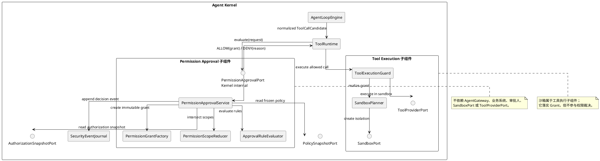
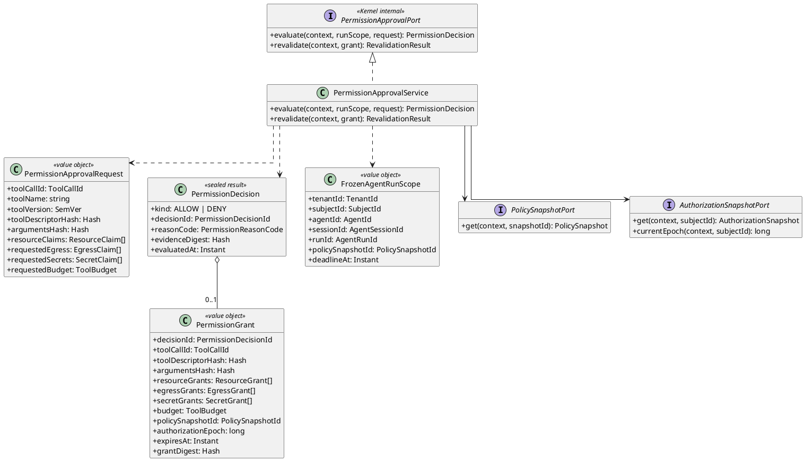
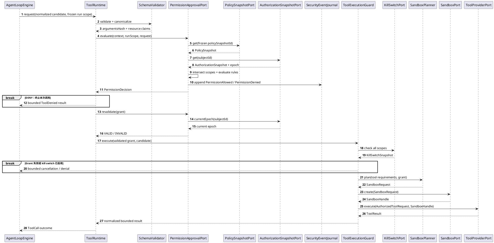

# Permission Approval 子组件详细设计

> 文档状态：设计草案，待架构评审与 ACR 确认后进入实现基线
>
> 版本：0.3.0
>
> 日期：2026-09-03
>
> 适用范围：LawClaw Agent Kernel 内部对单次 ToolCall 的权限判定、最小权限收敛、授权 Grant 生成与审计

## 1. 目的

Permission Approval 是 Agent Kernel 内部的权限决策子组件。它回答一个问题：在当前 Runtime、Session、AgentRun 和 ToolCall 的冻结约束下，这次候选调用是否允许，以及最多允许哪些能力。

它不实现人工审批，不创建业务 `ApprovalCase`，不接收外部系统决定，也不直接执行工具。业务系统、模型 Runtime 和 Tool Provider 都不能调用该子组件。

本设计中的“审批”是 Kernel 内部的技术权限判定，不是人在环审批。若未来需要人在环确认，应作为独立扩展设计，通过 Agent Kernel 的公共协议接入，不能把业务工作流放入本子组件。

## 2. 系统边界

### 2.1 调用边界

Permission Approval 的唯一调用方是 Agent Kernel 内部的 `ToolRuntime`。它只暴露内部 `PermissionApprovalPort`，不进入 `AgentGateway`、JSONL 方法目录或 Provider SDK。



### 2.2 边界规则

| 方向 | 允许 | 禁止 |
|---|---|---|
| `ToolRuntime` → Permission Approval | 提交已规范化、绑定 Run 的权限请求 | 提交原始模型文本或要求绕过政策 |
| Permission Approval → `ToolRuntime` | 返回不可变 `ALLOW(grant)` 或 `DENY(reason)` | 调用 Provider、创建沙箱或推进 Agent Loop |
| Permission Approval → Policy/Auth ports | 读取指定版本的权威快照 | 修改身份、角色或政策 |
| Permission Approval → Event Journal | 追加脱敏的权限决定事件 | 发布业务事件或写入工具结果 |
| Tool Execution → Sandbox | 用 Grant 和工具隔离要求创建执行环境 | 要求审批子组件选择沙箱实现 |

`AgentGateway` 不能暴露 `approveTool()`、`submitDecision()` 或等价方法。`AgentLoopEngine` 也不能绕过 `ToolRuntime` 直接调用审批服务。

## 3. 与四对象模型的关系

Permission Approval 不是新的聚合根。权限请求和决定都是一次 `AgentRun` 内、单个 `ToolCall` 的短生命周期值对象：

```text
RuntimePolicy
  ∩ SessionPermissionCeiling
  ∩ FrozenAgentRunScope
  ∩ ToolDescriptorPolicy
  ∩ CurrentAuthorizationSnapshot
  ∩ CandidateResourceClaims
  = PermissionGrant 或 DENY
```

`Runtime` 提供系统级权限上限和权威端口；`Session` 提供会话权限上限；`AgentRun` 冻结本次执行范围和政策版本；每个 `ToolCall` 只能继续缩小这些权限。

## 4. 设计目标与非目标

### 4.1 目标

- 默认拒绝未知工具、未知资源和不完整上下文；
- 对 Runtime、Session、Run、工具和资源权限求交集，只减不增；
- 决定绑定精确 ToolCall、工具版本、参数哈希、资源声明和政策版本；
- 返回可供执行层消费的最小 `PermissionGrant`；
- 同一冻结输入产生确定性决定；
- 决定、拒绝原因和政策证据可审计但不泄露敏感内容；
- 执行前支持快速再校验，防止授权撤销后的旧决定被使用。

### 4.2 非目标

- 不实现人工审批、审批流、通知、组织 RBAC 或业务 `ApprovalCase`；
- 不向 Agent Kernel 外部暴露任何审批接口；
- 不创建、选择、启动或销毁沙箱；
- 不执行工具，不调用 Tool Provider；
- 不把 `ALLOW` 解释为工具执行成功；
- 不允许模型、Provider 或业务调用方提供权威权限结论。

## 5. 零信任不变量

1. **唯一内部入口**：只有 `ToolRuntime` 可以调用 `PermissionApprovalPort`。
2. **默认拒绝**：缺少身份、租户、Run、工具、Schema、政策或资源信息时返回 `DENY`。
3. **权限只减不增**：下层不能覆盖上层权限上限。
4. **调用级授权**：一个 Grant 只绑定一个 ToolCall，不支持工具名或路径通配授权。
5. **内容不可替换**：工具版本、参数、资源、主体或政策变化使决定失效。
6. **短时有效**：Grant 有绝对过期时间，不超过 Run deadline。
7. **Provider 不可信**：Provider 不能读取政策快照或请求扩大 Grant。
8. **审批不替代沙箱**：逻辑上允许的调用仍必须经过执行守卫和必需沙箱。
9. **沙箱不替代审批**：能够隔离执行不代表主体有权访问目标资源。
10. **失效优先**：authorization epoch、policy epoch 或 kill switch 变化阻止旧 Grant 执行。

## 6. 组件职责

| 组件 | 职责 | 明确禁止 |
|---|---|---|
| `PermissionApprovalService` | 编排快照读取、权限收敛、规则判定和决定生成 | 调用 Provider 或 Sandbox |
| `PermissionScopeReducer` | 对各层工具、资源、网络、Secret 和预算范围求交集 | 使用“后者覆盖前者”扩权 |
| `ApprovalRuleEvaluator` | 对规范化事实执行稳定规则 | 读取模型自然语言作为权威政策 |
| `PermissionGrantFactory` | 生成不可变、短时、调用级 Grant | 生成可跨 ToolCall 重放的票据 |
| `PolicySnapshotPort` | 提供指定版本的冻结技术政策 | 在一次判定中静默切换版本 |
| `AuthorizationSnapshotPort` | 提供主体授权快照和撤销 epoch | 把模型声明当作身份 |
| `SecurityEventJournal` | 保存脱敏决定证据 | 保存参数正文、Secret 或裸路径 |
| `ToolExecutionGuard` | 在子组件外执行再校验并协调沙箱 | 修改 PermissionDecision |

## 7. 领域模型

### 7.1 类图



### 7.2 决定模型

首版只有两个终态结果：

| 结果 | 含义 | 后续动作 |
|---|---|---|
| `ALLOW(grant)` | 当前冻结条件下允许指定能力 | 进入 `ToolExecutionGuard` 再校验 |
| `DENY(reason)` | 当前调用不可执行 | 产生有界 `ToolDenied` 结果 |

不设计 `PENDING`、`APPROVED`、`WAITING_DECISION` 或外部 `decision.submit`。如果某项政策需要人工确认，首版必须返回 `DENY(HUMAN_CONFIRMATION_UNSUPPORTED)`，不能保持无限等待或偷偷放行。

## 8. 权限判定算法

判定顺序固定如下：

1. 验证 `RequestContext`、租户和主体；
2. 验证 Session、Run、Turn 和 ToolCall 归属；
3. 解析冻结版本的 `ToolDescriptor` 和政策快照；
4. 验证参数 Schema，并对参数和资源声明做规范化；
5. 读取当前 authorization snapshot 和 epoch；
6. 对 Runtime、Session、Run、工具描述符和主体授权求交集；
7. 验证请求的文件、网络、Secret、进程和预算均在交集内；
8. 生成 `DENY(reason)`，或生成只包含交集结果的 `PermissionGrant`；
9. 原子追加脱敏决定事件；
10. 将决定返回 `ToolRuntime`。

任何步骤出错都失败关闭。规则求值不得发起网络请求，也不得在一次判定中读取不同版本的政策。

## 9. 内部接口契约

```ts
/** Kernel 内部接口；不得从公共 Gateway、Runtime adapter 或 Provider 导出。 */
export interface PermissionApprovalPort {
  evaluate(
    context: RequestContext,
    runScope: FrozenAgentRunScope,
    request: PermissionApprovalRequest,
    signal: AbortSignal,
  ): Promise<PermissionDecision>;

  revalidate(
    context: RequestContext,
    grant: PermissionGrant,
    signal: AbortSignal,
  ): Promise<RevalidationResult>;
}

export interface PermissionApprovalRequest {
  readonly toolCallId: ToolCallId;
  readonly toolName: string;
  readonly toolVersion: SemVer;
  readonly toolDescriptorHash: Hash;
  readonly argumentsHash: Hash;
  readonly resourceClaims: readonly ResourceClaim[];
  readonly requestedEgress: readonly EgressClaim[];
  readonly requestedSecrets: readonly SecretClaim[];
  readonly requestedBudget: ToolBudget;
}

export type PermissionDecision =
  | {
      readonly kind: "ALLOW";
      readonly decisionId: PermissionDecisionId;
      readonly reasonCode: "POLICY_ALLOWED";
      readonly grant: PermissionGrant;
      readonly evidenceDigest: Hash;
      readonly evaluatedAt: IsoInstant;
    }
  | {
      readonly kind: "DENY";
      readonly decisionId: PermissionDecisionId;
      readonly reasonCode: PermissionDenialReasonCode;
      readonly evidenceDigest: Hash;
      readonly evaluatedAt: IsoInstant;
    };
```

接口约束：

- 输入必须来自 `ToolRuntime` 已完成 Schema 规范化的候选调用；
- `request` 不包含 `SandboxHandle`、沙箱实现名称或 Provider 凭据；
- `grant` 不包含可由 Provider 修改的政策对象；
- 相同冻结输入应得到相同结果语义，decisionId 和时间字段除外；
- 取消或 deadline 到期时返回稳定拒绝，不留下待决状态。

## 10. Kernel 内部调用时序



图中审批子组件在返回 `ALLOW(grant)` 后结束本次职责。沙箱规划、创建和 Provider 调用都由工具执行子组件负责。

## 11. 审批与沙箱的关系

### 11.1 两者解决不同问题

| 机制 | 回答的问题 | 典型输入 | 典型输出 |
|---|---|---|---|
| Permission Approval | “这个主体在这次 Run 中最多可以做什么？” | 身份、Run scope、工具、参数哈希、资源声明、政策 | `PermissionGrant` 或 `DENY` |
| Sandbox | “如何强制工具只能在获批范围内运行？” | Grant、工具隔离要求、宿主能力 | `SandboxHandle` 或创建失败 |

审批属于控制平面，沙箱属于执行强制平面。它们是串联的两道独立防线：

```text
ToolCallCandidate
  → Schema / resource normalization
  → Permission Approval
  → PermissionGrant
  → execution-time revalidation
  → SandboxPlanner 将 Grant 映射为可执行限制
  → SandboxPort 创建隔离环境
  → ToolProvider 在 SandboxHandle 中执行
```

### 11.2 唯一衔接契约

两者不互相调用。`PermissionGrant` 是它们之间由 `ToolExecutionGuard` 转交的唯一权限契约：

- Approval 只描述获批资源、网络出口、Secret 使用方式、预算和有效期；
- `SandboxPlanner` 将这些逻辑能力映射成只读挂载、临时写目录、网络 allowlist、Secret 注入句柄、进程和资源限制；
- `SandboxPort` 不能完整落实 Grant 时必须失败关闭；
- Sandbox 只能进一步缩小 Grant，不能补充新的文件、网络、Secret 或进程能力；
- Sandbox 返回的是执行句柄，不得反向改变 PermissionDecision。

### 11.3 为什么 Approval 不绑定沙箱实现

Approval 不保存 `sandboxProfileHash`、Sandbox 实例 ID 或实现名称。这些属于执行机制，写入审批绑定会导致权限政策和平台实现耦合。

需要绑定的是逻辑能力和工具隔离要求：工具、参数、资源、出口、Secret、预算和政策版本。执行层据此选择满足或强于要求的沙箱。如果平台更换了等价或更强的沙箱实现，不需要重新定义权限规则；如果新环境无法满足要求，则拒绝执行。

### 11.4 双重校验

`ToolRuntime` 在把 Grant 交给 `ToolExecutionGuard` 前必须调用 `revalidate(grant)`；随后执行守卫在创建沙箱前必须：

1. 验证收到的是刚完成再校验的同一个 Grant digest；
2. 检查 Runtime、Session、Run、Tool 的 kill switch；
3. 验证 `SandboxPlanner` 的输出是 Grant 的子集；
4. 验证实际 Sandbox 能力不弱于 ToolDescriptor 的隔离要求；
5. 将 Grant digest、Sandbox plan digest 和 Sandbox instance digest 写入执行审计。

因此，审批通过不保证一定执行；沙箱不可用、能力不足、Grant 失效或 kill switch 命中时，Provider 都不能启动。

## 12. Kill switch 的位置

Kill switch 不是审批规则，也不是沙箱功能。它是高优先级运行时停止机制：

- 模型暴露工具前检查一次；
- ToolCall 创建时检查一次；
- Approval 返回后、沙箱创建前再次检查；
- Provider 执行前再次检查；
- 执行中通过取消信号和 `SandboxPort.terminate()` 强制停止。

Permission Approval 可以把当前 epoch 写入 Grant，但最终阻断由 `ToolExecutionGuard` 执行。任何上层 kill switch 命中都不能通过重新审批解除。

## 13. 审计与数据最小化

最小事件：

| 事件 | 触发条件 | 最小载荷 |
|---|---|---|
| `PermissionAllowed` | 生成 Grant | decisionId、toolCallId、grantDigest、policySnapshotId、authorizationEpoch、expiresAt |
| `PermissionDenied` | 权限判定拒绝 | decisionId、toolCallId、reasonCode、policySnapshotId |
| `PermissionInvalidated` | 执行前再校验失败 | decisionId、toolCallId、reasonCode、currentEpoch |
| `PermissionConsumed` | Grant 被用于创建一次执行授权 | decisionId、toolCallId、executionId、grantDigest |

不得记录完整工具参数、Prompt、ToolResult、Secret、物理路径或身份令牌。资源仅记录类型、脱敏标签或不可逆摘要。

决定事件必须与 ToolCall 状态变更处于同一原子提交边界，或使用可证明不丢失的 Outbox。事件消费者只用于审计和观测，不能驱动权限状态迁移。

## 14. 稳定拒绝码

| 错误码 | 语义 | retryable |
|---|---|---:|
| `PERMISSION_CONTEXT_INVALID` | 上下文缺失、归属不一致或无法验证 | 否 |
| `PERMISSION_TOOL_NOT_ALLOWED` | 工具不在有效权限交集 | 否 |
| `PERMISSION_RESOURCE_OUT_OF_SCOPE` | 请求资源超出允许范围 | 否 |
| `PERMISSION_EGRESS_NOT_ALLOWED` | 网络出口不在 allowlist | 否 |
| `PERMISSION_SECRET_NOT_ALLOWED` | Secret 能力未授予 | 否 |
| `PERMISSION_BUDGET_EXCEEDED` | 请求预算超出 Run 上限 | 条件性 |
| `PERMISSION_POLICY_MISSING` | 冻结政策不可读取或版本未知 | 否 |
| `PERMISSION_GRANT_EXPIRED` | Grant 已过期 | 否 |
| `PERMISSION_GRANT_STALE` | policy/auth epoch 或调用绑定已变化 | 否 |
| `HUMAN_CONFIRMATION_UNSUPPORTED` | 政策要求人在环，但首版未提供该扩展 | 否 |

错误不得泄露跨租户资源是否存在。

## 15. 测试与验收

### 15.1 契约测试

- 公共 `AgentGateway` 和 JSONL 方法目录不存在审批方法；
- 业务模块、Runtime adapter 和 Provider 不能导入 `PermissionApprovalPort`；
- 只有 `ToolRuntime` 组合根获得审批端口实例；
- Approval 决定不包含 Sandbox 实例、实现名称或 Provider 凭据；
- Sandbox 只接收 Grant 派生的执行约束。

### 15.2 安全负向测试

- Runtime、Session、Run、工具和资源权限任一为空时默认拒绝；
- 参数、工具版本、资源或主体替换使 Grant 失效；
- policy/auth epoch 变化阻止执行；
- Sandbox plan 扩大 Grant 时拒绝；
- 沙箱不可用或隔离能力不足时不得回退宿主执行；
- Provider 不能请求额外文件、网络、Secret 或进程权限；
- kill switch 在各检查点均能阻止新动作。

### 15.3 性质测试

- 单调性：减少上游权限不能增加最终 Grant；
- 交集性：Grant 始终是所有上游 scope 的子集；
- 确定性：相同冻结输入产生相同决定语义和 grantDigest；
- 不可替换性：任一绑定字段变化都会改变摘要或导致拒绝；
- 失败关闭：Port 超时、异常和未知状态均不产生 Grant。

验收要求：外部审批调用入口、权限扩大、Grant 重放、沙箱扩权和 kill switch 绕过成功数必须为零。

## 16. 从当前代码迁移

1. 定义仅 Kernel 内可见的 `PermissionApprovalPort` 和 DTO；
2. 实现规范化资源声明和 `PermissionScopeReducer`；
3. 接入冻结 `PolicySnapshotPort` 与 `AuthorizationSnapshotPort`；
4. 实现确定性 `PermissionGrantFactory` 和稳定拒绝码；
5. 由 `ToolRuntime` 在 Schema 验证后调用审批端口；
6. 由 `ToolExecutionGuard` 完成 Grant 再校验、kill switch 和 Sandbox 编排；
7. 增加安全事件、原子提交和数据脱敏；
8. 完成权限单调性、Sandbox 子集约束和失败关闭测试；
9. 删除或禁止 `decision.submit`、业务 ApprovalCase 和外部审批 Bridge 契约；
10. 通过 ACR 更新总体 Run 状态机：首版不再引入 `WAITING_DECISION`。

未经新的 ACR，不得增加人在环审批、外部决定接口、持久等待状态或允许审批绕过静态权限与沙箱。
