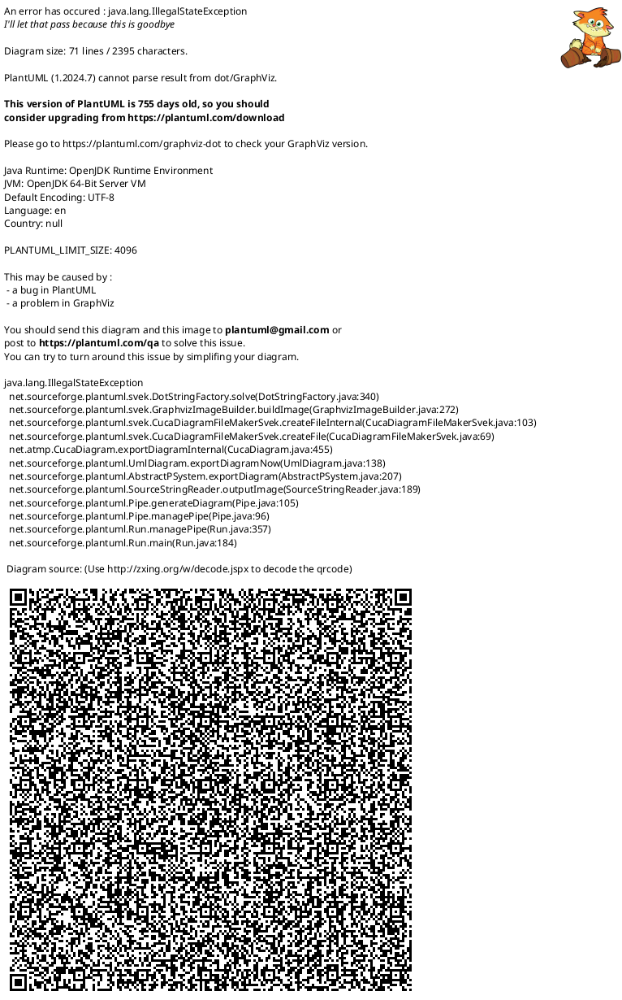
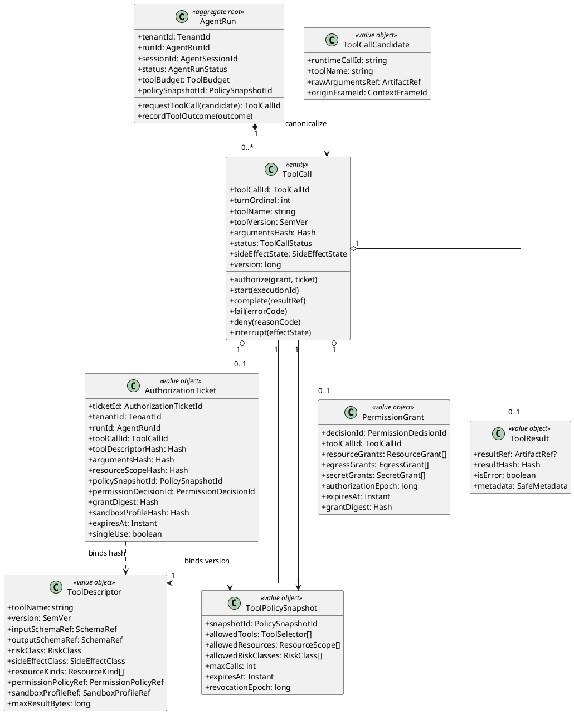
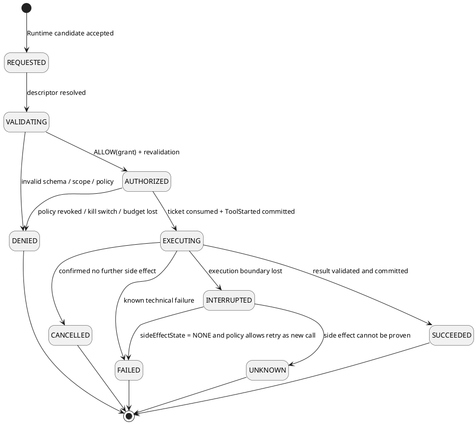
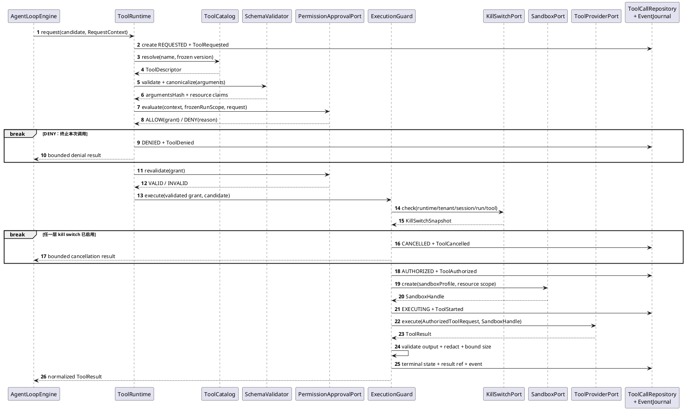
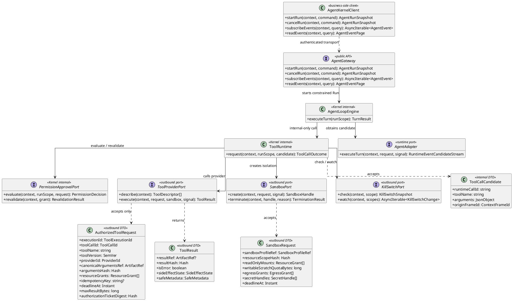
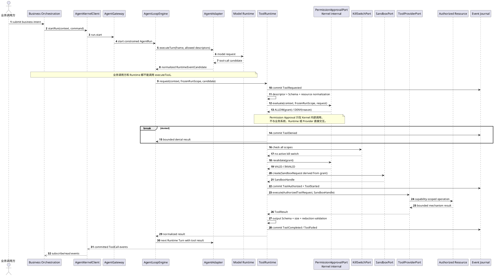

# ToolCall 子组件详细设计

> 文档状态：设计草案，待架构评审与 ACR 确认后进入实现基线
>
> 版本：0.3.0
>
> 日期：2026-09-03
>
> 适用范围：LawClaw Agent Kernel 的工具发现、内部权限判定、隔离执行、结果归一化与审计

## 1. 目的

本文把现有 `ToolRuntime` 的静态白名单原型扩展为最小零信任 ToolCall 子组件。该子组件必须保证：模型只能提出候选动作，任何工具调用都必须经过独立验证、Kernel 内部权限判定、最小权限收敛、沙箱隔离、执行时再校验和完整审计，Runtime 或 Provider 均不能自行扩大权限。

本文细化现有总体设计，不改变以下职责边界：

- Backend 负责认证、RBAC 和签发可信 `TenantContext`；
- Agent Kernel 内部的 Permission Approval 子组件拥有 ToolCall 权限判定；
- 权限判定不对业务系统、模型 Runtime 或 Provider 暴露接口；
- Tool Provider 只提供受控执行机制，不拥有授权和审批策略；
- Pi Runtime 只产生规范化工具调用候选，不直接执行 Provider。

## 2. 与四对象模型的关系

ToolCall 不是第五个顶层聚合根。它是 `AgentRun` 聚合内的有界实体，由一次 Runtime Turn 产生，并通过事件与所在 Session、Run 和 Turn 关联。

```text
Runtime
  └─ Session
      └─ AgentRun（聚合根）
          └─ Agent Loop
              └─ Turn
                  └─ ToolCall（Run 内实体）
                      └─ PermissionDecision / PermissionGrant（值对象）
```

Runtime 负责能力目录和基础设施装配；Session 负责会话级权限上限；AgentRun 冻结本次执行政策；ToolCall 只能在三者权限交集内继续收敛，不能向上扩权。

### 2.1 系统边界与调用方向

ToolCall 没有面向用户或业务系统的公开 `executeTool` 接口。业务系统只能通过 `AgentGateway.startRun()` 提交受约束的 AgentRun；具体 Runtime 在一次 Turn 中返回工具调用候选，Kernel 再决定是否执行。真正跨出 Kernel 的调用方向是 Kernel 主动调用 `SandboxPort` 和 `ToolProviderPort`，而不是 Provider 回调 Kernel 请求授权。



### 2.2 边界规则

| 边界 | 调用方向 | 允许数据 | 禁止事项 |
|---|---|---|---|
| 业务系统 → Agent Kernel | `AgentKernelClient` → `AgentGateway` | Run 命令、Context/Tool Policy 引用、取消和事件查询 | 直接构造 ToolCall、直接调用 Provider、覆盖授权票据 |
| Kernel → Runtime | `AgentAdapter.executeTurn()` | ContextFrame、已允许暴露的 ToolDescriptor 快照 | Runtime 自行执行工具或返回原生 Provider 对象 |
| Kernel 内部 | `AgentLoopEngine` → `ToolRuntime.request()` | 规范化 `ToolCallCandidate` 和冻结 RunScope | 将该方法暴露为外部 RPC |
| Kernel → 受限执行域 | `SandboxPort`、`ToolProviderPort` | `AuthorizedToolRequest`、资源授权和 deadline | 传递原始身份凭据、宿主绝对路径或可扩权策略 |
| Provider → 外部资源 | capability-scoped mechanism | 沙箱映射、Egress grant、SecretHandle | 使用宿主默认网络、环境变量或文件权限 |
| Kernel → 业务系统 | 已提交 AgentEvent | 脱敏状态、哈希、ArtifactRef | 参数、结果正文、Secret 或授权票据 |

## 3. 设计目标与非目标

### 3.1 目标

- 所有工具默认拒绝，只有版本明确且命中有效政策的工具可被模型发现；
- 对参数执行完整 JSON Schema 校验和工具专属语义校验；
- 将身份、租户、Session、Run、工具和资源权限收敛为不可变 PermissionGrant；
- 权限判定只由 `ToolRuntime` 在 Kernel 内部调用，不产生外部审批请求；
- 工具只在匹配的沙箱和出口策略中执行；
- 支持 Run、Session、租户和 Runtime 级 kill switch；
- ToolCall 状态、决定依据和结果可持久化、可审计、可补拉；
- 对超时、取消、崩溃和未知副作用采用默认安全行为。

### 3.2 非目标

- 不实现人工审批、业务 ApprovalCase 或外部决定提交协议；
- 不允许 Tool Provider 动态下载代码或自行注册未评审能力；
- 不承诺任意外部副作用的 exactly-once；
- 不允许 Permission Approval 把一个不在静态权限内的工具变为可用；
- 首版不支持跨 Run 复用授权票据或 PermissionGrant；
- 不把工具结果解释为业务事实或直接修改业务状态。

## 4. 零信任不变量

1. **候选不等于授权**：Runtime 输出的 `tool_call` 只能创建 `ToolCall` 候选。
2. **逐次验证**：每次调用都验证上下文、政策版本、参数、资源范围、PermissionGrant、沙箱和 kill switch。
3. **权限只减不增**：有效权限是所有上游权限集合的交集。
4. **权限判定不能扩权**：PermissionGrant 必须是全部上游权限的交集或子集。
5. **参数不可替换**：PermissionDecision、授权和执行绑定同一个规范化参数哈希。
6. **Provider 不可信**：Provider 只能收到 `AuthorizedToolRequest`，且仍受沙箱、超时和结果限制。
7. **执行前再校验**：PermissionGrant 交给执行层后必须重新检查有效期、撤销、预算、资源和 kill switch。
8. **未知副作用不重放**：崩溃时无法证明未产生副作用的调用进入 `UNKNOWN`，禁止自动重试。
9. **先记录后执行**：`ToolAuthorized` 或 `ToolStarted` 必须先持久化，才能触发外部执行。
10. **终态不可逆**：ToolCall 终态不能被重复决定或覆盖。

## 5. 组件职责

| 组件 | 职责 | 明确禁止 |
|---|---|---|
| `ToolCatalog` | 保存版本化、签名或受信配置来源的 `ToolDescriptor` | 根据用户输入动态下载工具 |
| `ToolRuntime` | 协调完整 ToolCall 生命周期 | 内联具体 Provider 或绕过 Permission Approval |
| `PermissionApprovalPort` | Kernel 内部计算有效权限并返回 `ALLOW(grant)` 或 `DENY(reason)` | 暴露为外部 RPC、执行工具或创建沙箱 |
| `ToolExecutionGuard` | Grant、资源、预算、kill switch 和执行前再校验 | 自行放宽政策 |
| `ToolSchemaValidator` | 执行 JSON Schema 2020-12 和受控格式校验 | 执行任意自定义代码 |
| `ToolSemanticValidator` | 执行路径、目标、数据分类等工具专属校验 | 替代通用 Schema 校验 |
| `SandboxPort` | 创建隔离执行单元并强制文件、网络、进程和资源限制 | 决定工具是否有业务权限 |
| `KillSwitchPort` | 查询和订阅分层紧急停止状态 | 代替正常授权政策 |
| `ToolProviderPort` | 在授权请求与沙箱句柄下执行机制 | 接收原始 Runtime 调用或扩大资源范围 |
| `ToolCallRepository` | tenant-scoped ToolCall 状态和条件更新 | 保存 Secret 或裸参数正文 |
| `EventJournal` | 追加严格有序、脱敏的 AgentEvent | 先发布后提交 |

## 6. 领域模型

### 6.1 类图



### 6.2 ToolCall 状态



`UNKNOWN` 是安全终态，不代表执行失败且无副作用。它必须进入人工或业务补偿路径，不能自动重放。

## 7. 描述符与风险模型

`ToolDescriptor` 必须至少包含：

| 字段 | 语义 |
|---|---|
| `toolName`、`version` | 稳定名称和精确语义版本；Run 启动后不得漂移 |
| `providerId`、`implementationDigest` | 绑定受信 Provider 及实现摘要 |
| `inputSchemaRef`、`outputSchemaRef` | JSON Schema 2020-12 引用及内容哈希 |
| `riskClass` | `READ_ONLY`、`MUTATING`、`NETWORK`、`PRIVILEGED` |
| `sideEffectClass` | `NONE`、`IDEMPOTENT`、`NON_IDEMPOTENT`、`UNKNOWN` |
| `resourceKinds` | 文件、网络目标、Secret、进程或业务资源类型 |
| `permissionPolicyRef` | Kernel 内部权限政策引用；不包含外部审批地址 |
| `parallelSafety` | 是否允许同一 Run 内并发 |
| `sandboxProfileRef` | 必需的不可变沙箱档案 |
| `maxArgumentsBytes`、`maxResultBytes` | 输入输出硬上限 |
| `defaultTimeoutMs` | 默认单次执行期限，不得超过 Run 剩余 deadline |
| `dataAccess` | 可读取和可产生的数据分类上限 |

未知字段、未知风险、未知 Schema 主版本、无法验证的实现摘要都必须拒绝注册。

## 8. 最小权限收敛

有效权限采用交集而非覆盖：

```text
EffectiveCapability =
  RuntimeCapability
  ∩ TenantAuthorizationSnapshot
  ∩ AgentCapability
  ∩ SessionCapability
  ∩ AgentRunToolPolicy
  ∩ ToolDescriptorCapability
  ∩ PermissionGrant
  ∩ CurrentKillSwitchState
```

每层都可以缩小工具、资源、风险、网络、Secret、时间、次数和结果大小，但不能扩大上一层。授权结果必须生成不可变 `AuthorizationTicket`，绑定：

- tenant、subject、agent、session、run、turn 和 tool call；
- 精确工具版本、实现摘要和 Provider；
- 规范化参数哈希和资源范围哈希；
- Policy Snapshot、authorization snapshot 和 revocation epoch；
- PermissionDecision ID 与 grant digest；
- 沙箱档案哈希、有效期和 single-use 标记。

授权票据只用于进程内或受认证的 Sidecar 内部调用，不向模型、业务编排或 Provider 暴露可重放凭据。

## 9. 工具调用流程



Permission Approval 返回 `ALLOW(grant)` 后结束权限判定职责。`ExecutionGuard` 独立完成 Grant 再校验、kill switch、沙箱创建和 Provider 调用；审批子组件不调用 `SandboxPort`。

## 10. 参数与资源验证

验证顺序固定如下：

1. 解析精确工具版本并验证描述符完整性；
2. 限制原始参数字节数和嵌套深度；
3. 使用 JSON Schema 2020-12 校验类型、required、format、范围和 `additionalProperties`；
4. 生成确定性 canonical JSON 和 `argumentsHash`；
5. 提取资源声明，例如相对路径、主机名、SecretHandle 或业务资源引用；
6. 对每个资源执行 tenant 和授权范围检查；
7. 执行工具专属语义验证；
8. 生成只包含规范化资源引用的执行请求。

路径工具必须防止绝对路径、`..`、符号链接、硬链接、设备文件和 TOCTOU。仅执行 `realpath` 后再用普通路径打开仍不足够；基础设施实现应优先使用目录句柄相对打开、禁止跟随链接和执行后文件身份复核。

## 11. 沙箱执行边界

### 11.1 沙箱档案

`SandboxProfile` 至少冻结：

- 只读输入根和可写临时根；
- 允许的文件类型、文件大小和打开文件数；
- 网络默认关闭；如允许，使用目标、协议、端口和 DNS 解析结果白名单；
- 允许的环境变量和 SecretHandle，默认空环境；
- CPU 时间、墙钟时间、内存、进程数和输出字节数；
- 是否允许创建子进程；
- Provider 可执行文件摘要和工作目录；
- kill grace period 和强制终止策略。

沙箱不可用、档案版本未知或实际隔离能力弱于描述符要求时，工具调用必须拒绝，不能降级为宿主进程直接执行。

### 11.2 首版建议

- 三个内置只读工具仍可进程内执行，但必须使用独立的 `InProcessReadOnlySandbox` 档案并明确其能力上限；
- Shell、写文件、MCP、网络和第三方 Provider 必须使用进程外沙箱；
- 进程外沙箱通过 `ProcessSupervisorPort` 创建，Provider 只能看到授权资源映射；
- 沙箱输出先写临时 Artifact，验证后再原子提交。

### 11.3 模块归属与物理拆分

沙箱归属 **Tool Execution Security（工具安全执行）子组件**，不归属 Permission Approval（权限审批/安全审核）子组件。实现拆成三层：

| 层 | 归属 | 内容 | 依赖方向 |
|---|---|---|---|
| 执行安全编排 | Agent Kernel / ToolRuntime | `ToolExecutionGuard`、`SandboxPlanner`、Grant 子集校验、失败关闭 | 消费 PermissionGrant，调用 SandboxPort |
| 稳定机制契约 | Kernel contracts | `SandboxPort`、`SandboxRequest`、`SandboxHandle`、终止结果 | 不依赖具体 OS、容器或进程库 |
| 隔离机制实现 | Infrastructure / Adapter | `InProcessReadOnlySandbox`、进程沙箱、文件挂载、网络隔离、资源限制 | 实现 SandboxPort，由 Composition Root 注入 |

Permission Approval 只产生逻辑权限，不导入 `SandboxPort`。具体 Sandbox Adapter 也不导入审批服务，只接收经过执行守卫收敛的 `SandboxRequest`。这样既避免审批政策与 macOS/Linux 实现耦合，也禁止基础设施反向参与授权裁决。

如果未来模型执行、代码解释器或子 Agent 也需要相同隔离机制，可以复用 `SandboxPort` 和 Infrastructure Adapter；各调用方仍必须拥有自己的执行守卫，不能把共享沙箱变成共享授权服务。

## 12. Kill switch 集成

Kill switch 是授权之外的紧急拒绝层，支持以下作用域：

```text
GLOBAL > RUNTIME > TENANT > AGENT > SESSION > RUN > TOOL > TOOL_CALL
```

任一上层作用域关闭即拒绝下层新动作。检查点包括：工具暴露给模型前、ToolCall 创建时、PermissionGrant 生成后、授权票据消费时和 Provider 执行前。执行中的调用收到关闭信号后：

1. 停止产生新的模型、工具和子 Run 动作；
2. 传播取消信号；
3. 等待有界协作终止；
4. 必要时由 `ProcessSupervisorPort` terminate/kill；
5. 持久化触发作用域、原因码、操作者引用和终止结果；
6. 无法证明副作用状态时标记 `UNKNOWN`。

## 13. 内部权限判定衔接

`PermissionApprovalPort` 只可返回：

- `ALLOW(grant)`：当前冻结条件下允许 Grant 中的最小能力；
- `DENY(reason)`：当前调用不可执行。

首版没有 `REQUIRE_APPROVAL`、外部决定或等待状态。`DENY` 默认产生有界 `ToolDenied` 结果供模型调整方案；只有冻结政策明确声明必须终止 Run 的风险场景才取消 Run。

权限判定与沙箱的职责分离、Grant 衔接契约见 [technical-approval-subsystem-design.md](technical-approval-subsystem-design.md)。

## 14. 幂等、并发与副作用

- `(tenantId, runId, toolCallId)` 唯一；同 ID 不同参数哈希返回冲突；
- 同一个 `AuthorizationTicket` 只能消费一次；
- 工具预算采用持久化 reservation，先预留再执行，失败后是否归还由冻结政策决定；
- 首版同一 Run 顺序执行 ToolCall；并行执行需要描述符 `parallelSafety=true` 且资源范围不冲突；
- `NONE` 调用可在确认未开始时安全重试；
- `IDEMPOTENT` 调用只能使用 Provider 支持的幂等键重试；
- `NON_IDEMPOTENT` 和 `UNKNOWN` 在执行边界失联后禁止自动重试；
- 权限判定受独立 deadline 和并发上限约束，不产生持久等待状态。

## 15. 持久化与事件

### 15.1 ToolCall 最小持久字段

- tenant/session/run/turn/tool call ID；
- 工具名、版本、Provider 和实现摘要；
- 参数 ArtifactRef、参数哈希和资源范围哈希；
- Policy Snapshot、authorization snapshot 和 revocation epoch；
- 状态、side-effect state、版本号和 deadline；
- PermissionDecision ID、grant digest、授权票据摘要和沙箱档案哈希；
- 结果 ArtifactRef、结果哈希、安全元数据和稳定错误码；
- created/updated/started/completed 时间。

### 15.2 事件目录

| 事件 | 关键安全载荷 |
|---|---|
| `ToolRequested` | toolCallId、toolName、toolVersion、argumentsHash |
| `ToolValidationFailed` | reasonCode、schemaVersion；不含原始参数 |
| `ToolPermissionAllowed` | decisionId、grantDigest、policySnapshotId、authorizationEpoch |
| `ToolPermissionDenied` | decisionId、reasonCode、policySnapshotId |
| `ToolAuthorized` | ticketId 摘要、policySnapshotId、sandboxProfileHash |
| `ToolDenied` | reasonCode、onDeny |
| `ToolStarted` | executionId、providerId、sandboxInstanceId 摘要 |
| `ToolCompleted` | resultRef、resultHash、sideEffectState |
| `ToolFailed` | errorCode、retryable、sideEffectState |
| `ToolCancelled` | cancelReason、terminationMode、sideEffectState |
| `ToolInterrupted` | lastKnownPhase、sideEffectState |

参数正文、Secret、物理路径和 ToolResult 正文不得进入普通事件或日志。

## 16. 稳定错误码

| 错误码 | 语义 | retryable |
|---|---|---:|
| `TOOL_NOT_ALLOWED` | 工具或风险不在有效权限交集 | 否 |
| `TOOL_DESCRIPTOR_INVALID` | 描述符或实现摘要不可信 | 否 |
| `TOOL_SCHEMA_INVALID` | 参数不符合 Schema | 否 |
| `TOOL_RESOURCE_DENIED` | 资源不属于授权范围 | 否 |
| `TOOL_PERMISSION_DENIED` | Kernel 内部权限判定拒绝调用 | 否 |
| `TOOL_PERMISSION_STALE` | Grant 绑定或政策/授权 epoch 已变化 | 否 |
| `TOOL_SANDBOX_UNAVAILABLE` | 无满足要求的执行隔离 | 条件性 |
| `TOOL_KILL_SWITCH_ACTIVE` | 某层紧急停止已启用 | 否 |
| `TOOL_BUDGET_EXCEEDED` | 次数、时间或资源预算不足 | 否 |
| `TOOL_EXECUTION_FAILED` | Provider 已知技术失败 | 取决于副作用分类 |
| `TOOL_SIDE_EFFECT_UNKNOWN` | 无法证明是否产生副作用 | 否 |
| `TOOL_RESULT_INVALID` | 结果 Schema、大小或脱敏失败 | 否 |

## 17. 故障处理

| 故障点 | 安全行为 |
|---|---|
| ToolCall 创建前崩溃 | 无持久记录，不执行 Provider |
| REQUESTED 后崩溃 | Run 启动扫描转 `INTERRUPTED`；不自动执行 |
| 权限判定期间崩溃 | 不产生 Grant；Run 恢复时将原 ToolCall 转 `INTERRUPTED` |
| `ToolAuthorized` 后、执行前崩溃 | single-use ticket 未消费，可由明确恢复策略处理；首版不自动恢复 |
| `ToolStarted` 后失联 | 根据 Provider 证据标记 `NONE` 或 `UNKNOWN` |
| Provider 返回、结果提交前崩溃 | 不向模型暴露；非幂等调用不得重试 |
| 结果提交后、事件发布前崩溃 | 从 Journal 补拉 |
| kill switch 在 Grant 生成后开启 | 执行前再校验并拒绝 |
| Policy Snapshot 被撤销 | 未开始调用拒绝；执行中调用按撤销政策取消 |

## 18. 可观测性

最小 Span：`tool.resolve`、`tool.validate`、`permission.evaluate`、`permission.revalidate`、`tool.sandbox.create`、`tool.execute`、`tool.result.validate`。允许记录工具稳定名称、版本、状态、风险码、字节数、耗时和不可逆桶化租户标签；禁止记录参数、结果正文、Secret 和裸路径。

最小指标：

- 按风险和结果分类的调用数；
- 默认拒绝和权限允许率；
- Schema、资源和沙箱拒绝数；
- 权限判定与再校验时长；
- Provider 执行时长和取消时长；
- `UNKNOWN` 副作用数；
- kill switch 触发数；
- pending ToolCall 和权限判定并发水位。

## 19. 接口与外部调用

### 19.1 接口分层

ToolCall 使用三组不同可见性的接口：

1. **业务公开接口**：`AgentGateway`。业务系统启动/取消 Run 和读取事件，不直接执行工具；
2. **Kernel 内部接口**：`ToolRuntime.request()` 与 `PermissionApprovalPort`。前者只接受 `AgentLoopEngine` 的候选，后者只接受 `ToolRuntime` 的权限请求；两者都不进入 JSONL 方法目录；
3. **Kernel 下行 Port**：`ToolProviderPort`、`SandboxPort`、`KillSwitchPort`。由 Kernel 主动调用具体基础设施或 Provider。

### 19.2 接口类图



### 19.3 TypeScript 契约草案

```ts
/** Kernel 内部入口；不得从 AgentGateway、JSONL 或业务代码直接调用。 */
export interface ToolRuntime {
  request(
    context: RequestContext,
    runScope: FrozenAgentRunScope,
    candidate: ToolCallCandidate,
    signal: AbortSignal,
  ): Promise<ToolCallOutcome>;
}

/** 具体 Runtime 只产生候选事件，不能获得 ToolProviderPort。 */
export interface AgentAdapter {
  executeTurn(
    context: RequestContext,
    request: AgentTurnRequest,
    signal: AbortSignal,
  ): AsyncIterable<RuntimeEventCandidate>;
}

/** Kernel 主动调用的工具机制端口。 */
export interface ToolProviderPort {
  describe(
    context: RequestContext,
  ): Promise<readonly ToolDescriptor[]>;

  execute(
    context: RequestContext,
    request: AuthorizedToolRequest,
    sandbox: SandboxHandle,
    signal: AbortSignal,
  ): Promise<ToolResult>;
}

/** 授权后才能构造；不包含可由 Provider 修改的 ToolPolicy。 */
export interface AuthorizedToolRequest {
  readonly executionId: ToolExecutionId;
  readonly toolCallId: ToolCallId;
  readonly toolName: string;
  readonly toolVersion: SemVer;
  readonly providerId: ProviderId;
  readonly canonicalArgumentsRef: ArtifactRef;
  readonly argumentsHash: Hash;
  readonly resourceGrants: readonly ResourceGrant[];
  readonly idempotencyKey?: string;
  readonly deadlineAt: IsoInstant;
  readonly maxResultBytes: number;
  readonly authorizationTicketDigest: Hash;
}

/** 沙箱机制端口；能力不足时拒绝，不得退回宿主执行。 */
export interface SandboxPort {
  create(
    context: RequestContext,
    request: SandboxRequest,
    signal: AbortSignal,
  ): Promise<SandboxHandle>;

  terminate(
    context: RequestContext,
    handle: SandboxHandle,
    reason: TerminationReason,
  ): Promise<TerminationResult>;
}

/** 分层紧急停止状态的权威读取端口。 */
export interface KillSwitchPort {
  check(
    context: RequestContext,
    scopes: readonly KillSwitchScope[],
  ): Promise<KillSwitchSnapshot>;

  watch(
    context: RequestContext,
    scopes: readonly KillSwitchScope[],
  ): AsyncIterable<KillSwitchChange>;
}
```

`ToolProviderPort.execute()` 不能接收 `ToolPolicy`、原始 `authorizationSnapshot` 或完整 `AuthorizationTicket`。Provider 只能消费已经收敛的资源 grant 和不可用于扩权的 ticket digest。

### 19.4 完整跨边界调用时序



### 19.5 Provider 注册和发现

Provider 不是系统外部调用者，不能运行时向 Kernel 推送注册请求。注册方向固定为：

```text
Composition Root
  → 构造经过配置和实现摘要校验的 ToolProviderPort
  → ToolCatalog.refresh() 主动调用 provider.describe()
  → 验证 ToolDescriptor
  → 生成不可变 Catalog Snapshot
  → AgentRun 冻结所使用的工具版本集合
```

动态下载、Provider 自注册、模型指定 Provider 地址和同一 Run 内描述符热替换均默认禁止。Catalog 更新只影响尚未启动的新 Run。

### 19.6 远程 Provider

如未来 Provider 位于独立进程或服务，必须由 `ToolProviderClient` 实现相同 `ToolProviderPort`：

- 使用受认证的本地 IPC 或 mTLS；
- 每帧大小、并发、deadline 和响应 Buffer 有硬上限；
- 请求绑定 executionId、toolCallId、argumentsHash 和 ticket digest；
- Provider 不能从传输层获得宿主文件系统或环境变量；
- 断线后的副作用状态默认为 `UNKNOWN`，除非 Provider 提供可验证幂等和执行查询协议；
- 不允许 Provider 通过回调接口请求额外资源，任何扩权都必须创建新的 ToolCall。

### 19.7 事件消费者

业务系统可以通过 `subscribeEvents()` 或 `readEvents()` 观察 `ToolRequested`、`ToolDenied`、`ToolCompleted` 等已提交事件，但事件消费者不是工具调用者。它不能：

- 用事件数据直接重放 ToolCall；
- 向 Provider 发送执行请求；
- 修改 ToolCall 状态；
- 把 `ToolCompleted` 自动解释为业务状态已经生效。

事件消费者不能提交、覆盖或恢复 PermissionDecision。权限判定始终由 `ToolRuntime` 内部同步触发；详细边界见 [Permission Approval 子组件设计](technical-approval-subsystem-design.md#2-系统边界)。

## 20. 测试与验收

### 20.1 契约测试

- ToolDescriptor 版本、Schema、实现摘要和未知字段拒绝；
- Provider 只能收到 `AuthorizedToolRequest`；
- Runtime 原生 Tool 类型不越过 Adapter；
- 所有 Port 显式携带 `RequestContext`。
- AgentGateway 和 JSONL 方法目录不存在 `executeTool`；
- ToolRuntime 内部入口不能从业务模块导入；
- Provider 只能收到 `AuthorizedToolRequest` 和 `SandboxHandle`；
- Provider 不能主动注册、请求扩权或绕过 SandboxPort。

### 20.2 安全负向测试

- 未注册工具、错误版本、额外参数、嵌套炸弹和超大参数；
- 路径穿越、符号链接、硬链接和 TOCTOU；
- 跨租户资源、过期 authorization snapshot、撤销政策；
- PermissionGrant 参数替换、工具版本替换和 ticket 重放；
- 沙箱不可用时不得回退宿主执行；
- 网络、Secret、进程和文件权限默认关闭；
- kill switch 在每个检查点触发；
- 日志和事件无参数、正文、Secret 和物理路径。

### 20.3 韧性测试

- 每个持久化窗口故障注入；
- Provider 忽略 Abort 时强制终止；
- 权限判定、工具队列和结果 Buffer 上限；
- 非幂等工具崩溃后不重放；
- 事件提交后发布和断线补拉；
- 多 ToolCall 竞争预算和取消传播。

验收要求：跨租户逃逸、权限判定绕过、沙箱降级和 ticket 重放成功数必须为零。

## 21. 从当前代码迁移

1. 扩充 `ToolDescriptor` 与 `ToolPolicy`，引入精确版本、Schema validator、side-effect 和 sandbox 元数据；
2. 将当前 `ToolRuntime.execute()` 拆分为 candidate、validation、decision、authorization 和 execution 阶段；
3. 引入 `ToolCall` 实体、Repository、持久化 reservation 和完整事件；
4. 接入仅 Kernel 内可见的 `PermissionApprovalPort`，返回 `ALLOW(grant)` 或 `DENY(reason)`；
5. 引入 `SandboxPort`、`KillSwitchPort` 和 `ProcessSupervisorPort`；
6. 将三个只读工具迁移到 `InProcessReadOnlySandbox`；
7. 完成安全负向、故障注入和日志泄漏门禁后，再评审写入、Shell、MCP 或网络工具。

未经新的 ACR，不得启用会扩大能力面的工具类别。
