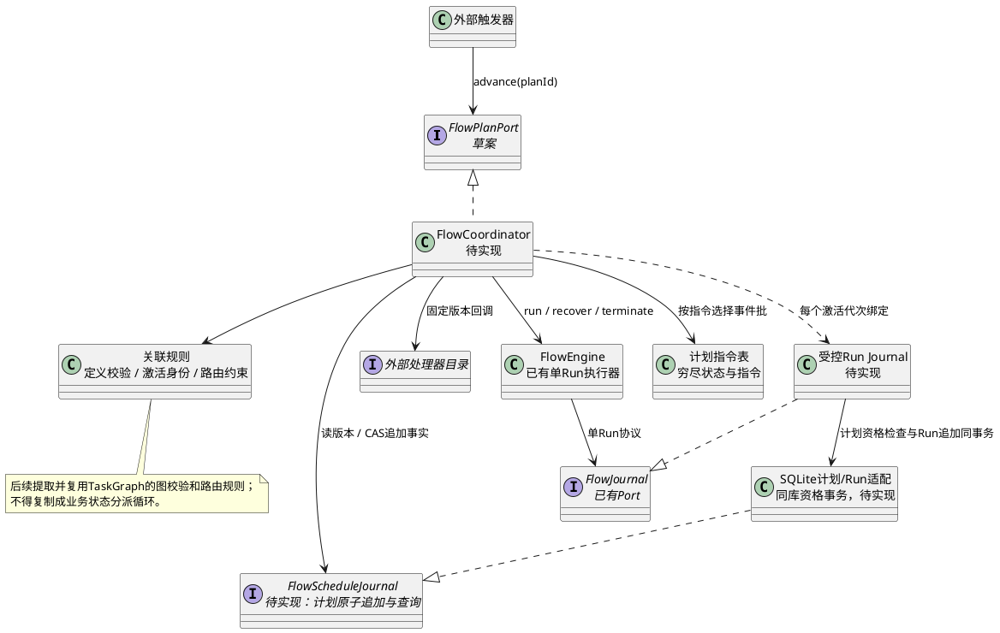
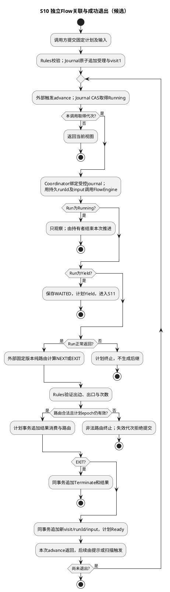
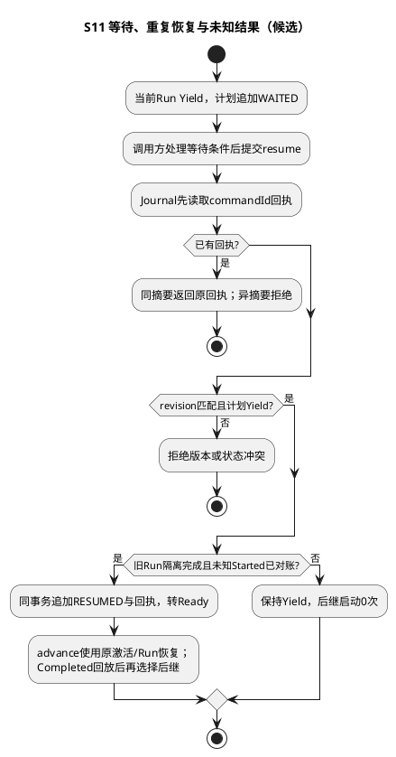
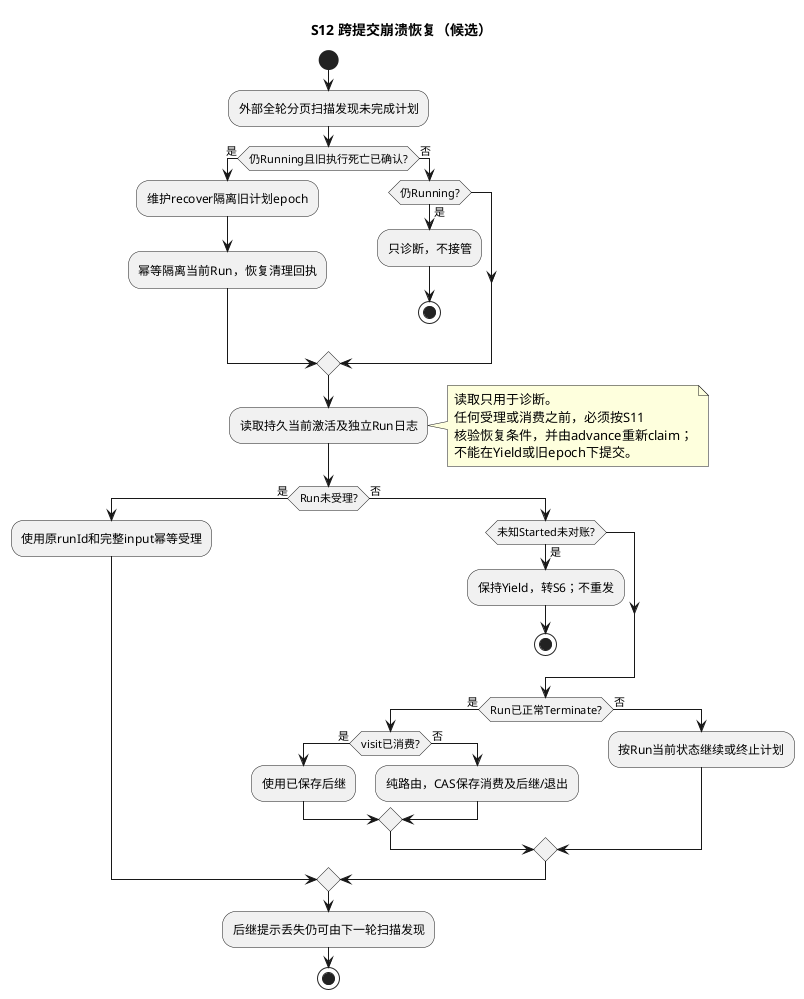
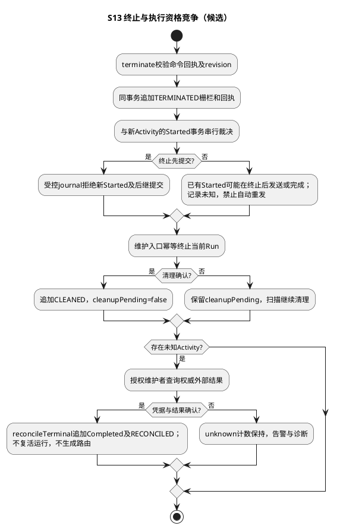

# SR-FE-SYS-04：跨FlowRun关联与调度扩展点（本期不实施）

> **已失效的历史候选：** 本文将 Session sub-session Fork/Join 归 FE 的所有叙述均已被 [SessionManager SubSessionCoordinator 设计](../../design/layers/l1-control/components/session-manager/sr-03-subsession-fork-join.md) 取代。只有未来不涉及 Session/Parent Summary 的通用 Flow 关联才可重新立项；以下表、类和测试不得作为当前开发依据。

**2026-09-08最新范围决定：当前没有跨flowRun Fork/Join诉求，将本SR降为扩展点，不纳入本期实现、交付或开发准入门槛。** 当前范围保留单flowRun四态、Activity拦截与回放、恢复及单flowRun内部有向环。Session父子关系仍归SM；此决定不删除已有Agent业务委派功能，也不把跨flowRun协调迁给Agent适配层。

扩展只保留职责边界和未来评审入口，不预建FlowCoordinator、计划表、占位API或后台恢复循环。出现明确的多flowRun并发执行与汇合场景后，再评审成员身份、汇合策略、取消竞争、持久化和恢复协议。

**以下为延期扩展的历史候选材料，均非本期规范。** 接口、图、三表方案、容量值、迁移和测试门槛仅供未来重新评审，不表示已冻结、必须立即补齐或已有实现。当前TaskGraph只控制单flowRun里的节点；业务Child处理器不能充当通用Fork/Join实现。

## 1. 场景、功能与关联模型

调用方是需要组合多个Flow的外部模块。前置条件：固定版本的工作流及路由处理器可解析，所有Run在同一可信存储作用域，计划输入可持久化，关系图具有入口、声明出边、出口和访问上限。业务判断由外部处理器返回，框架只解释关联与执行顺序。

扩展启用后的归属约束：跨FlowRun执行关联、Fork/Join、等待唤醒、取消传播及执行恢复属于FE；Session父子关系的创建、血缘校验、持久化和查询属于SM。此前将完整Fork/Join列为本期必需项的要求已被上述最新决定替代。Agent参数转换不得持有第二套Flow关系日志或执行恢复循环，也不得另建Session关系权威。

FlowRun执行图与Session血缘图不是同一个图：一次Fork可以复用已有Session快照而不创建子Session；创建Session分支也不等于创建或启动FlowRun。FE不遍历Session树决定Join或取消，不读取AgentRun或RunRegistry。SM通过SessionBranchPort/SessionQueryPort提供自身能力，FE经外部适配调用这些端口，只保留调用回执及不透明引用，不维护Session父子索引。

以下接口、单个currentActivation、消费事务、S10～S13和三表结构仅是**顺序子场景草案**，不能直接冻结为完整调度协议。Fork的多激活成员、Join的汇合条件及去重、父取消与子受理竞争、跨分支恢复和上限仍需补齐；不能把这些缺口交给外部业务模块实现。顺序例中A完成后选择B，B可返回A或退出；每次访问产生新的Run，不能复活已Terminate的Run。

| 对象 | 字段与语义 |
| --- | --- |
| FlowPlanDefinition | planId、version、entry、nodes、maxVisits；planId在scope内唯一 |
| FlowPlanNode | nodeId、workflowName、workflowVersion、routeVersion、next、canExit、maxVisits；名称与版本解析为外部注册实现 |
| FlowActivation | planId、visit、nodeId、runId、input；visit是计划级递增正安全整数，进入前持久化 |
| FlowDependency | 本次activation只依赖前一次activation的已消费完成结果；entry无前驱；后继选择来自已保存路由 |
| FlowPlanView | planId、revision、state、epoch、currentActivation或null、reason、result；state复用系统四态常量 |

定义字段不可变。相同planId而定义或初始输入不同必须拒绝。动态输入与结果使用现有规范JSON边界；关系节点ID和版本沿用单Run图标识约束。runId由框架对(scope、planId、计划版本、visit、nodeId)的规范摘要派生并保存；外部调用方不得把已有任意Run接到计划上。由计划创建的Run只由该计划控制，外部控制应走计划入口，防止旁路唤醒。

### 能力归属与外部准备接口

| 能力 | 唯一所有者 | 接入约束 |
| --- | --- | --- |
| FlowRun执行关联、Fork/Join、等待、取消及执行恢复 | FE | Root/Child FlowRun共用指令与权威Flow关系日志，不能在外部另建协调器 |
| 权限子集、委派授权、Permit | 安全模块 | FE消费可信结果/执行检查接口；不解释Agent角色或权限政策 |
| 子任务业务定义、上下文隔离选择 | 外部业务处理器 | 只产生冻结输入及外部准备回调，不拥有调度状态 |
| Session父子关联、血缘校验、分支、快照和归档 | SessionManager | SM独占关系数据及本地事务恢复；外部回调调用其端口，FE只记录回调身份、结果引用与继续条件 |
| 用量政策与资源分配 | 外部模块 | 不能把模型轮数/资源池预留迁入通用FE；FE只限制图和执行自身规模 |

上表明确关联调度与外部模块的职责边界。Fork前按稳定激活身份完成外部输入准备，准备未确认不启动Child FlowRun；幂等外部调用仍经过Activity，提交未知时先查原回执及对账，不能改key盲目重发。FE负责恢复执行到了哪一步；SM负责Session事务、分支回执与已提交事件的恢复。SM的关系数据和本地恢复不是第二套FE调度日志；外部业务适配不得复制任一方的权威状态或另建恢复循环。

需要在完整Fork/Join设计中保留的验收：同命令只有一个Child身份；准备已提交但受理未知不误清理；父取消先提交禁止子启动；受理先提交则保留清理事实；Join结果一次消费；未知副作用不重发；分支归档失败持久可诊断。删除独立组件不删除这些行为要求。现有顺序表结构尚不能证明多分支协议完成。

## 2. 对外接口草案与指令

| 接口草案 | 输入 → 输出 | 执行与确认点 |
| --- | --- | --- |
| FlowPlanPort.admit | definition、initialInput → FlowPlanView | 校验冻结定义和退出可达性；Plan_Admitted及首个Activation_Declared原子追加后受理成功；尚未执行业务 |
| FlowPlanPort.advance | planId → Promise&lt;FlowPlanView&gt; | 读取计划，CAS取得Running代次；推进当前一个独立Run；消费其终止结果，保存路由及下一次激活，返回Ready/Yield/Terminate |
| FlowPlanPort.resume | planId、commandId、expectedRevision → FlowPlanView | 只处理Yield，确认等待条件解除；追加幂等恢复指令并转Ready；不会直接发送Activity |
| FlowPlanPort.recover | planId、commandId、expectedRevision、evidenceRef → FlowPlanView | 受信维护入口确认旧执行停止；隔离旧计划代次及当前Run代次，再允许恢复 |
| FlowPlanPort.terminate | planId、commandId、expectedRevision、reason → FlowPlanView | 先追加计划终止栅栏，禁止后继激活；随后幂等终止当前Run；清理未确认在查询中明确返回 |
| FlowPlanPort.get | planId → FlowPlanView | 从权威事件重建；不能由内存队列状态回答 |

commandId在scope+planId内唯一；同ID同内容返回原回执，异内容冲突。expectedRevision冲突不产生新指令，调用方重读再决定。advance的并发调用只允许一个代次推进，其他调用返回现有视图，不加入或接管已有执行。计划恢复不自动解除Activity结果未知；未完成Started须先按SR-02对账。

外部触发器只通知planId；提示丢失可由持久计划目录重新发现。处理器目录按名称/版本提供FlowWorkflow和纯路由函数；业务代码、模型选择和权限判断不进入调度实现。运行选择逻辑不采用ReAct位置、业务轮次或命令名。

## 3. AR：调度实现结构

关联规则只做纯计算；协调器只负责读事实、选操作、提交、调用单Run执行器。存储适配器承担事务；外部模块供给实现和触发条件。队列和定时器是可重建提示，不拥有计划状态，不引入资源分配组件。

创建与生命周期：可信Composition Root按scope创建存储适配及处理器目录，再创建Coordinator。每次claim成功后按(planId,visit,epoch)创建受控journal和单Run FlowEngine；结束推进即可丢弃这些对象。计划及Run的权威事实不随对象销毁。Commands和Rules为无状态共享定义；不创建全局可变当前计划。

拟议开发单元：contracts/flow-plan.ts承载DTO/Port，flow-plan-values.ts承载常量；control/flow-engine/graph-rules.ts承载共享图规则；flow-plan-transitions.ts承载指令表；flow-coordinator.ts只串接端口；infrastructure/adapters中的计划journal与受控Run journal实现事务。新增业务路由仅修改外部目录和版本化定义。接口名为草案，现有代码未导出。

调度顺序：先检查计划终止/旧执行隔离，再核对当前激活身份与定义版本；Ready通过CAS取得Running。先持久化激活，再用其稳定runId及输入调用FlowEngine。若Run返回Running，只观察，不把未完成当成功；返回Yield，计划记录等待并Yield；返回Terminate且框架完成原因有效，调用固定版本纯路由函数。路由合法后，在单个计划事务中追加结果消费、路由及下一激活或计划终止。下一激活保存完成后才可触发下一Run。

路由复用`FLOW_GRAPH_ROUTE.NEXT/EXIT`及出边/出口/访问上限规则。因框架故障或显式终止而Terminate的Run默认使计划停止，不等同业务成功。业务成功或失败内容保持不透明，仅正常返回的业务结果可交给注册路由处理器解释。纯路由不得直接读时钟、随机数或外部服务；这类数据必须来自已提交输入/Activity结果。

## 4. 场景流程

S10主成功：A第一次完成→B第一次完成→A第二次完成→退出。后置条件：三个独立Run；每次结果只消费一次；所有关联和路由可重放。

S11特殊等待：当前Run主动Yield或Activity结果未知。后置条件：后继零启动；显式恢复重复提交不造成额外激活。

S12异常恢复：计划日志、Run日志分两次提交，进程可在任意间隙崩溃。不得用“事务保证”隐藏跨Run提交窗口。

S13终止与并发：计划终止先于后继登记提交时，新后继必须为零；反序提交的已登记后继也必须被终止栅栏阻断执行。

跨Run取消不能撤回已发送的外部请求；只有计划Terminate加清理确认，才表示框架不会继续启动其Run，不能承诺外部副作用消失。

## 5. 持久化与恢复点（候选逻辑结构）

| 事实 | 唯一性、写入与读者 |
| --- | --- |
| 计划受理及输入 | scope+planId唯一；冻结定义摘要、初始输入及版本由admit原子保存；恢复不依赖进程闭包 |
| 激活声明 | scope+planId+visit唯一，runId同时唯一；保存nodeId和完整输入；Coordinator据此幂等调用单Run |
| 完成消费与路由 | 每个visit至多一次；绑定Run终止revision与结果摘要；消费、路由、下一激活在同一计划事务追加 |
| 恢复/终止命令与回执 | scope+planId+commandId唯一，绑定请求摘要；终止清理确认另追加，不覆盖旧事实 |
| 计划状态与代次 | append-only计划事件序号单调；expectedRevision校验后追加；队列投影丢失可以重建 |

当前`system_flow_events`只有单Run事实，**没有上述计划记录**；FlowJournal也没有跨Run枚举、关联事务和唤醒回执接口。不能把激活登记整体放入普通Activity：若已登记子Run而Activity完成日志丢失，会被错误封闭为无法继续的未知调用。正确恢复依据是激活唯一身份、子Run事实与计划消费回执。

本轮细化采用下列候选物理协议，决策依据见[ADR-0012](../../governance/changes/ADR-0012-flow-association-and-execution-gate.md)。现有FlowEngine没有计划级栅栏检查入口，以下新增端口及schema均待批准后实现。

### 5.1 字段与错误约定

定义中所有字段必填，未知字段拒绝；nodes非空。标识及版本为1～64位ASCII字母、数字、点、横线、下划线；planId同约束，派生runId固定为fp_加SHA-256小写十六进制。摘要输入是现有flowDigest规范编码的数组[scope,planId,version,visit,nodeId]，不能用有歧义的字符串拼接。初始输入、激活输入、路由结果使用SR-02规范JSON，null为合法业务值，undefined拒绝；同ID比较覆盖完整定义与输入。

view增加cleanupPending:boolean和unknownActivityCount:number，终止后仍可显示未完成外部动作；result在非正常终止时为null。revision为最新计划事件序号；epoch取最近CLAIM事件序号，未启动为0。计数都是安全整数；visit从1开始不复用。所有scope从Host构造的Scoped Adapter获取，公开请求不允许指定或覆盖scope。

草案统一错误对象为{code,retryable,revision:number|null}，不含原异常或输入。常量集中在拟议flow-plan-values.ts，以冻结as const对象定义并推导类型；代码不得用字符串分派。FLOW_PLAN_INVALID、IDENTITY_CONFLICT、COMMAND_CONFLICT、VERSION_UNAVAILABLE、REVISION_CONFLICT、FENCED、NOT_FOUND、LIMIT、STORAGE_UNCONFIRMED分别表示输入非法、计划身份不符、命令身份不符、实现版本缺失、CAS冲突、失效代次、不存在、超过上限、存储确认不明。仅后两类中的存储不明及版本竞争允许查询后重试；原命令ID和请求摘要保持不变，不能自动增加新命令。VERSION_UNAVAILABLE可在目录恢复后使用原计划重试，不升级版本冒充恢复。

所有控制入口在Host鉴权后调用。get不执行回调；advance只推进一个visit，不等待下一次外部唤醒。Host超时结束等待不表示事务回滚，也不表示停止已调用程序；需要停止必须提交terminate。网络与CPU截止时间由外部实现/宿主提供，框架不能抢占任意JavaScript。

### 5.2 候选物理表与追加事务

新库版本2包含现有system_flow_events结构，以及下表。未另注类型的字段均为TEXT；declared_revision和receipt_revision均为INTEGER。外键约束由连接启用；所有表禁止UPDATE/DELETE/INSERT OR REPLACE，包含与现有系统日志等价的替换拦截。普通INSERT冲突后读回校验，禁止以IGNORE掩盖不同内容。

| 表 | 字段与主键 | 附加约束/索引 | 写入、读出 |
| --- | --- | --- | --- |
| flow_plan_events | scope TEXT、plan_id TEXT、log_sequence INTEGER、kind TEXT、payload TEXT均NOT NULL；PK(scope,plan_id,log_sequence) | sequence在1～2^53-1；payload为规范JSON；kind为版本2事件常量集合 | Journal在BEGIN IMMEDIATE中核对日志尾CAS并追加；Coordinator重建视图 |
| flow_plan_activations | scope、plan_id、visit INTEGER、node_id、run_id、input_json、declared_revision均NOT NULL；PK(scope,plan_id,visit) | UNIQUE(scope,run_id)；FK(scope,plan_id,declared_revision)指向计划事件；visit/revision为正安全整数，input有效JSON | 只随Activation_Declared同事务插入；作为不可变所有权及分页目录，重放可核对 |
| flow_plan_commands | scope、plan_id、command_id、request_digest、receipt_revision均NOT NULL；PK(scope,plan_id,command_id) | FK(scope,plan_id,receipt_revision)指向计划事件；digest固定SHA-256；commandId同标识约束 | 只随成功控制指令插入；重试先查原回执，再检查expectedRevision |

计划事件kind及payload：ADMITTED={definition,initialInput,digest}；CLAIMED={visit}；WAITED={visit,reason}；ADVANCED={visit,runRevision,resultDigest,route}；ACTIVATED={visit,nodeId,runId,input}；RESUMED/RECOVERED={commandId,reason}；TERMINATED={reason,result,commandId或null}；CLEANED={runId}；RECONCILED={runId,activitySequence,evidenceRef,resultDigest}。每条含protocolVersion=2。kind从FLOW_PLAN_EVENT常量生成DDL；历史值变更必须升级协议。Plan_Admitted等前文名称为这些常量的语义名称，不新增第二种事件编码。

受理事务追加ADMITTED和ACTIVATED及激活表。消费事务核对当前visit、Running代次、Run终止revision与摘要，追加ADVANCED，随后同事务追加ACTIVATED及新激活行或TERMINATED。同visit已消费则返回既有route；异结果拒绝。无需对所有Run加巨型事务锁，Run完成事件可以早于消费事务独立提交。

恢复、唤醒、终止先查command回执；存在且摘要相同按receipt_revision重建原回执，即使当前状态已推进；异摘要拒绝。不存在才比较expectedRevision，成功事件与command行同事务提交。无成功提交不保存命令回执。终止后的CLEANED/RECONCILED仅增加维护事实，不增加系统态、不复活计划。

### 5.3 强制执行入口与恢复

拟议FlowScheduleJournal提供admit、claim、consume、control、get、scan、bindRunJournal七个操作。control使用FLOW_PLAN_COMMAND静态处理表；每个处理器只构造自己的事件批，统一事务提交，非法状态×指令组合默认拒绝。consume接收已读取的Run结果引用，在提交时再次验证；纯路由计算在事务外执行，提交前CAS失败就丢弃计算结果。

bindRunJournal(planId,visit,planEpoch)是可信装配入口，返回实现现有FlowJournal的受控journal给单Run FlowEngine；业务回调拿不到该接口。它必须在同一SQLite写事务内读取不可变Run归属，验证计划仍Running、当前visit与epoch一致、Run代次有效，然后进行run启动、start、complete或saveCheckpoint。不得使用“先调用canRun再写另一个库”的实现；独立Run按原规则执行。只读Completed回放仍受Host读取授权约束。

terminate先提交计划栅栏，之后幂等终止当前Run并追加CLEANED；清理扫描不依赖客户端再发请求。recover要求可信维护方提供旧宿主已停止的凭据引用，追加RECOVERED使旧计划epoch无效，再通过专用维护journal将当前Running Run隔离为Yield。中途崩溃由同一command回执恢复清理；未完成隔离时保持计划Yield并拒绝resume。未知Started未对账时同样不能resume。

**S13精确承诺：计划终止提交后，新Started插入成功数为0。** Started先提交的动作可能在终止之后才发送网络请求；不能要求外部新增调用总数为0。迟到结果不得通过旧epoch正常完成。由于现有reconcile只接受Yield，版本2须增设受信维护操作reconcileTerminal，仅对已有Started追加Completed与证据，并为计划追加RECONCILED；不执行回调、不改变Terminate、不生成路由。CLEANED仅证明Run停止推进，unknownActivityCount归零才表示所有未知结果已核对。

scan(cursor,limit)按scope内plan_id做keyset分页，limit范围1～100，末页返回null游标；扫描所有计划的ADMITTED目录，重建后筛选Ready、清理未确认或待诊断项。当前页不合格仍推进游标；完成一轮从头开始，避免丢掉游标前新产生的Ready。队列只保存最多100个待处理ID，满时依靠下一次全轮扫描；扫描器不擅自恢复Running，不把超时当作旧执行已死亡。大规模索引优化必须保持相同契约。

### 5.4 上限、升级与运维

首版候选上限：每计划256节点、4096边、1024总visit；每节点maxVisits不超过总visit；定义及每项输入/输出各2MiB；计划事件总量64MiB，受理及后继提交前预留至少一条64KiB控制记录空间，数据达到阈值则LIMIT终止，不能耗尽到无法取消。Run日志总量也须配置64MiB安全阈值并为终止/维护预留空间；当前版本1没有此总量门禁，需作为实现差异验证。常规数据不得消耗维护预留；预留耗尽或磁盘不可写时停止派发并报告存储故障，不承诺磁盘满时仍能提交。

图校验通过反向邻接表从出口做工作队列遍历，复杂度O(V+E)，不使用DAG检测。新图规则抽取后由TaskGraph及PlanRules共用；静态规则不解释业务退出谓词。数量和存储上限是候选运行档案，尚未经性能测量或批准。

版本1独立Run保持旧库。版本2使用新库，启用前校验所有处理器版本、备份恢复和旧版本拒绝。新计划开关默认关闭，单计划验证后逐步开放受理；旧计划不在线改图/输入/visit。回退关闭受理、停止推进并隔离执行，保留版本2维护器完成清理/对账；不得用旧快照抹掉已发生副作用。数据归档只针对已终止且无未知结果的完整计划及所属Run，由授权宿主离线备份校验后迁移整个分片；首版不做在线删行或截断权威日志。

外部ObservabilityPort传递OperationContext的trace/span/correlation引用；重启时以planId/visit/runId建立新的trace链接，不持久化鉴权令牌。默认日志只含这些技术标识、状态常量、epoch/revision、错误码和耗时。指标按操作/错误分类，不能把runId作为高基数标签。候选告警：任一未知副作用或日志损坏立即告警；扫描连续2轮失败、清理未确认超过60秒、库剩余容量低于20%告警。Running时长超过宿主截止时间只触发诊断，不能自动重发。健康分开报告进程存活、存储可追加和待处理积压。

## 6. 可测试手段与开发验收

| 场景 | 测试设计与独立期望 | 当前状态 |
| --- | --- | --- |
| S10 | DT/UT：A→B→A→EXIT对应三个不同runId、两个后继、一次结果消费/visit；回环上限L-1/L/L+1；非法目标不执行 | 待编写 |
| S11 | 系统集成：重复resume、过期revision、未对账Started；后继启动计数始终0，解除后原Run恢复 | 待编写 |
| S12 | 混沌：分别在激活登记后、子Run受理后、完成后消费前、消费后提示前SIGKILL；恢复身份不变且每visit只消费一次 | 待编写 |
| S13 | 双连接及屏障竞争终止/后继登记/新Activity；终止先提交时新Started为0，Started先提交允许迟到副作用且必须可对账 | 待编写 |
| 外部接入 | 端到端：两个不依赖模型的业务模块共用同一框架，提供不同工作流/路由，不修改中央状态机 | 待编写 |

注入处理器目录、计划日志、单Run执行入口与触发源；观测planId、visit、runId、revision、epoch及追加顺序，不记录业务正文。现有AK-FS-001～012只能证明可复用的单Run基础，不能替代本表。以上只是顺序子集；原首版范围批准请求已撤回。先补齐Fork/Join和统一父子控制协议，再评审存储及维护指令，不宣称已通过开发准入或实现验收。

| 计划验收ID | 类型与输入/注入 | 独立期望结果 |
| --- | --- | --- |
| FE-SCH-TC-01 | DT/UT：固定A→B→A→EXIT，A上限2，总上限3；Fake目录 | visit严格1/2/3，三个不同runId，A第二次不命中第一次Activity；增加C只改定义及注册 |
| FE-SCH-TC-02 | DT/UT：状态×指令矩阵、重复/缺失处理器、非法出边、L-1/L/L+1 | 非法组合默认拒绝；超限节点调用0；状态表与处理器覆盖相等，重复键装配失败 |
| FE-SCH-TC-03 | 系统集成：双连接争用claim/consume/resume；相同commandId异输入 | 同visit一次消费、一条后继；原回执可重读；异内容不写任何新事件 |
| FE-SCH-TC-04 | 混沌：激活提交后、Run受理后、Run完成后、后继提交后分别SIGKILL | 原runId/输入不变，已完成动作调用增量0，下一轮扫描找回丢失提示 |
| FE-SCH-TC-05 | 混沌/集成：两条屏障交换terminate和Started提交顺序；清理中崩溃 | 终止先提交无新Started；相反顺序保留未知记录；迟到结果只由受信维护对账收敛 |
| FE-SCH-TC-06 | 安全集成：跨scope ID、绕过计划调用Run、无权限get/reconcileTerminal、带Secret载荷 | 外部动作0，受限数据不返回，默认日志泄漏0；审计只保留证据引用 |
| FE-SCH-TC-07 | 端到端：Docker新卷部署两个非ReAct工作流，保留卷重启并运行版本2回退步骤 | 三次激活顺序一致；旧版本拒绝新库；终止后不产生后继；不依赖模型可用性 |
| FE-SCH-TC-08 | 性能/运维：256节点、1024visit、满页/空页扫描、64MiB阈值及注入磁盘写失败 | 有界遍历，无丢唤醒，失败无派发；记录p95/峰值RSS/恢复耗时，原单Run对照退化不超过10% |

这些ID是测试设计，未登记成已通过的acceptance.json记录。真实环境测试工具在G4实现：命令行受信入口提供plan admit/advance/get/history/recover/terminate/reconcile-terminal，故障点只能在测试装配中注入；健康接口不接受故障开关或原始SQL。

维护端口草案FlowPlanMaintenancePort.reconcileTerminal({planId,runId,activity,result,evidenceRef,commandId,expectedRevision})返回FlowPlanView。activity使用现有FlowActivity完整身份，scope仍由Host绑定，Run必须属于该计划且已Terminate；无Started、异身份/异结果或空证据拒绝。同库事务中追加Run Completed、计划RECONCILED及命令回执；唯一键与摘要使同请求可重放。evidenceRef为1～256字符的不透明凭据引用，不接收凭据正文或密钥；凭据真实性由受信维护方校验。该维护事务只记录同一对账事实，不合并其他业务聚合。清理回执CLEANED须绑定controlRevision与runRevision，旧控制指令的清理不能解除新代次的恢复屏障。

返回[FlowEngine入口](../../design/layers/l1-control/components/flow-engine/README.md)，复用[单Run接口](../../design/layers/l1-control/components/flow-engine/sr-01-lifecycle.md)、[Activity执行协议](../../design/layers/l1-control/components/flow-engine/sr-02-activity.md)、[节点路由规则](../../design/layers/l1-control/components/flow-engine/sr-03-task-graph.md)。
