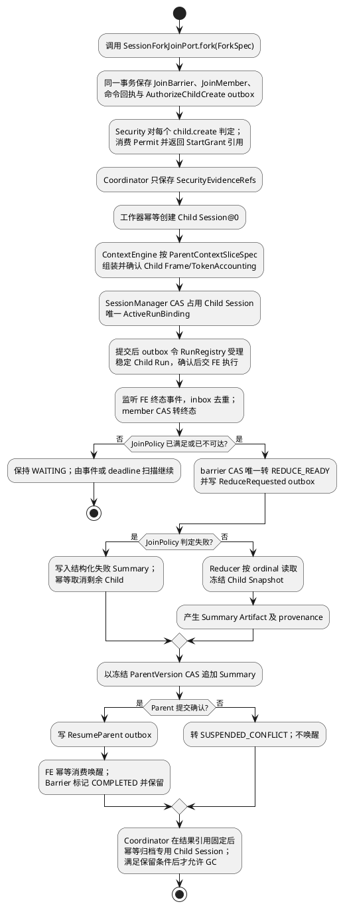
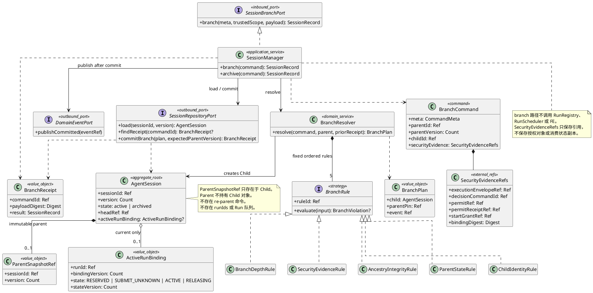
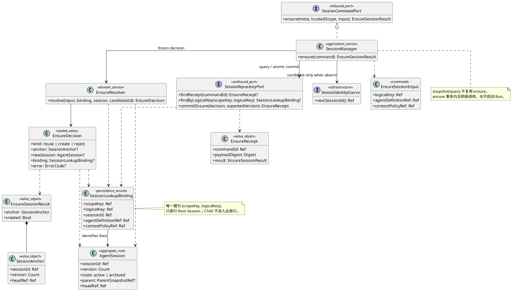
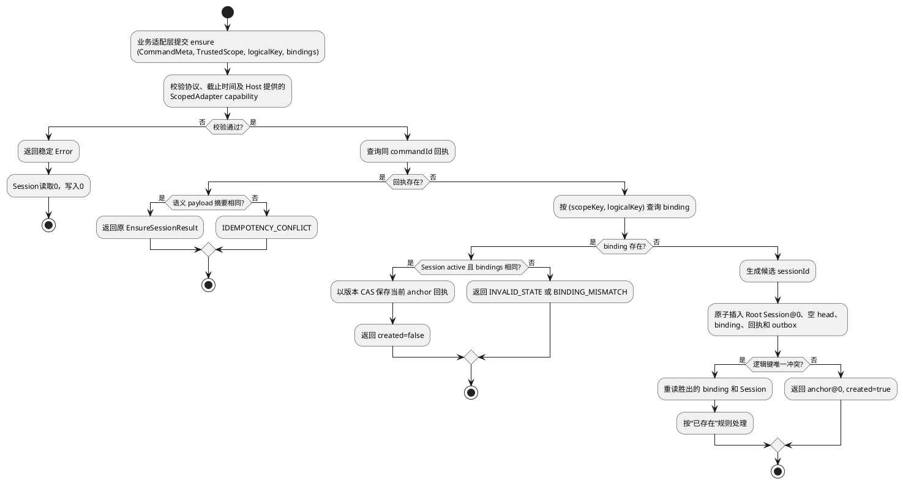
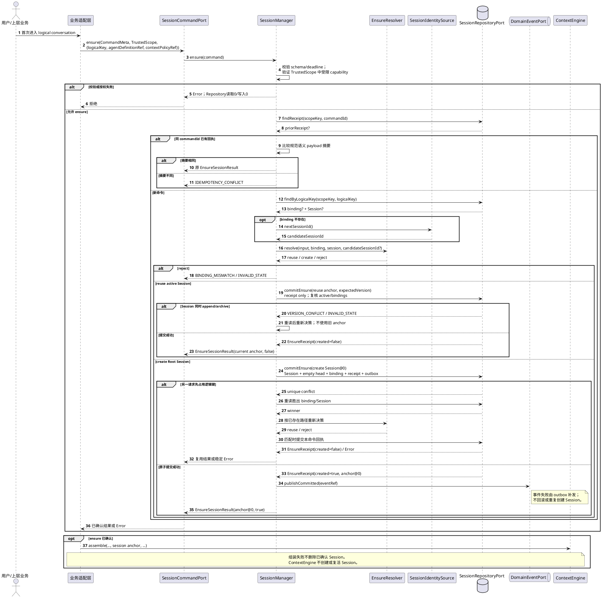
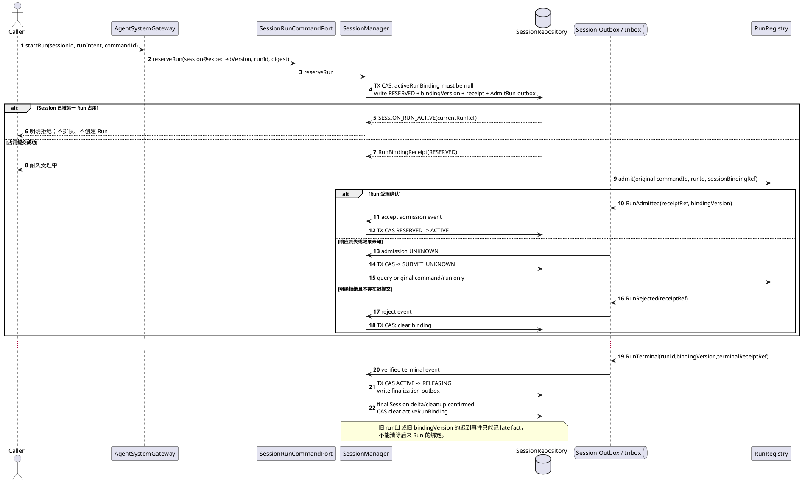
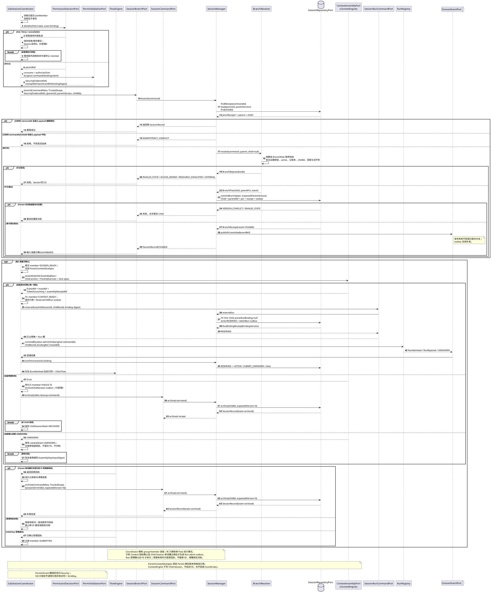
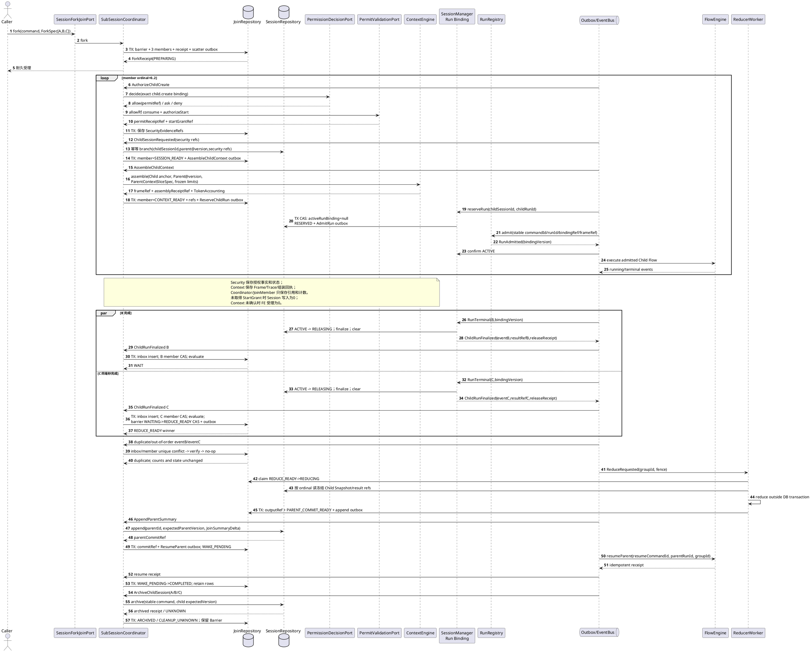
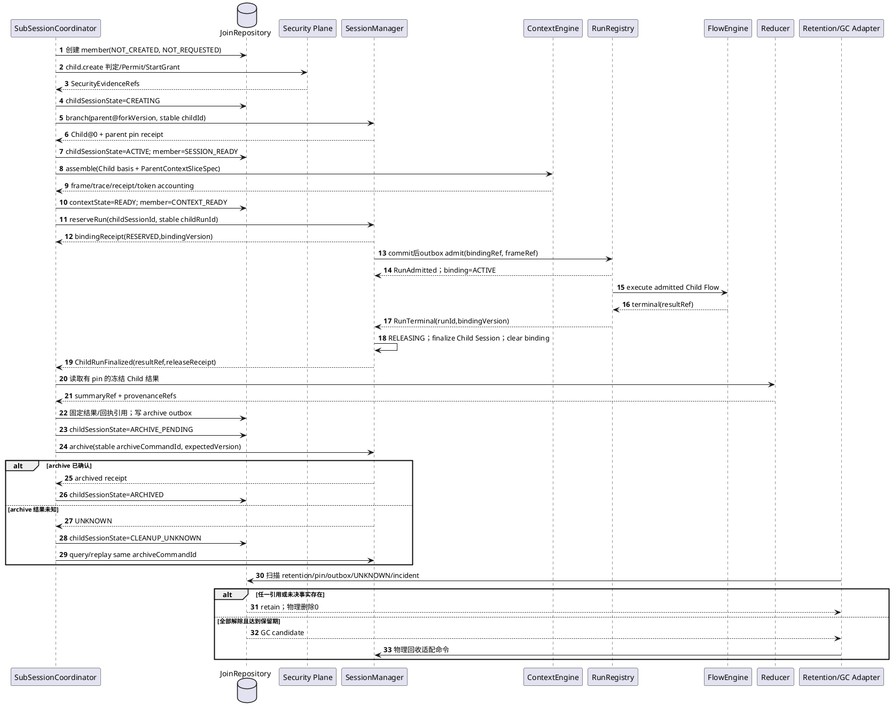

# SessionManager 组件设计（SR 拆分前归档）

> 非规范历史。当前权威入口为 `docs/design/layers/l1-control/components/session-manager.md`，三个功能实现域分别由 `SR-SESSION-01～03` 维护。

## 1. 目标与非目标

SessionManager 管理可持久、可卸载、可分支的技术会话档案，并保护每个 Session 的 `0..1` 当前活跃 Run 绑定；它不保存 `runIds[]`、不维护 Run 集合，也不在 Session 内排队多个 Run。历史终态 Run 由 RunRegistry 独立留档。内部 `SubSessionCoordinator` 统一管理 sub-session 的 Fork、Child Run 编排、Join、Reduce 和 Parent Run 唤醒。Session 不是业务 Conversation，不等于进程、线程、Runtime 或执行槽；单个 Run/Attempt/Flow 的执行状态仍由 RunRegistry 和 FE 保管，SM 只持有当前绑定、稳定引用与协调事实。

权限决定、一次性 Permit、启动 Grant、授权版本和撤销状态全部属于 Security Plane。`AgentSession`、`JoinBarrier` 与 `JoinMember` 不保存权限对象或策略副本；SM 只在协调记录中保存 Security 返回的不透明引用，并在每次受保护动作发生前通过安全 Port 取得当前可执行资格。引用用于关联和恢复，不构成访问授权。

### 1.1 业务场景分析

这里的“业务场景”指 Kernel 技术业务场景，不是上层法律业务 Workflow。Root Session 首次入口和 Child Session 分支是两条不同创建路径：前者按逻辑会话键确保一个无 Parent 的 Root Session，后者必须从确定 Parent 版本建立血缘。

| 场景 ID | 调用者目标 | 触发与前置 | SessionManager 行为 | 后置/边界 |
|---|---|---|---|---|
| `SES-BS-00` 首次访问 Root Session | 为 Root Run 输入准备取得稳定 Session 锚点 | Host 已编译 `logicalKey`，并以 `TrustedScope.executionEnvelopeRef` 和受限 Repository capability 提供查询/创建能力 | 通过 `SessionCommandPort.ensure` 查询同命令回执，并按 `(scopeKey, logicalKey)` 复用或原子创建 Root Session@0 | 返回已确认 `SessionAnchor`；Session 不复制权限内容；纯查询缺失仍返回 `NOT_FOUND/GONE`，不会暗中创建 |
| `SES-BS-01` 一次性只读 Child 不建 sub-session | Child Run 只需使用 Parent 已确认事实完成一次计算 | Child 不追加独立历史、不需要多轮恢复、没有独立黑板且不作为 Reducer 的 Session 来源 | 不创建 Child Session；调用方把已授权的 `ParentSessionSnapshot@version` 选择为只读来源，ContextEngine 生成独立不可变 Frame | 这不是“共享 Session”，而是两个 Run 读取同一冻结版本；Parent live head 与对象均不共享。只要需要独立追加、重试状态或 Join 黑板，就必须改走 `SES-BS-02` |
| `SES-BS-02` Scatter 创建隔离分支并注入部分父上下文 | Parent 需并发处理 A/B/C，且每个 Child 需要独立演进 | Parent Session/Run 版本、稳定 Child 身份、`ParentContextSliceSpec` 与 ForkSpec 已冻结；Security 可解析 Parent/Child 的 `executionEnvelopeRef` | Coordinator 先持久化 `JoinBarrier + JoinMember + outbox`；完成 `child.create` 授权并幂等创建 Child Session 后，调用 ContextEngine 从 Parent 确切版本选择允许子集；组装确认后由SM占用该Child Session唯一Run槽，经RunRegistry受理再交FE执行 | Child Session 只保存自己的增量和 Parent 版本引用，不复制父全文；JoinMember 保存 `contextAssemblyReceiptRef` 与绑定回执引用，恢复时不改读 latest、扩大范围或创建第二Run |
| `SES-BS-03` 并发乱序 Join | B/C 同时或重复上报终态 | Child Run 终态事件可乱序、至少一次投递 | Coordinator 用 inbox 去重、member CAS 和 barrier CAS 裁决 | 每个成员只终结一次；只产生一个 Reduce 和一个逻辑唤醒 |
| `SES-BS-04` 部分失败/超时 | A 成功、B 失败、C 超时 | group 已冻结 JoinPolicy 及 deadline | Coordinator 按 `ALL_SUCCESS / WAIT_ALL / QUORUM` 评估可达性，并幂等取消不再需要的 Child | Parent 失败或携结构化部分结果继续，不由代码现场猜测 |
| `SES-BS-05` Map-Reduce 聚合 | 将多个 Child 黑板归约为 Parent 可消费 Summary | 屏障已唯一进入 `REDUCE_READY` | Reducer 按声明顺序读取冻结 Child Snapshot，产生带来源的 Summary Artifact，再以 Parent 版本 CAS 追加 | Child 无权写 Parent；唤醒只在 Parent 提交确认后投递 |
| `SES-BS-06` Parent Session 归档 | 关闭会话档案的新写入 | Parent 无活动写入，归档与分支可能并发 | 用 Parent 版本 CAS 序列化；归档先成功则拒绝新分支 | 已存 Child 不级联归档；开放 Barrier 须进入取消/人工收敛；被引用 Parent 版本仍受保留策略保护 |
| `SES-BS-07` sub-session 归档与物理回收 | 收敛专用 Child Session，避免长期泄漏 | Child 未受理且失败已确认，或 Child Run 已终态且结果/组装/Reduce 所需引用已固定 | Coordinator 先写 `ARCHIVE_PENDING`，再以稳定命令调用 Session archive；UNKNOWN 时仅对账。逻辑归档成功后仍按 retention/pin/outbox/incident 条件等待 GC | 不提供同步 `destroy` 或级联硬删除；归档只禁止新追加，不能删除 Barrier、回执、父版本 pin 或尚需恢复的 Child 数据 |
| `SES-BS-08` Session 单活 Run 受理与释放 | 在 Root 或 Child Session 上启动一次执行 | Session active，`activeRunBinding=null`，Run 身份与受理载荷已冻结 | SM 以 Session 版本和绑定代次 CAS 写 `RESERVED + AdmitRun outbox`；受理确认后转 `ACTIVE`，Run 终态及最终 Session 写入确认后经 `RELEASING` 清空绑定 | 任意时刻每个 Session 最多一个非空绑定；并发第二个不同 Run 返回 `SESSION_RUN_ACTIVE`，不排队；相同命令只返回原回执；终态历史仅在 RunRegistry 查询 |



本文分别详细走读 `SES-BS-00`、`SES-BS-02～08`。`SES-BS-01` 是重要反例：它描述“Child Run 使用父冻结输入但没有 Child Session”的窄场景，不是多个 Session 共享黑板。指定版本快照读取则是另一个反例，不能借“首次访问”把 Query 变成写命令。

## 2. 所有状态与不变量

`AgentSession` 是本组件权威聚合，拥有上下文增量、消息/观察记录、Artifact 引用、版本、归档状态、可选父 Session 快照引用和至多一个 `ActiveRunBinding`。该绑定只表达“哪个 Run 当前占用此 Session”，不复制 Run 的 queued/running/terminal 状态，也不形成历史 Run 集合。

模型私有原始 chain-of-thought 不持久化。分支默认使用父快照引用加增量，不复制整个历史；并发追加必须以期望版本提交。

### 2.1 Sub-session 职责边界分析

**2026-09-08职责决定：Session 的 fork/join/run 协调由 SessionManager 内部 `SubSessionCoordinator` 统一管理。** 这里的“管理 Run”指创建稳定 Child Run 身份、提交执行指令、消费终态、取消与唤醒协调；FE 仍是单个 Flow 的执行者，RunRegistry 仍是 Run 执行状态的权威库。SM 不复制 FE/RunRegistry 的单 Run 日志，FE 不保存 JoinBarrier、JoinPolicy 或 Session 血缘。

具体例子：A/B/C 由 Parent 一次 Fork 产生。B/C 同时完成时，FE 只发布各自终态事实；Coordinator 在 SM 的 inbox/member/barrier 事务中去重和裁决，只允许一个 worker 进入 Reduce。FE 不能根据自己的 Flow 日志猜测这个 group 的 Join 策略。

本节不把“Session 数据生命周期”和“Run 单次执行生命周期”合并；它们由 Coordinator 通过稳定引用编排，跨界只交换指令、回执和事件。

| 问题 | 现有上层约束 | 本组件结论 |
|---|---|---|
| 谁创建 sub-session | `AgentSession` 的版本和分支血缘归 SessionManager | SessionManager 实现 `SessionBranchPort.branch`，创建新的 Child `AgentSession` 聚合 |
| 谁选择 Child 初始上下文 | ContextFrame 的读取、选择、预算和冻结归 ContextEngine | Coordinator 冻结 `ParentContextSliceSpec` 并调用 `ContextAssemblyPort`；ContextEngine 只返回 Frame/Trace/回执，不创建 Session 或启动 Run |
| 谁启动 Child 执行 | FE 提供单 Flow 执行能力，RunRegistry 保存执行事实 | Coordinator 派生稳定 childRunId 并经 `FlowRunCommandPort` 提交；受理未知时查原回执，不换 ID 重发 |
| Parent 与 Child 如何关联 | Child 仅在需要独立上下文演进时创建 Session 分支 | Child 只保存不可变 `parent={sessionId, version}`，后续增量不反写 Parent |
| 谁判定 Join/Reduce/唤醒 | group 策略与 Child 黑板版本属于 Session 协调语义 | Coordinator 持有 Barrier 与 ReducerSpec；Parent Summary 提交确认后才经 FE 唤醒 Parent Run |
| Parent 结束时如何收敛 | Parent Run 终态与 Parent Session 归档是两个不同事实 | Coordinator 提交取消栅栏、不再创建新 Child，并经 FE 取消已受理 Run；Session 归档仍单独提交 |

SessionManager 在 sub-session 方面的单一职责是：**在不共享可变上下文的前提下，管理从 Fork 意图到 Join Summary 提交与 Parent 唤醒的完整协调事实。**

```text
外部业务 -> SessionForkJoinPort -> SessionManager/SubSessionCoordinator
SubSessionCoordinator -> FlowRunCommandPort -> FE 单 Flow 执行器
FE/RunRegistry -> DomainEventPort -> SessionManager JoinEventHandler

Child Session -> Parent SessionSnapshot@version
Parent Session -X-> Child Session
FE -X-> JoinBarrier / Reducer / SessionRepository
JoinEventHandler -X-> FE 同步回调
```

`->` 表示允许的调用或不可变引用，`-X->` 表示禁止的反向持有或调用。

为避免数据环和组件循环依赖，采用以下结构约束：

1. `branch` 只能创建一个尚不存在的 `childId`；不提供 re-parent 或修改 `parent` 的命令。Parent 先存在、Child 后创建，且边在创建后不可变，因此正常命令无法构造 Session 环。
2. Child 聚合单向持有 Parent 快照引用；Parent 聚合不持有 Child 对象或可变集合。需要运维反查时使用 Repository 索引，不把反查索引变成第二份领域关系。
3. 分支创建固定 Parent 的确切版本，并保证该版本在 Child 引用期间不被 GC。Parent 后续追加或归档不改变 Child 基线。具体物理删除和保留时长仍由持久化保留策略定义，本组件不自行发明新期限。
4. Child 初始上下文只由 ContextEngine 从 `ParentSessionSnapshot@forkVersion` 的显式候选引用中选择。Coordinator 保存组装回执引用而不保存 Frame 正文；ContextEngine 不反向调用 Coordinator，也不写 Child Session，因此不会形成 `SM -> Context -> SM` 同步环。
5. Coordinator 对 FE 的命令只能在 SM 事务提交后通过 outbox 发布；FE 终态只能通过 event bus/inbox 进入 SM。双方不在各自数据库事务内同步回调对方，因此不产生组件循环依赖或分布式大事务。
6. FE 只持有 `groupId/childRunId/commandId/contextFrameRef`，不理解 Session 树、JoinPolicy、父上下文选择或 Reducer。SM 只持有 Run 身份、回执和终态引用，不复制 FE 的节点位置、Activity 或 Provider 执行状态。

Parent Session 归档后禁止创建新 Child Session；已创建 Child 是独立聚合，不因 Parent Session 归档被同步级联归档。开放 group 必须由 Coordinator 转入取消或人工挂起状态；不允许归档命令绕过 Barrier 直接删除恢复依据。本候选设计不表示当前代码已实现。

#### 2.1.1 安全能力归属与外部引用

受保护的 `child.create` 采用“Session 协调、Security 授权”的双所有者协作，但不形成双写聚合：

| 数据或行为 | 权威所有者 | SessionManager 可保留 | SessionManager 禁止保留或解释 |
|---|---|---|---|
| `AuthorizationState`、策略快照、资源上限、撤销 epoch | Security Plane | 当前命令携带的 `executionEnvelopeRef` | 授权快照正文、权限集合、会话级 permission ceiling |
| `Decision`、`ExecutionPermit`、`PermitReceipt`、`StartGrant` | Security Plane | `decisionCommandId/permitRef/permitReceiptRef/startGrantRef/bindingDigest` 等不透明引用 | Grant/Permit 对象、消费状态副本、可续期 token、策略判定结果缓存 |
| Session 版本、`ParentSnapshotRef`、Delta、Artifact 索引和归档状态 | SessionManager | Session 聚合自身事实 | 由 Session 字段推导“已授权”或因授权撤销重写历史 Session |
| Child Run 状态与执行回执 | FE / RunRegistry | `childRunId` 及已确认回执引用 | 单 Flow 状态副本或 Provider 执行权 |

上表中的 Session 行实际语义为：SessionManager 只拥有 Session 版本、`ParentSnapshotRef`、Delta、Artifact 索引和归档状态；这些事实不携带权限。实现时不得使用占位字段名或可选 JSON 把完整授权对象重新塞回 Session。

`TrustedScope` 是 Host 建立的进程内可信调用上下文，内部带 `executionEnvelopeRef` 和受限 Repository 能力；它不是 Grant，也不进入 `AgentSession` 序列化。Coordinator 对每个 Child 维护内部 `SecurityEvidenceRefs={executionEnvelopeRef,decisionCommandId,permitRef,permitReceiptRef,startGrantRef,bindingDigest}`，字段全部是对 Security 事实的引用。该记录只用于恢复同一授权命令和核对绑定，不允许凭引用自行判断有效、延长有效期或签发新能力。

`child.create` 的唯一合法顺序是：从冻结 Parent Run 和 `ChildSpec` 重建 `SecurityAction/Binding` → `PermissionDecisionPort.decide` → Allow 后 `PermitValidationPort.consume` → `authorizeStart` → 将 Security 返回的 `StartGrant` 与同一 `bindingDigest` 绑定到分支提交 → 提交 Child Session/协调回执。Ask、Deny、不可用、过期、撤销或绑定不一致均在 Session 读取/写入和 FE Child 受理前失败关闭。Permit 已消费但 Session 提交结果未知时，只查询原安全回执和原 Session 命令；不得创建新授权命令或换 Child ID 重试。

Child 后续运行只携带其独立 `executionEnvelopeRef`。它不会继承 Parent 的 Grant，也不能用创建 Child 的 Permit 执行工具、Memory 或另一个 Child 创建动作。Parent 授权撤销不会删除已提交 Session 历史；它阻断新的受保护动作，并由现有 Run/Coordinator 取消路径收敛活动执行。

#### 2.1.2 Session 单活 Run 绑定

前置条件冻结为：**同一 `(scopeKey, sessionId)` 在任意时刻只允许一个当前活跃 Run；SessionManager 不管理多个 Run，不提供 Session 内 Run 队列，也不保存历史 Run ID 列表。** “最多一个 Run 存在”在持久模型中具体解释为 `activeRunBinding` 的基数是 `0..1`。终态 Run 记录仍由 RunRegistry 保留，以支持审计和查询；同一 Session 只有在旧绑定完整释放后才可顺序启动下一 Run。

具体例子：两个请求同时尝试在 Session S 上启动 R1 和 R2。二者都读到空绑定时，只有一个 `reserveRun` 能以 Session 版本 CAS 写入；另一个得到 `SESSION_RUN_ACTIVE`，不会进入等待队列。如果 R1 受理响应丢失，S 保持 `SUBMIT_UNKNOWN`，此时也不能让 R2 抢占；恢复器必须用 R1 原 `commandId/runId` 对账。R1 终态事件只有在 `runId + bindingVersion` 都匹配时才能释放，迟到的 R1 事件不能清掉后来 R2 的绑定。

`ActiveRunBinding={runId,bindingVersion,state,reserveCommandId,admissionCommandId,payloadDigest,admissionReceiptRef?,terminalReceiptRef?,stateVersion}`，其中 `state=RESERVED|SUBMIT_UNKNOWN|ACTIVE|RELEASING`；字段缺失表示 IDLE。`bindingVersion` 在每次成功占用时递增，绑定存续期间不变；`stateVersion` 用于状态 CAS。Session 聚合不出现 `runIds[]`、`maxRunsPerSession` 或 `pendingRuns[]`。

| 状态/事件 | 事务守卫 | 原子结果 | 失败或恢复 |
|---|---|---|---|
| `IDLE + ReserveRun` | Session active；无绑定；同命令回执不存在 | 写 `RESERVED`、占用新 `bindingVersion`、命令回执和 `AdmitRun` outbox | 不同 Run 竞争失败返回 `SESSION_RUN_ACTIVE`；同命令同摘要返回原回执 |
| `RESERVED + admission confirmed` | `runId/bindingVersion/admissionCommandId` 全匹配 | 写 `ACTIVE + admissionReceiptRef` | 同事件重放为 no-op；不匹配记 late/integrity fact |
| `RESERVED + result unknown` | 原派发已发生但未取得权威回执 | 写 `SUBMIT_UNKNOWN` 与原命令查询任务 | 只查原 Run 受理回执；一次 absent 不释放槽、不换 Run ID |
| `RESERVED/SUBMIT_UNKNOWN + rejection confirmed` | RunRegistry 权威证明未受理且旧提交不可能迟到 | 清空绑定并保存拒绝回执 | 无证明时保持 UNKNOWN |
| `ACTIVE + terminal confirmed` | 终态回执匹配当前 `runId/bindingVersion` | 写 `RELEASING`，生成最终 Session 提交/清理任务 | 终态事件本身不直接清空绑定 |
| `RELEASING + finalization confirmed` | Run 终态、允许的最终 Delta/Join outcome 与所需回执均已提交 | 清空绑定；Session 可顺序启动下一 Run | 崩溃后按原 finalization 命令恢复；迟到旧事件不能影响新绑定 |

Root Run 和需要独立 Session 的 Child Run 必须共用同一受理协议：Gateway 或 `SubSessionCoordinator` 调 `SessionRunCommandPort.reserveRun`，SM 在本地事务中占槽并写 outbox，提交后由 worker 调 RunRegistry 的 `RunCommandPort.admit`。RunRegistry 的受理/终态事实通过事件和 SM inbox 回报，双方不得在对方事务中同步回调。Parent 等待 Child Join 时仍由原 Parent Run 占用 Parent Session；`resumeParent` 恢复的是同一 Run，不创建第二个 Run，也不重新占槽。

这个约束减少了 Session 内并发设计：删除多 Run 列表一致性、Session 级调度、公平性、容量上限和多 Run 写入仲裁；仍必须保留单行 CAS、幂等回执、UNKNOWN 对账、迟到终态防护，以及跨多个 Child Session 的 Barrier 并发。Attempt 接管、lease/fence 和旧执行资格归 RunRegistry；SM 不复制一套 Session lease。

### 2.2 内部类图与对象职责


[查看 PlantUML 权威源](../../../diagrams/components/l1-control/12-session-manager-data-model.puml)

本图统一表达 Session 聚合、Fork/Join 聚合、可靠性记录和外部能力引用；下方两张类图继续展开分支与首次访问的内部协作者，不重复定义领域数据所有权。



| 内部协作者                 | 责任                                             | 禁止行为                           |
| --------------------- | ---------------------------------------------- | ------------------------------ |
| SessionManager        | 组合查询、纯规则计算、单聚合提交和提交后通知                         | 根据 Child Run 状态直接推进 Scope      |
| BranchResolver        | 对冻结输入执行无 I/O 守卫，生成 `BranchPlan`                | 访问 Repository、发布事件或执行补偿        |
| BranchRule 策略集        | 按稳定顺序分别检查安全回执与分支载荷绑定、Parent 状态、Child 身份、深度和祖先完整性；不执行权限策略求交 | 在一个巨型 Resolver 分支中混合 I/O、恢复、授权裁决和提交 |
| AgentSession          | 保护 Child 身份、版本、状态和 Parent 快照引用不变量              | 保存 Run 权威状态或反向持有 Child 集合      |
| SessionRepositoryPort | 提供父版本读取、回执查询和原子分支提交机制                          | 定义是否允许分支的领域规则                  |

### 2.3 首次访问的内部类图与事务职责

本章节主要解决多个请求首次访问同一个逻辑会话时，如何保证只创建一个 Root Session，并且命令重试不会重复创建或返回不同结果。

核心设计模式：
+ Get-or-Create command：`snapshot+ensure`保证查询+显式创建
+ 幂等命令模式：用 `commandId + payloadDigest + EnsureReceipt` 保证同一命令重复执行得到相同结果
	+ 载荷校验判断是否请求冲突
+ UniqueKey并发守卫
+ 两阶段提交的一致性：
	+ 乐观锁并发控制：通过`expectedVersion`或状态条件确认有效
	+ 本地事务提交的原子性
	+ Transactional Outbox



| 内部协作者 | 责任 | 禁止行为 |
|---|---|---|
| SessionManager | 校验命令身份和可信 Scope，查询回执，编排冻结决策与原子提交 | 在 `SessionQueryPort` 中调用 ensure，或在事务中启动 Run/组装 Context |
| EnsureResolver | 对已读取的 binding、Session 和候选 ID 产生封闭 `reuse/create/reject` 决策 | 访问 Repository、生成权限结论或吞掉绑定冲突 |
| SessionLookupBinding | 维护 `(scopeKey, logicalKey)` 到一个 Root Session 及其定义/策略绑定 | 索引 Child Session、保存业务 Conversation 正文或作为授权凭证 |
| SessionIdentitySource | 仅在确实缺失时提供新候选 Session ID | 决定逻辑键、权限、幂等或复用规则 |
| SessionRepositoryPort | 在唯一键与 Session 版本约束下提交 Session、binding、命令回执和 outbox | 自行改写 `EnsureResolver` 的领域拒绝或返回半提交结果 |

`SessionLookupBinding` 是候选内部持久记录，不扩张公共 `SessionRecord`。它解决 CTX-CON-1 的 `agentDefinitionRef/contextPolicyRef` 一致性检查，同时保留 CD-1 `SessionRecord` 的唯一公共定义。物理表名和 DDL 留给 Infrastructure 设计，本文只冻结逻辑唯一键、读写者和事务语义。

### 2.4 父子双生命周期

| 生命周期                  | 权威所有者                                    | 关键状态/事实                                                                                  | Parent 结束时的行为                                |
| --------------------- | ---------------------------------------- | ---------------------------------------------------------------------------------------- | -------------------------------------------- |
| Session 数据生命周期        | SessionManager                           | `active -> archived`，不可变 ParentSnapshotRef，版本保留 pin                                      | Parent Session 归档后拒绝新分支；已存 Child 独立归档，不同步级联  |
| Session 单活 Run 绑定生命周期 | SessionManager                           | `null -> RESERVED -> ACTIVE -> RELEASING -> null`；受理不明进入 `SUBMIT_UNKNOWN`                | 归档要求绑定为空；Parent等待/恢复仍使用同一Run；不创建第二个Run       |
| 安全能力生命周期              | Security Plane                           | AuthorizationState、Decision、Permit、Receipt、StartGrant、撤销与过期                              | SM 仅保留外部引用；撤销阻断新动作，不重写 Session 历史            |
| Run 执行生命周期            | RunRegistry                              | queued/running/suspended/terminal、cancel fence                                           | Parent Run 终态禁止新 Child 业务，不由 Session 状态推导    |
| Sub-session 协调生命周期    | SessionManager / `SubSessionCoordinator` | group、member、Barrier、JoinPolicy、Reduce、取消与唤醒回执                                           | Parent 终止或政策不可达时转取消；只在 Summary 提交确认后唤醒       |
| Child Session 资源生命周期  | SessionManager / `SubSessionCoordinator` | `NOT_CREATED -> CREATING -> ACTIVE -> ARCHIVE_PENDING -> ARCHIVED`；`CLEANUP_UNKNOWN` 待对账 | Parent 结束只触发协调收敛，不直接级联硬删除；结果/pin/回执未解除前不物理回收 |
| 单 Child Flow 执行生命周期   | FlowEngine + RunRegistry                 | Child Run 受理、Flow 位置、Activity、单 Run 终态                                                   | 按 SM 稳定指令执行/取消/唤醒；不判定 Join                   |

这些生命周期不得通过对方状态的本地副本耦合。跨界只传递稳定引用、不可变快照和幂等回执。`ActiveRunBinding` 属于 SessionManager，但 `AgentRun/Attempt/Flow` 状态仍属于 RunRegistry/FE；二者不是同一聚合。

## 3. Port

| 方向  | Port                              | 语义                                                                                                                          |
| --- | --------------------------------- | --------------------------------------------------------------------------------------------------------------------------- |
| 入站  | `SessionCommandPort`              | `ensure` 按逻辑键取得或创建 Root Session；另提供显式创建、追加增量和归档命令                                                                           |
| 入站  | `SessionQueryPort`                | 读取带版本的不可变 SessionSnapshot                                                                                                   |
| 入站  | `SessionRunCommandPort`           | 为 Root/Child Session 原子占用、确认和释放唯一活跃 Run 绑定；不提供列表、排队或抢占接口                                                                    |
| 入站  | `SessionBranchPort`               | 从确定父版本创建隔离分支                                                                                                                |
| 入站  | `SessionForkJoinPort`             | 受理 ForkSpec、查询/取消 group；终态事件经内部 handler 进入 Coordinator                                                                      |
| 出站  | `SessionRepositoryPort`           | 持久化 Session 聚合                                                                                                              |
| 出站  | `PermissionDecisionPort`          | Coordinator 为冻结的 `child.create` 请求 Security 判定；不把策略或 Grant 搬入 SM                                                            |
| 出站  | `PermitValidationPort`            | Coordinator 消费一次性 Permit 并取得当前 StartGrant；SM 只保存回执引用                                                                        |
| 出站  | `ContextAssemblyPort`             | Coordinator 在 Child Session 创建确认后，以冻结 Parent 版本和选择规格请求 ContextEngine 生成 Child 初始 Frame；SM 只保存组装回执/Frame 引用及 TokenAccounting |
| 出站  | `RunCommandPort` / `RunQueryPort` | 仅由已提交 outbox worker 受理 Run，或在 `SUBMIT_UNKNOWN` 时查询原命令；Run 状态权威仍归 RunRegistry                                                |
| 出站  | `FlowRunCommandPort`              | 幂等提交/取消 Child Flow 及 Resume Parent；不在 SM 事务内调用                                                                              |
| 出站  | `FlowRunQueryPort`                | 只在受理或执行结果未知时按原身份对账                                                                                                          |
| 出站  | `ArtifactPort`                    | 保存大对象并只保留不透明引用                                                                                                              |
| 出站  | `DomainEventPort`                 | 提交后发布 Session 事实                                                                                                            |

## 4. 生命周期与算法

创建时绑定技术 Agent/上下文策略引用；启动 Run 前先原子占用唯一活跃绑定；Run 执行期间按 sequence 追加经过筛选的 Delta；Run 终态及 finalization 确认后释放绑定；分支冻结父版本并建立血缘；归档只允许在无活跃绑定时提交，归档后禁止普通追加但保留查询和审计。ContextEngine 始终从 Snapshot 构建 Frame，不持有共享可变 Session。

### 4.1 调用场景：首次访问时确保 Root Session

**调用方**：Root Run 输入准备的业务适配层。**触发**：用户或上层业务第一次以某个逻辑会话进入 Kernel。**前置**：Host 已在可信 Scope 内编译稳定 `logicalKey`，固定 `agentDefinitionRef` 与 `contextPolicyRef`，调用方同时具有查询和创建 Session 的能力。

“首次访问”不是任意 `GET snapshot` 的副作用。调用方不执行“先 query、查不到再 create”的竞态组合，而是显式提交 `SessionCommandPort.ensure`；指定 `sessionId/version` 的历史读取始终走 `SessionQueryPort`，缺失返回 `NOT_FOUND/GONE`。

#### 4.1.1 首次访问业务流程图



#### 4.1.2 首次访问创建时序图



#### 4.1.3 算法、事务与恢复

1. 在读取任何 Session 数据前，校验 `CommandMeta`、`TrustedScope`、deadline、字段全集以及 Host 装配的查询/创建 ScopedAdapter capability；SM 只验证能力句柄可用于本操作，不读取策略、不计算权限交集，也不保存授权对象。拒绝路径的 Session Repository 读取和写入计数均为 0。
2. 以 `(scopeKey, L1-CMP-005, commandId)` 查询命令回执。相同语义 payload 返回原 `EnsureSessionResult`，包括原 `created` 值和原 anchor；即使 Session 后续追加，也不能把重投升级到新版本。同键异载荷返回 `IDEMPOTENCY_CONFLICT`。
3. 新命令按唯一键 `(scopeKey, logicalKey)` 读取 `SessionLookupBinding`。binding 存在时必须同时验证 Session 仍为 active，且 `agentDefinitionRef/contextPolicyRef` 完全一致；匹配时冻结读取时的当前 anchor，以 Session 版本 CAS 提交本命令回执，返回 `created=false`。
4. binding 不存在时才从 `SessionIdentitySource` 取得候选 ID。`EnsureResolver` 生成 parent=null、version=0、空 head 的 Root Session 创建决策；Repository 原子提交 Session、binding、命令回执、引用关系和 outbox。该提交是创建成功的唯一确认点，事件发布不是确认点。
5. 两个不同命令并发确保同一逻辑键时，唯一约束只允许一个 Root Session 提交。失败者不改换 logicalKey，也不暴露候选 ID；它重读胜出记录，按已存在路径校验绑定并保存自己的回执。最终 Session 数=1，两个成功命令的 anchor 指向同一 Session；胜者 `created=true`，失败者 `created=false`。
6. 已存在 Session 被归档时返回 `INVALID_STATE`，不删除 binding、不复活、不创建替代 Session。定义或策略不匹配返回 `BINDING_MISMATCH`，不修改旧绑定。
7. 提交结果未知或响应丢失时只用原 `commandId/idempotencyKey` 查询或重投 ensure。查到同摘要回执即返回；没有确认前不得另造 logicalKey。若 Session 已创建而随后 Context 组装、Run 受理或模型调用失败，Session 保持 active，由正常生命周期显式归档，不做跨组件回滚。

取消或 deadline 在提交前生效时停止并返回 `CANCELLED/DEADLINE_EXCEEDED`，不产生 Session、binding 或回执；若取消与本地提交并发且提交结果无法确认，则按“结果未知”核对原命令，不能把取消信号解释成事务一定未发生。

#### 4.1.4 数据契约与边界

本场景的公共类型和 `ensure` 操作唯一来源是 [CTX-CON-1 Session入口](../../../contracts/context-assembly-contract.md#1-session入口查询不存在则创建)；CD-1 继续拥有公共 `SessionRecord`、`CommandMeta`、`TrustedScope`、`ErrorCode` 和通用幂等规则。

| 数据/约束 | 创建或读取方式 | 持久化与边界 |
|---|---|---|
| `EnsureSessionInput` | Host 提供 `logicalKey`、`agentDefinitionRef`、`contextPolicyRef` | 字段均必填，未知字段拒绝；Kernel 不解释 logicalKey 的业务含义 |
| `SessionLookupBinding` | SessionManager 内部按可信 scope 建立 | 逻辑唯一键 `(scopeKey,logicalKey)`；只索引 parent=null 的 Root Session；Child 必须走 `branch` |
| `SessionAnchor` | 从已确认 Session 的 `sessionId/version/headRef` 冻结 | 表示某次命令选择的版本，不是跟随 head；不得携带 live Session 对象 |
| `EnsureReceipt` | 每个 commandId 保存语义摘要和完整结果 | 同命令重投返回原 anchor/created；保留期和墓碑沿用 CD-1 |
| 原子创建范围 | Session@0、空 head、binding、receipt、引用和 outbox | 任一未提交则全部不可见；物理 DDL 与跨表实现由 Infrastructure 设计 |
| 错误 | `ACCESS_DENIED`、`IDEMPOTENCY_CONFLICT`、`BINDING_MISMATCH`、`INVALID_STATE`、`VERSION_CONFLICT`、`RESOURCE_EXHAUSTED`、`DEPENDENCY_UNAVAILABLE` | 除 CD-1 允许的只读依赖失败外不自动重试；提交未知只核对原命令事实 |

显式 `create({sessionId,agentId})` 仍可服务已持有技术 Session 身份的受控调用；首次 Root 输入准备使用 `ensure`，避免调用方自行拼接 query/create。`ensure` 不替代 Child `branch`，也不替代指定版本 `snapshot`。

#### 4.1.5 Root Run 单活受理与释放时序

Root Session 创建或复用成功只表示 Session 锚点存在，不表示 Run 已经占用。Run 启动必须显式经过如下协议：



占槽事务与 RunRegistry 的 Run 创建不能做跨库原子事务，所以以 `RESERVED + outbox` 把顺序固定为“先占槽、后创建 Run”。如果 RunRegistry 已受理但 SM 未收到 ACK，状态保持 `SUBMIT_UNKNOWN` 并查询原受理回执；禁止清槽后创建第二个 Run。释放顺序固定为“Run 终态确认 → 最终 Session/Join 写入确认 → 清空绑定”，避免新 Run 在旧 Run 最终写入前进入 Session。

### 4.2 调用场景：委派时创建隔离 sub-session

**调用方**：SessionManager 内部 `SubSessionCoordinator`。
**触发**：Fork group 已提交，某个 `JoinMember` 需要独立上下文演进。
**前置**：Coordinator 已冻结 Parent Session/Run 版本、稳定 childSessionId/childRunId、Parent `executionEnvelopeRef`、Child 独立 `executionEnvelopeRef` 和 `ParentContextSliceSpec`，并持久化 member 和授权请求 outbox；此时尚未在 Session 中保存任何 Grant，也尚未创建 Child。

本节只设计单个 Child Session 的物化原语；完整 Fork/Join 协议由 4.4 的 Coordinator 统一编排。`submitChildFlow` 只是对 FE 单 Flow 执行能力的出站调用，不代表 FE 获得 group 所有权。

#### 4.2.1 Child Session 创建时序图



| 步骤 | 负责组件 | 命令或事实 | 状态变化与确认点 |
|---|---|---|---|
| 1 | SubSessionCoordinator → Security Plane | 从已提交 member 重建精确 `child.create` Action/Binding；调用 PDP，Allow 后消费 Permit 并取得 StartGrant | Security 保存 Decision/Permit/Receipt/Grant；SM 只取得 `SecurityEvidenceRefs`；失败时 Session 读写与 FE 受理均为0 |
| 2 | SubSessionCoordinator | 从已提交 member 取得 `childSessionId`，组合 `CommandMeta + TrustedScope + SecurityEvidenceRefs + {parentId, parentVersion, childId}` 调用 `SessionBranchPort.branch` | group 已耐久受理；尚未向 FE 提交 Child Flow |
| 3 | BranchResolver | 验证 Security 返回的 binding 与冻结分支载荷一致、Parent Session 与确切版本存在、Parent 未归档、`childId` 尚不存在、深度和祖先结构合法 | 不执行策略求交或撤销判断；任一守卫失败均不写 Session；检出存储中的祖先环时返回 `INTERNAL` 并记录数据完整性 incident，失败关闭 |
| 4 | SessionManager + SessionRepositoryPort | 提交 Child Session、不可变 Parent 版本引用、保留 pin、幂等回执、安全引用和事件 outbox | 该事务提交是“sub-session 已创建”的唯一确认点；事件发布不是成功点；SessionRecord 本身仍无权限字段 |
| 5 | Coordinator → ContextEngine | 以 Child anchor、Parent 确切版本、显式候选/必选引用、Child 任务和冻结预算调用 `ContextAssemblyPort.assemble` | 回执确认是 Child 输入可提交 FE 的前置；JoinMember 保存 `frameRef/assemblyReceiptRef/tokenAccounting`，不保存 Frame 正文；失败或 UNKNOWN 时 FE 受理为0 |
| 6 | Coordinator → SessionManager → RunRegistry/FE | Coordinator 在 `CONTEXT_READY` 后先调用 `SessionRunCommandPort` 占用 Child Session 唯一 Run 槽；SM 原子写 `RESERVED + AdmitRun outbox`，RunRegistry 受理确认后 FE 才执行同一 Child Flow | Child Session 的 `activeRunBinding` 基数始终 `0..1`；受理 UNKNOWN 不清槽、不换 ID；Coordinator 不复制 Run/Flow、安全状态或 Context 工作集 |
| 7 | Coordinator | 处理 Join/Cancel 并跟踪清理；必要时幂等归档专用 Child Session | 归档不删除 Barrier、Context/Security 回执或 Parent pin；只有硬保留条件解除后才允许物理 GC |

**并发与恢复**：

- 分支提交与 Parent 归档并发时，以 Parent 版本的 CAS 提交顺序为准：分支先提交则 Child 合法存在，归档先提交则分支返回 `INVALID_STATE`。
- 分支提交成功但响应丢失时，Coordinator 按原 `childId`、`commandId` 和 `idempotencyKey` 查询或幂等重投；同语义载荷返回原 `SessionRecord`，同命令身份异载荷冲突。
- Child Session 已创建但 FE 受理被拒绝时，Coordinator 先持久化 member 失败结果，再幂等归档专用 Child Session；受理响应未知时先核对原回执，不能根据一次 absent 就归档或换 ID 重发。
- Child Session 上已有不同活跃 Run 时，`reserveRun` 返回 `SESSION_RUN_ACTIVE`，该 member 进入明确失败或受信人工挂起；Coordinator 不在 Session 内排队第二个 Run。相同 childRunId 的同命令重投只返回原绑定回执。
- Child Session 已创建但 Context 组装明确失败时，Coordinator 不提交 Child Flow，先保存失败事实，再以稳定清理命令归档；组装确认 UNKNOWN 时只按原 `AssemblyKey/inputDigest` 对账，不能重新选择 Parent latest 或提前归档。
- Parent Run 取消与分支创建并发时，Coordinator 在创建 member 及派发 outbox 时均复核 Parent 取消栅栏。分支先成功不等于 Child Run 可以绕过取消栅栏。

**后置**：Child 初始 Frame 只包含 `ParentContextSliceSpec` 允许且预算选择成功的父内容，后续增量只写 Child；恢复复用同一组装回执，Session 数据图仍无环。跨界不循环的含义是“SM 调用 ContextEngine 的单向组装 Port、提交后经 outbox 调用 FE，FE 经事件/inbox 回报”，而不是禁止 SM 使用这些出站 Port。

### 4.3 分支核心算法与扩展方式

`branch` 算法的顺序和终止条件固定如下：

1. 校验 `CommandMeta`、`TrustedScope`、Security 返回的 `SecurityEvidenceRefs` 和 branch payload；按契约规范化语义 payload 并计算内部摘要，失败终止，不读 Parent 正文。SM 不反序列化 Permit/Grant，也不把 `permitRef` 当作可自行验证的 bearer token。
2. 按 `(可信 scopeKey, L1-CMP-005, commandId)` 查询原回执；同摘要直接返回原 `SessionRecord`，异摘要返回 `IDEMPOTENCY_CONFLICT`。首版 `commandId=idempotencyKey`，重投时二者不变。
3. 通过 Host 装配的 ScopedAdapter，在 `TrustedScope.executionEnvelopeRef` 对应的范围内读取 Parent 确切版本、Child 身份占用情况和有界祖先链；任一必需数据不可用则失败关闭。ScopedAdapter 是外部能力，不把权限集合复制进 Session。
4. `BranchResolver` 按 `SecurityEvidenceRule -> ParentStateRule -> ChildIdentityRule -> BranchDepthRule -> AncestryIntegrityRule` 顺序评估。`SecurityEvidenceRule` 只比较 Security 已返回的 `bindingDigest/startGrantRef` 与冻结 branch 命令是否一致，不执行授权策略或撤销判断；首个违例以稳定错误码终止，不执行后续规则以避免越权信息泄漏。
5. 全部规则通过后生成不可变 `BranchPlan`，内含 Child@0、ParentSnapshotRef、pin 身份、回执和事件。
6. Repository 以 Parent 的 `expectedVersion/state` 为 CAS 条件原子提交整个 Plan。失败时不返回部分 Child；冲突后必须重读，不重用旧 Plan。
7. 提交回执是成功点。`DomainEventPort` 只发布已提交 outbox 事件；发布失败由 outbox 补发，不重新创建 Child。

#### 4.3.1 分支数据契约使用

公共契约唯一来源仍是 [CD-1 SessionManager](../../../contracts/component-development-contracts-v1.md#session-manager)，本文不另建一套 DTO。Coordinator 实际调用组合 `CommandMeta + TrustedScope + SecurityEvidenceRefs + {parentId, parentVersion, childId}`，成功返回契约中的 `SessionRecord`；图中的 `BranchCommand`、`BranchPlan` 和 `BranchReceipt` 都是实现内部对象，其中 `BranchReceipt` 保存公共成功结果、内部幂等摘要和 Security 事实引用，绝不保存权限对象正文。

| 契约项                          | 本场景使用方式                                            | 约束                                                                                                   |
| ---------------------------- | -------------------------------------------------- | ---------------------------------------------------------------------------------------------------- |
| `parentId` / `parentVersion` | 选择唯一 Parent 快照基线                                   | 必须精确读取；归档或版本竞争不能降级到最新版本                                                                              |
| `childId`                    | 外部回调从 FE 稳定激活身份派生的 Child Session 身份                | 只允许新建；不得 re-parent；同身份异载荷拒绝                                                                          |
| `CommandMeta`                | 提供协议、截止时间和命令身份                                     | 写入唯一键与摘要规则完全复用 CD-1；trace/request 不进入语义摘要                                                            |
| `TrustedScope`               | 携带 Host 建立的 `executionEnvelopeRef` 与受限 Repository capability | JSON payload 不能自行声明权限；它不是 Grant，也不进入 Session 持久化                                                     |
| `SecurityEvidenceRefs`       | Coordinator 在 Security 完成 decide/consume/authorizeStart 后取得 | 只保存外部 `decisionCommandId/permitRef/permitReceiptRef/startGrantRef/bindingDigest`；不得缓存权限内容或自行判断撤销状态 |
| `SessionRecord.parent`       | 写入 `{sessionId: parentId, version: parentVersion}` | Child 创建后不可变；Parent 不保存反向 Child 集合                                                                   |
| 错误                           | 使用 CD-1 封闭 `ErrorCode`                             | 版本竞争=`VERSION_CONFLICT`，状态非法=`INVALID_STATE`，身份异载荷=`IDEMPOTENCY_CONFLICT`，祖先数据腐坏=`INTERNAL`+incident |

当前契约中 `branch` 的语义固定为 Child Run 上下文隔离，不额外增加未冻结的 `branchPurpose` 字段。如果未来增加“用户显式从历史快照 fork”，必须先在契约增加封闭 purpose 和独立授权语义，然后注册对应的静态 `BranchRule` 组合及测试向量。SessionManager 的查询→解析→提交骨架、Child 单向 ParentSnapshotRef 和无 re-parent 规则保持不变；不允许在 `branch()` 中增加一串 purpose `if/else` 或绕过共用规则。

### 4.4 SubSessionCoordinator 开发粒度设计

#### 4.4.1 内部类图与职责

```plantuml
@startuml SubSessionCoordinatorClassDiagram
skinparam defaultFontName "Hiragino Sans GB"
skinparam classAttributeIconSize 0
skinparam linetype ortho
hide empty members

interface SessionForkJoinPort <<inbound_port>> {
  +fork(meta, scope, spec): ForkReceipt
  +cancel(meta, scope, groupId): JoinGroupView
  +get(scope, groupId): JoinGroupView
}
interface SessionRunCommandPort <<inbound_port>> {
  +reserveRun(command): RunBindingReceipt
  +acceptAdmission(event): RunBindingReceipt
  +acceptTerminal(event): RunBindingReceipt
  +finalizeRelease(command): SessionRecord
}
class SessionManager <<application_service>>
class SubSessionCoordinator <<internal_application_service>> {
  +fork(command): ForkReceipt
  +acceptTerminal(event): void
  +onDeadline(groupId, nowMs): void
  +reduce(groupId, fence): void
  +recover(cursor, limit): ScanResult
}
class "JoinBarrier" as BarrierAggregate <<aggregate_root>> {
  +groupId: Ref
  +state: BarrierState
  +version: Count
  +evaluate(policy): JoinDecision
}
class JoinMember <<entity>> {
  +ordinal: Count
  +childSessionId: Ref
  +childRunId: Ref
  +state: MemberState
  +childSessionState: ChildSessionState
  +contextState: ChildContextState
  +assemblyReceiptRef: Ref?
  +runBindingVersion: Count?
  +runBindingReceiptRef: Ref?
  +terminalVersion: Count
}
interface "JoinPolicy" as PolicyStrategy <<strategy>> {
  +evaluate(view): JoinDecision
}
class AllSuccessPolicy
class WaitAllPolicy
class QuorumPolicy
interface ReducerPort <<strategy>> {
  +reduce(input): ReductionResult
}
class ReducerRegistry {
  +resolve(ref, version): ReducerPort
}
interface "JoinRepositoryPort" as BarrierRepository {
  +createGroup(plan): ForkReceipt
  +acceptTerminal(event): AcceptResult
  +claimReduction(groupId, version): ReductionFence
  +commitReduction(result, fence): CommitResult
  +scan(cursor, limit): JoinGroupView[]
}
interface FlowRunCommandPort {
  +submitChild(command): ExecutionReceipt
  +cancelChild(command): CancelExecutionResult
  +resumeParent(command): ExecutionReceipt
}
interface RunCommandPort {
  +admit(startIntent, sessionBindingRef): AdmissionReceipt
}
interface RunQueryPort {
  +queryAdmission(commandId, runId): AdmissionQuery
}
interface FlowRunQueryPort {
  +query(commandId, runId): ExecutionQuery
}
interface PermissionDecisionPort <<security_port>> {
  +decide(childCreateAction): Decision
}
interface PermitValidationPort <<security_port>> {
  +consume(permitRef, commandId, binding): PermitReceipt
  +authorizeStart(receiptRef, claim, executorRef): StartGrant
}
interface ContextAssemblyPort <<context_port>> {
  +assemble(meta, scope, basis): AssemblyResult
  +findAssembly(key): AssemblyResult?
}
interface ArtifactPort
class InboxReceipt <<record>>
class OutboxRecord <<record>>
class ReductionRecord <<record>>
class SecurityEvidenceRefs <<external_refs>> {
  +executionEnvelopeRef: Ref
  +decisionCommandId: Ref
  +permitRef: Ref
  +permitReceiptRef: Ref
  +startGrantRef: Ref
  +bindingDigest: Digest
}

SessionForkJoinPort <|.. SessionManager
SessionRunCommandPort <|.. SessionManager
SessionManager *-- SubSessionCoordinator
SubSessionCoordinator --> SessionManager : Child唯一Run占用
SessionManager --> RunCommandPort : commit后outbox
SessionManager --> RunQueryPort : admission UNKNOWN
SubSessionCoordinator --> BarrierRepository
SubSessionCoordinator --> ReducerRegistry
SubSessionCoordinator --> FlowRunCommandPort : commit 后 outbox worker
SubSessionCoordinator --> FlowRunQueryPort : UNKNOWN 对账
SubSessionCoordinator --> PermissionDecisionPort : child.create 判定
SubSessionCoordinator --> PermitValidationPort : consume / authorizeStart
SubSessionCoordinator --> ContextAssemblyPort : Child 初始 Frame / 原回执对账
SubSessionCoordinator --> ArtifactPort
BarrierAggregate *-- "1..*" JoinMember
JoinMember o-- "0..1" SecurityEvidenceRefs : 只保存外部引用
BarrierAggregate --> PolicyStrategy
PolicyStrategy <|.. AllSuccessPolicy
PolicyStrategy <|.. WaitAllPolicy
PolicyStrategy <|.. QuorumPolicy
ReducerRegistry o-- ReducerPort
BarrierRepository ..> InboxReceipt
BarrierRepository ..> OutboxRecord
BarrierRepository ..> ReductionRecord

note right of SubSessionCoordinator
  持有协调流程，不持有 Provider/Runtime。
  不在数据库锁内执行 Reduce、Context 组装或调用 FE。
  不拥有 Permit/Grant/授权状态。
end note
@enduml
```



| 开发单元 | 必须做 | 不得做 |
|---|---|---|
| `SubSessionCoordinator` | 串联 Fork、Child 安全调用、分支创建、Context 组装回执、Child Session单活Run占用、Run/FE受理、事件接收、超时、策略评估、Reduce claim、Parent 提交与唤醒 | 保存进程内唯一状态，在一个Session排队多个Run，直接调 Provider，在长事务内执行 Context/Reducer，复制或续期安全能力 |
| `JoinBarrier` | 保护 group 版本、政策、决策和唯一阶段迁移 | 读库、发网络、解释子任务正文 |
| `JoinMember` | 固定 ordinal/session/run 身份，只允许首个有效终态；保存 Child `executionEnvelopeRef`、安全回执、Context 回执、Session 清理状态等引用 | 按事件到达顺序改写 ordinal，从 TIMED_OUT 自动回到 SUCCEEDED，保存权限/Frame 正文，或把引用当授权结论 |
| `JoinPolicy` | 对冻结 member 投影纯计算 `WAIT/REDUCE/FAIL` | 在运行中改变阈值或产生副作用 |
| `ReducerPort` | 对有序、不可变 `ReductionInput` 产生 Summary Artifact | 直接追加 Parent Session，依赖到达时序，越权读取 Child |
| `JoinRepositoryPort` | 在本地事务中实现 inbox/member/barrier/outbox 原子更新 | 以 `completed_children++` 作为唯一真相，忽略成员行唯一性 |

#### 4.4.2 ForkSpec、JoinPolicy 与静态 Barrier 数据

```typescript
ForkSpec={groupId,parentSessionId,parentSessionVersion,parentRunId,children:ChildSpec[],joinPolicy,reducer,deadlineAtMs}
```

`ChildSpec={memberId,ordinal,childSessionId,childRunId,agentRef,inputRef,childExecutionEnvelopeRef,parentContextSlice}`；`ordinal` 在 group 内唯一且从 0 连续，`childSessionId/childRunId` 由 `(scopeKey,groupId,memberId)` 的版本化规范摘要派生并一次冻结。`childExecutionEnvelopeRef` 指向 Security Plane 已安装的 Child 授权状态，不包含权限内容，也不能替代本次 `child.create` 的一次性 Permit。`parentContextSlice` 使用 CTX-CON-1 的 `ParentContextSliceSpec`，绑定 Parent 确切 anchor、显式候选引用、必选子集、选择器版本和 `maxInheritedTokens`；它不是“继承父 Session 全文”的布尔开关。首版 `children` 为 1～16，嵌套深度仍受组件的硬上限约束。

Child 自己的 system/task/tools 是 Child Run 的必选输入；父 Session 内容只能经 `parentContextSlice` 成为候选来源。ContextEngine 按父因果顺序和冻结预算选择完整单元，产生不可变 Frame 与 TokenAccounting。父输入在 Fork 后追加、Child 重试或 Coordinator 重启都不能改变本次选择：同一 member 只接受同一 `AssemblyKey/inputDigest` 的权威回执。

`JoinPolicy` 是封闭受理快照，group 建立后不允许修改：

| 策略                                       | 完成条件                                 | 提前失败条件                                            | 剩余 Child                            |
| ---------------------------------------- | ------------------------------------ | ------------------------------------------------- | ----------------------------------- |
| `ALL_SUCCESS`                            | `succeeded == total`                 | 首个 `FAILED/TIMED_OUT/CANCELLED`；`UNKNOWN` 保持挂起待对账 | 产生 cancel outbox，Parent 取得结构化失败     |
| `WAIT_ALL{minSuccesses,includeFailures}` | 全部有明确终态且 `succeeded >= minSuccesses` | 全部终态后仍低于 `minSuccesses`                           | 不提前取消；Reducer 可接收失败/超时摘要            |
| `QUORUM{minSuccesses,cancelRemainder}`   | `succeeded >= minSuccesses`          | `succeeded + pending < minSuccesses`              | 按 `cancelRemainder` 幂等取消不再需要的 Child |

A 成功、B 失败、C 超时的具体结果：`ALL_SUCCESS` 失败；`WAIT_ALL{minSuccesses:1,includeFailures:true}` 对 A 结果与 B/C 失败摘要做 Reduce；`QUORUM{minSuccesses:2}` 失败；`QUORUM{minSuccesses:1}` 在 A 成功时即可 Reduce，余下处理由 `cancelRemainder` 决定。这个策略必须由调用方在 Fork 前明确，不能在 B 失败后才临时猜测。

`join_barrier` 不存储 Child 黑板正文或任何权限对象；`*_count` 只是可校验的缓存投影，判定以 `join_barrier_member` 的唯一终态为准。成员中的安全字段都是 Security Plane 记录的外部引用，不是可本地求值的授权快照。

| 逻辑表 | 关键字段 | 唯一性与语义 |
|---|---|---|
| `join_barrier` | `scope_key,group_id,parent_session_id,parent_session_version,parent_run_id,policy_json,reducer_ref,reducer_version,total_children,succeeded_count,failed_count,timed_out_count,cancelled_count,state,version,decision_kind,decision_reason_ref,decision_event_id,decision_version,outcome_kind,outcome_ref,outcome_digest,aggregation_command_id,aggregation_fence,reduction_ref,parent_commit_ref,resume_command_id,wake_receipt_ref,cleanup_state,cancel_fence,suspended_from_state,blocking_unknown_count,suspension_set_digest,incident_set_ref,deadline_at_ms,created_at_ms,completed_at_ms` | PK `(scope_key,group_id)`；`version` 作 CAS；策略/版本/成员数冻结；decision首次写入后不可变；decision 与 Parent outcome 分离；阻塞未知数量/摘要必须等于 unknown-effect 行投影；缓存计数必须等于member行投影。字段语义以[状态机详细设计](session-manager/join-barrier-state-machine.md#2-状态空间与正交投影)为准 |
| `join_barrier_member` | `scope_key,group_id,member_id,ordinal,child_session_id,child_run_id,child_execution_envelope_ref,decision_command_id,permit_ref,permit_receipt_ref,start_grant_ref,binding_digest,parent_context_slice_digest,context_state,context_assembly_receipt_ref,context_frame_ref,token_accounting_ref,child_run_binding_version,child_run_binding_receipt_ref,child_session_state,archive_command_id,archive_receipt_ref,retention_pin_ref,cleanup_error_ref,state,terminal_event_id,terminal_run_version,result_ref,error_ref,version` | PK `(scope_key,group_id,member_id)`；UNIQUE childSession/childRun/ordinal；Run绑定字段只保存SM权威回执投影，不复制绑定状态；安全、Context 与清理字段只保存外部引用/摘要并随阶段单调补齐；非终态到终态只能成功一次 |
| `join_inbox` | `scope_key,event_id,group_id,child_run_id,payload_digest,received_at_ms` | PK `(scope_key,event_id)`；同事件异摘要为完整性错误 |
| `join_outbox` | `scope_key,outbox_id,group_id,kind,command_id,payload_ref,state,attempts,next_attempt_at_ms,claimed_at_ms,receipt_ref,error_ref`；`state=READY|CLAIMED|SENT_UNKNOWN|ACKED|CANCELLED` | PK outbox；UNIQUE `(scope_key,command_id)`；payload提交后不可变；只有READY可在取消覆盖时CAS为CANCELLED，CLAIMED/SENT_UNKNOWN必须先对账 |
| `join_unknown_effect` | `scope_key,group_id,command_id,kind,member_id,origin_state,payload_digest,role,state,receipt_ref,incident_ref,observed_at_ms,resolved_at_ms`；`role=BLOCKING|CLEANUP`，`state=OPEN|CONFIRMED|ABSENT_SAFE_TO_RETRY|CONFLICT|CLOSED` | PK `(scope_key,group_id,command_id)`；多个 Child 的 UNKNOWN 各自保存原阶段，后到结果不能覆盖前者；Barrier 只保存集合投影 |
| `join_reduction` | `scope_key,group_id,attempt,input_digest,reducer_ref,reducer_version,state,fence,output_ref,output_digest,error_ref` | UNIQUE `(scope_key,group_id,attempt)`；同 fence 下只有一个提交结果 |

Barrier 不在唤醒后立即删除。它以 `COMPLETED/FAILED/CANCELLED` 和 inbox/outbox/回执一起至少保留30天，并延长至活跃引用、未投递 outbox、UNKNOWN 或 open incident 全部解除。过期 groupId 保留不可重用墓碑。

#### 4.4.3 Barrier 状态机入口

完整开发设计见 [AR-SM-JOIN-001：JoinBarrier 状态机详细设计](session-manager/join-barrier-state-machine.md)。该文档是状态、事件、守卫、事务写集、并发优先级、UNKNOWN/冲突恢复、不变量和状态机测试的唯一权威来源；本文不复制完整迁移矩阵。

主状态摘要为：`PREPARING|SCATTERING|WAITING|REDUCE_READY|REDUCING|FAILURE_READY|FAILURE_BUILDING|PARENT_COMMIT_READY|WAKE_PENDING|CANCEL_PENDING|COMPLETED|FAILED|CANCELLED|SUSPENDED_UNKNOWN|SUSPENDED_CONFLICT`。其中：

1. 成功路径必须经过 `REDUCE_READY -> REDUCING -> PARENT_COMMIT_READY -> WAKE_PENDING -> COMPLETED`。
2. 失败和取消必须经过 `FAILURE_READY -> FAILURE_BUILDING -> PARENT_COMMIT_READY -> WAKE_PENDING -> FAILED/CANCELLED`，不能绕过 Parent outcome 提交和唤醒。
3. `decisionKind=REDUCE|FAIL|CANCEL` 与 `outcomeKind=SUCCESS|FAILURE|CANCELLED` 分离；首个 Join 决策不可变，Reducer 故障不能改写原决策。
4. `SUSPENDED_UNKNOWN` 必须保存 `suspendedFromState/blockingUnknownCount/suspensionSetDigest/incidentSetRef`；每个未知命令写独立 `join_unknown_effect`，逐条按原命令对账，集合清零后从权威投影恢复。
5. Child Context、Child Session 清理和 group cleanup 是正交单调投影；Parent outcome 已交付不等于资源已物理删除。终态 Barrier 仍保留去重、对账和审计事实，直至保留及 GC 守卫全部满足。

#### 4.4.4 Scatter-Gather 并发乱序时序



乱序裁决算法（逻辑上一个本地事务）：

1. 根据可信 scope 与 `childRunId` 查 member；对Run来源的成功/失败只接受SessionManager在匹配`runId + bindingVersion`并完成Child finalization/绑定释放后发布的`ChildRunFinalized`事实。原始Run终态、不在group内或run/version不匹配的事件记late/security fact，不改屏障；deadline/cancel仍走状态机自己的短事务。
2. `INSERT join_inbox`；唯一冲突时核对摘要，同摘要返回 duplicate，异摘要转完整性 incident。
3. 以 `member.version + non-terminal state` 为条件执行一次终态 CAS。只有 CAS 胜出者改变缓存计数；复活、降级或覆盖既有终态均拒绝。
4. 从同事务的 member 行生成 `JoinView`，校验缓存计数与行数一致，调用冻结 `JoinPolicy`。
5. 仅当策略返回 `REDUCE/FAIL` 时，执行 barrier `WAITING -> REDUCE_READY/FAILURE_READY` 的版本 CAS，并在同一事务冻结 decision、写对应 outbox。显式取消只有在 decision 尚为空时才能竞争进入 `CANCEL_PENDING`；两个 worker 只能有一个成为决策者。完整竞态规则见[状态机详细设计](session-manager/join-barrier-state-machine.md#6-并发裁决与锁策略)。

`SELECT ... FOR UPDATE` 可用于支持行锁的数据库；SQLite 等适配器使用短写事务与 version CAS。两者必须通过同一契约测试，不能只靠“`completed_children = completed_children + 1`”：该计数不能区分重复事件、迟到事件或已超时成员。

#### 4.4.5 Reduce、黑板隔离与 Parent 提交

Child 只读 `ParentSessionSnapshot@forkVersion` 及 Security 通过其独立 `executionEnvelopeRef` 允许的范围，只向自己的 Session 追加。Parent 不保存可变 Child 集合，Child 也无 Parent append 权限。Reducer 使用当前受信调用上下文访问冻结结果引用，不遍历 live Session head，也不复用 `child.create` 的 Permit/StartGrant。

`ReductionInput={groupId,parent:{sessionId,version},policyRef,reducer:{ref,version},members:[{memberId,ordinal,outcome,childSessionId,childSessionVersion,resultRef,errorRef}],inputDigest}`。members 始终按 `ordinal` 排序，不按事件到达顺序。`ReductionResult={summaryRef,provenanceRefs,successfulCount,failedCount,timedOutCount,outputDigest}`。首版内建 Reducer 可包含 `concat-v1` 和 `json-object-v1`，其他 Reducer 必须通过 `(reducerRef,version)` 注册。

Reduce 是可重复的纯计算或独立耐久执行，不在 barrier 锁内运行。对相同 `inputDigest + reducerVersion` 必须产生相同 `outputDigest`；模型辅助 Reducer 必须作为独立、可对账的 Reduce Run 持久化，返回 UNKNOWN 时挂起查原回执，不自动换 commandId 重执行。

Reducer 完成后，Coordinator 只追加一个 `JoinSummaryDelta`，其正文引用 `summaryRef`并携带 `groupId/reducerVersion/inputDigest/provenanceRefs`，不复制整块 Child 黑板。首版 Parent 提交策略是严格 CAS Fork 时的 `parentSessionVersion`；若 Parent 在等待期间被旁路追加，Barrier 转 `SUSPENDED_CONFLICT`，不自动合并、不重做 Reduce、不唤醒。

#### 4.4.6 超时、崩溃恢复与完成语义

- deadline scanner 按持久化游标分页，对超时且仍非终态的 member 执行一次 `TIMED_OUT` CAS，在同事务内重算 JoinPolicy 并写 cancel/reduce outbox。不依赖进程内 timer 恢复。
- `TIMED_OUT` 后到达的 SUCCEEDED 作为 late fact 保留，不改写已决策 Join；如需采纳必须走受信 incident 解决命令，不是普通事件重放。
- 进程在本地事务提交前崩溃，事务回滚；提交后、投递前崩溃，outbox scanner 使用原 commandId 补投。不从内存计数器推测结果。
- `ResumeParent` 是至少一次投递、恰好一次状态迁移：SM outbox 可重发，FE 必须按 `(parentRunId,resumeCommandId/groupId)` 返回原回执。只有 Summary/Failure 已确认追加 Parent 后才生成唤醒 outbox。
- 恢复 scanner 领取 `PREPARING/SCATTERING/REDUCE_READY/REDUCING/FAILURE_READY/FAILURE_BUILDING/PARENT_COMMIT_READY/WAKE_PENDING/CANCEL_PENDING` 的可执行项；`SUSPENDED_UNKNOWN` 逐条查询 `join_unknown_effect` 中的原命令并在阻塞集合清零后按权威投影恢复，`SUSPENDED_CONFLICT` 只接受受信显式决议，二者都不猜测效果或换身份重试。

#### 4.4.7 sub-session 创建、归档与回收生命周期

“销毁 sub-session”在领域接口中只表示**逻辑归档**，不表示同步物理删除。Child Session 可能仍被 Context 回执、Reducer、Parent Summary provenance、审计或故障对账引用，所以本组件不提供 `destroySubSession()` 或 Parent 级联删除命令。



| 触发窗口 | Coordinator 的清理决定 | 必要证据 |
|---|---|---|
| Security 拒绝，尚未创建 Child | 无 Session 可归档；member 直接失败/等待 | Session create=0、FE admit=0 |
| Child 已创建，Context 明确失败 | FE admit=0；记录失败后归档专用 Child | Context 明确错误、原 AssemblyKey、archive 回执 |
| Context 或 Run 受理结果 UNKNOWN | 保持现有Run槽状态，不归档，按原身份对账 | UNKNOWN 记录、原 commandId/inputDigest/bindingVersion |
| RunRegistry 明确拒绝 Child 且无迟提交 | SM清空`RESERVED`绑定，Coordinator记录拒绝后归档 | reject receipt、binding release receipt、Child 当前版本 |
| Child Run 成功/失败/超时/取消 | 先经`RELEASING`固定终态结果和Reducer所需版本并清空Run绑定，再归档 | terminal/finalization/release receipt、snapshot/result pin、group 清理进度 |
| Parent 取消或 group 提前达成 Quorum | 禁止新 Child；取消已受理 Run；每个 Child 分别在执行收敛后归档 | cancel fence、FE cancel/terminal receipt |
| Parent Session 归档 | 不直接级联；开放 group 转取消或人工挂起 | Parent archive 事实、Barrier 状态 |

归档命令使用稳定 `archiveCommandId=H(scopeKey,groupId,memberId,"archive",v1)` 和预期 Child 版本。同命令异载荷拒绝；版本冲突重读后判断是否已有原归档回执，不能用 latest 强行覆盖。归档可早于 Barrier 的物理回收，但不得早于 Child 新追加已被禁止、`activeRunBinding` 已清空且 Reduce/恢复所需引用已固定。

#### 4.4.8 部分父上下文继承与 Token 白盒上界

Sub-session 创建不复制 Parent Session 全文。Coordinator 把 CTX-CON-1 的 `ParentContextSliceSpec` 冻结进 ChildSpec：只列出允许读取的父因果单元候选、必选子集、选择器版本和 `maxInheritedTokens`。ContextEngine 使用 Child 自己的 system/task/tools 作为必选基线，只从 `ParentSessionSnapshot@forkVersion` 选择完整父单元；未列入候选、越权或超过预算的父内容不得进入 Frame。Child Session@0 本身仍是空增量，只通过 `parent` 和 `contextAssemblyReceiptRef` 重建初始输入。

Token 上界按同一 `estimatorVersion/formatVersion/modelWindowVersion` 计算：

```text
U_frame = min(inputTokenLimit,
              modelWindowTokens - outputReserveTokens - estimatorMarginTokens)
T_base  = estimate(canonical child frame with zero inherited parent units)
U_parent = max(0, min(maxInheritedTokens, U_frame - T_base))
```

`T_base` 已包含 Child system/task/tools、固定协议包装和所有非父必选内容；Provider 转换不得再增加未估算正文。`TokenAccounting` 至少记录 `U_frame/T_base/U_parent/inputTokens/estimatedInheritedTokens/nextEligibleInheritedUnitTokens/droppedInheritedTokens/estimatorVersion/formatVersion`。最终仍对完整 Frame 重新估算并要求 `inputTokens <= U_frame`，不能只依赖减法公式。

白盒质量判定只用于**饱和夹具**：构造的合规父候选总量必须大于 `U_parent`，并保证存在下一个可选完整因果单元。通过条件为：

1. `0 <= estimatedInheritedTokens <= U_parent`，必选父单元裁剪数为0，未授权父单元进入数为0；
2. `U_parent - estimatedInheritedTokens < nextEligibleInheritedUnitTokens`，证明剩余空间确实放不下下一个不可拆单元；对固定小单元夹具再要求利用率 `estimatedInheritedTokens / U_parent >= 0.95`；
3. 重启和同命令重投返回同一 Frame/Trace/TokenAccounting；Parent 后续追加不改变计数；
4. Faux Provider 记录的规范请求 `usage.inputTokens` 与 `inputTokens` 的差值不超过冻结 estimator profile 的 `calibrationToleranceTokens`。Provider 不返回 usage 时，只能证明本地组装预算，不能声称账单 Token 已验证。

因此“逼近理论上界”表示在过量候选的测试输入下没有无解释的预算空洞，不表示生产请求必须把窗口填满。普通小输入、敏感内容被排除或完整因果单元放不下时，低利用率是正确结果。普通遥测只记录上述计数、版本、比率和错误原因，不记录 Prompt、候选引用正文或敏感材料。

#### 4.4.9 部分失败、超时与乱序的确定性构造

系统测试不能用真实等待或随机异常“碰”出 A 成功/B 失败/C 超时。测试组合根注入以下替身；生产组合根不得装配这些测试控制面。

| 测试手段 | 构造 | 可证明的边界 |
|---|---|---|
| `ChildOutcomeScript` | A=`SUCCEED(resultRefA, checkpoint)`；B=`FAIL(errorRefB, after=FE_ACCEPTED)`；C=`STALL(manualGateC)` | 成功、明确失败与无终态是三个不同事实；失败不伪装成超时 |
| `ManualClock + DeadlineScanner` | 初始 `now < deadlineAtMs`；确认 A/B 后推进到 deadline；scanner 对 C 做 `TIMED_OUT` CAS | 不靠 sleep；超时由持久 deadline 和 CAS 产生 |
| `TerminalDeliveryBarrier` | B/C 事件分别停在 inbox 插入或 member CAS 前，按 B→C 与 C→B 两种顺序释放，并重复投递 | 乱序/同毫秒与至少一次事件下只决策一次 |
| `ManualGate` 迟到释放 | C 已超时并完成 Join 决策后释放 gate，令 FE 发 SUCCEEDED | 迟到成功只记 late fact，不覆盖 TIMED_OUT |
| `CrashCheckpoint` | 在 branch commit、Context receipt、FE admit、member CAS、Reduce fence、Parent append、resume ACK 前后分别 SIGKILL worker | 区分未发生、已确认和 UNKNOWN；恢复不换身份重做副作用 |
| Spy/Faux Ports | 记录 Session create/archive、Context assemble、FE admit/cancel、Provider、Reduce、Parent append/resume 调用次数 | 端到端断言“该发生一次、不该发生零次”而非只看最终状态 |

A/B/C 的默认测试轨迹为：先放行 A 成功和 B 失败，C 保持在 `manualGateC`；把时钟推进至 deadline 触发 C 超时；运行冻结的四个 JoinPolicy 向量；最后释放 C 产生迟到成功。每个向量都从全新数据库开始，策略期望由测试表常量给出，不调用被测 `JoinPolicy` 生成 oracle。

#### 4.4.10 扩展与开发分层

新增 JoinPolicy 或 Reducer 时，先在契约增加版本化判别值，再实现纯策略并注册；重复 key/version 在装配期失败。`SubSessionCoordinator` 的迁移表不得为某个业务策略增加特判。

建议开发单元：`contracts/session-fork-join.ts`（DTO/Port）、CTX-CON-1对应的Context DTO/Port（复用Context组件定义）、`control/session/join-policy.ts`（纯策略）、`control/session/join-transitions.ts`（穷尽迁移表）、`control/session/child-lifecycle.ts`（Context/Session清理迁移）、`control/session/sub-session-coordinator.ts`（应用协调）、`infrastructure/adapters/join-repository-*`（事务/CAS/inbox/outbox）、`control/session/reducers/*`（版本化 Reducer）。这些是一个 SessionManager 组件内的开发单元，不新建独立服务或第二套调度平面；SM不得复制Context的选择器、预算器或Token估算算法。

## 5. 韧性与可观测性

- `activeRunBinding` 只允许单行 CAS 占用；同一 Session 的第二个不同 Run 明确返回 `SESSION_RUN_ACTIVE`，不得排队、抢占或通过增加容量参数放行。
- Run 受理 UNKNOWN 时绑定保持占用，并仅按原 `admissionCommandId/runId` 对账；Run 终态释放必须匹配 `runId + bindingVersion`，防止迟到事件清除新绑定。
- `ensure` 提交超时或响应丢失时按原命令身份核对回执；同一逻辑键并发唯一冲突者重读胜出 Session，不重试候选 ID 的插入。
- 监控 `ensure_created`、`ensure_reused`、`ensure_binding_mismatch`、`ensure_unique_conflict` 和 `ensure_unknown` 计数，但不记录 logicalKey、定义/策略引用或 Session 正文。
- CAS 冲突时调用方重新加载并重算 Delta，不执行最后写入者覆盖。
- Artifact 写入成功但 Session 提交失败时保留可回收引用，由清理任务处理。
- 存储或 Artifact 不可用时有界失败，不在内存中伪造已提交 Session。
- 记录增量大小、冲突、分支深度、归档和重建耗时；内容必须脱敏。

## 6. 验收

- 首次 `ensure` 返回 Root Session@0、`parent=null` 和 `created=true`；同逻辑键后续新命令返回同一 Session 的已确认当前 anchor 与 `created=false`。
- 同 ensure 命令在 Session 后续追加后重投，仍返回首次确认的 anchor 和 `created`，不跟随新 head。
- 两个不同命令并发首次访问同一 `(scopeKey,logicalKey)`，最终 Root Session 和 binding 均只有1个；不同 Scope 可独立创建。
- `SessionQueryPort` 缺失时只返回 `NOT_FOUND/GONE`，运行时调用轨迹中对 ensure/create 的调用数为0；Child 创建也不能调用 ensure。
- 已归档或定义/策略不匹配的 Root Session 不复活、不换 ID、不修改绑定。
- 1000 个挂起 Session 不产生 1000 个进程或常驻协程。
- 每个 Session 的非空 `activeRunBinding` 数量只能是0或1；并发提交两个不同 Run 时恰好一个占用成功，另一个明确失败且 RunRegistry 中未创建失败者。
- Session 中不存在 `runIds[]`、`pendingRuns[]`、`maxRunsPerSession`、Run 权威状态字段和业务 Conversation 字段；终态 Run 仅从 RunRegistry 查询。
- 旧 Run 终态迟到与新 Run 占槽并发时，旧 `bindingVersion` 不得释放新绑定；受理 UNKNOWN 未对账前不得启动第二 Run。
- Parent 等待与 resume 始终使用同一个 Parent Run；每个 Child Session 各自只有一个 Child Run，Barrier 可跨 Session 并发但不违反单 Session 单活。
- 两个并发追加最多一个在同一版本成功，另一方必须重载。
- Child Session 只保存增量与父快照引用，且不会扩大父级权限。
- 只有“创建新 Child”操作，无 re-parent 操作；对已存在 `childId` 的任何异载荷分支请求均拒绝，不修改旧血缘。
- Parent 归档与分支创建的两种可控并发顺序均符合本文规则，不产生半个 Child 或失去 Parent 快照的 Child。
- Parent Run 取消发生在分支提交后、Child 受理前时，Child Run 受理数为零，专用 Child Session 最终被幂等归档。
- `branch` 路径的运行时调用轨迹中，对 FE、RunRegistry 和 RunScheduler 的反向调用数均为零；append 路径的 Run 权威转录只读校验不在此禁止范围。
- 独立 sub-session 只继承 `ParentContextSliceSpec` 指定的父候选；Parent 全文复制、Parent system角色继承、未列候选读取和 Parent latest 漂移均为零。
- Context组装回执确认前，Child FE受理和Provider调用均为零；恢复复用同一Frame/Trace/TokenAccounting。
- 饱和父候选夹具中继承Token不超过理论上界，且剩余空间小于下一个完整因果单元；固定小单元夹具利用率至少0.95。
- Child“销毁”只表现为幂等逻辑归档；UNKNOWN、活跃pin/outbox/incident存在时物理删除为零，达到保留条件后才成为GC候选。

## 开发设计：L1-CMP-005 / CD-1（2026-09-07）

候选开发设计，不代表实现或批准。分类：**独立组件**。字段与操作唯一维护于[CD-1契约](../../../contracts/component-development-contracts-v1.md#session-manager)；早期概要中的签名待定、可选重试等简写按CD-1明确行为解释。分类依据见[必要性审查](../../../reviews/components-2026-09-07/scope.md)。

### 1. 问题与取舍

具体失效/验证轨迹：并发append@7不同Delta：一方到8，另一冲突。需要下面的职责划分与明确提交/恢复点；协作者可用纯函数实现，不要求每个职责一个类、进程或公共Port。

### 2. 内部职责、依赖与生命周期

SessionManager：唯一聚合命令；EnsureResolver：首次入口复用/创建/拒绝决策；RunBindingResolver：唯一活跃 Run 的占用/确认/释放；DeltaValidator：合法转录增量；BranchResolver：父版本血缘；SnapshotProjector：只读重建。内容经ArtifactPort，Repository仅机制。

本节细化既有Port允许的调用方向。跨组件只交换不可变值、稳定引用或Port，不传共享可变Run/Session。机制依然归Infrastructure，不因合并开发任务而搬入领域层。

### 3. 数据与操作

[数据与操作明细](../../../contracts/component-development-contracts-v1.md#session-manager)给出字段、判别值和调用边界。写操作组合CD-1命令元数据，查询组合请求与可信作用域；Ref不构成访问授权。无状态对象仅为输入输出，不因此新建Repository。

### 4. 正常流程与分支

首次Root输入准备通过SessionCommandPort.ensure按可信scope和logicalKey复用或创建；SessionQueryPort始终纯读。Run 启动经 `RunBindingResolver` 从空槽写 `RESERVED + outbox`，受理确认后转 `ACTIVE`，终态及 finalization 后释放。append前发布所有Artifact，验证sourceRun转录收据及去重键；同事务CAS版本、插入Delta与新head、收据和事件。Run执行中转录仅由RunRegistry T2追加；Session写入为独立显式用例，由调用方选择完整已提交轮次，不逐模型片段隐式同步。branch冻结父确切版本并对其建立保留pin，child从version=0起独立增量；archive后拒绝普通append和ensure复活。

先验证来源、Scope、大小、契约与幂等前置，再执行本节算法。明确区分纯计算结果、耐久受理回执和外部执行结果；外部操作只在必要状态提交后派发。

### 5. 并发、幂等与恢复

并发ensure同一逻辑键由唯一约束选出一个Root Session，失败者重读并写各自回执；原命令重投固定原anchor。并发占用同一 Session 的两个不同 Run 由单行 CAS 选出一个胜者，失败者不排队；受理 UNKNOWN 保持占槽并查原回执。并发追加冲突返回新版本，由调用方重新筛选未写Delta；相同deltaId重投返回原回执而不再次增加版本。Artifact发布后写失败由pin/GC处理。父版本被引用期间不可GC。归档要求活跃绑定为空；取消活动 Run 必须先走 RunRegistry/Coordinator 收敛，不能由归档暗中完成。

无法证明未执行时返回UNKNOWN，不返回absent或success。模型/工具首版自动执行重试0，查询有界重试与重新执行分开。并发验收同时核对状态版本、提交顺序和真实执行次数。

### 6. 安全

ensure在读取存在性前校验Host装配的查询与创建ScopedAdapter capability，scopeKey只从TrustedScope取得；SM不解释策略或把能力内容写入Session。分支的父读/子写及Child范围由Security对精确`child.create`动作求交并签发一次性Permit，Coordinator取得StartGrant后才调用branch；BranchResolver只核对外部安全证据与冻结载荷，不作第二次裁决。归档保留受控查询。拒绝原始chain-of-thought与不可信Run来源冒充转录。

普通遥测不含Prompt、Memory正文、工具参数、内容摘要、Secret、Permit或物理路径。必要安全审计走独立耐久Journal；普通遥测失败不回滚事实。拒绝路径同时保证未授权读取数和新副作用数为0。

### 7. 配置、容量与运维

Delta≤64KiB元数据、最多128条；分支深度≤8；单Session累计32MiB；快照查询P99≤100ms；1000个闲置Session常驻执行槽=0。单 Session 活跃 Run 上限是不可配置常量1；不存在 `maxRunsPerSession` 配置项。

以上为设计目标，不是测量结果。配置启动校验、冻结configVersion，不能热更新放宽既有Run。指标使用CD-1封闭component/phase/result/code集合；共同告警、容量总账与保留期见CD-1。

诊断顺序：核对版本 → 查询本次身份与阶段 → 查询权威回执或投影来源 → 区分拒绝/未受理/已受理/UNKNOWN → 按本节恢复。禁止直接改数据库状态或放宽权限解除挂起。

### 8. SFMEA、故障注入与验收

局部表是契约验收矩阵，不对正常用例机械计算风险分数。具体失效原因、系统影响、严重度依据、控制措施与跨组件测试见[统一SFMEA](../../../reviews/components-2026-09-07/acceptance-matrix.md)。O/D无运行证据不估数值；全部具名风险均是强制实现验收项，不依赖RPN阈值。

| 场景/需求 | 输入、故障注入与精确预期 | 局部追踪 | 测试 |
|---|---|---|---|
| L1-CMP-005-SC-01/REQ-01 | 并发append@7不同Delta：一方到8，另一冲突 | L1-CMP-005-FM-01 | L1-CMP-005-TC-01 |
| L1-CMP-005-SC-02/REQ-02 | 同deltaId重复：新增条目数1且版本只增1 | L1-CMP-005-FM-02 | L1-CMP-005-TC-02 |
| L1-CMP-005-SC-03/REQ-03 | branch(parent@7)后父追加8：子重建仍以7为基线 | L1-CMP-005-FM-03 | L1-CMP-005-TC-03 |
| L1-CMP-005-SC-04/REQ-04 | 归档后append：INVALID_STATE，不改head | L1-CMP-005-FM-04 | L1-CMP-005-TC-04 |
| L1-CMP-005-SC-05/REQ-05 | Artifact已发布但CAS失败：无可见Delta，未引用对象可GC | L1-CMP-005-FM-05 | L1-CMP-005-TC-05 |
| L1-CMP-005-SC-06/REQ-06 | 1000闲置Session：执行槽与Runtime数不随Session增长 | L1-CMP-005-FM-06 | L1-CMP-005-TC-06 |
| L1-CMP-005-SC-07/REQ-07 | 同分支命令重投只有1个Child与pin；同childId异Parent拒绝；分支/归档双屏障两种顺序不产生半提交 | L1-CMP-005-FM-07 | L1-CMP-005-TC-07 |
| L1-CMP-005-SC-08/REQ-08 | 首次ensure创建Root@0；并发同逻辑键只有1个Session；重投固定原anchor；Query缺失不写 | L1-CMP-005-FM-08 | L1-CMP-005-TC-08 |
| L1-CMP-005-SC-09/REQ-09 | 同一Session并发占用R1/R2：仅一个`RESERVED`；UNKNOWN不释放；旧bindingVersion终态不能清除新绑定 | L1-CMP-005-FM-09 | L1-CMP-005-TC-09 / SES-RUN-T-01～06 |

九例均做契约/集成验证；纯算法使用冻结输入，涉及崩溃的用例加真实进程终止与SQLite/Artifact恢复，不能只重建内存实例。Faux Provider记录实际生效次数，测试不使用真实密钥或付费模型。用ManualClock和双屏障精确控制取消、到期和CAS竞态，不以sleep碰撞概率。

Parent Run 在 Child Session 已确认、`submitChildFlow` 前取消的跨聚合窗口由 Coordinator 系统集成测试覆盖：取消栅栏先提交时 Child Run 受理数为0，专用 Child Session 由 Coordinator 幂等归档；FE 受理先提交时仍使用原 childRunId 进入取消收敛。

#### 8.1 Session 创建 SFMEA

| 风险 ID | 失效原因 | 局部影响 | 系统影响与严重度依据 | 设计控制 | 验收 |
|---|---|---|---|---|---|
| `SES-FM-01` | 允许 re-parent、Parent 持有可变 Child 集合或并发改边 | Session 血缘出现环或双向不一致 | 快照无法确定重建或 GC；S=9 | 只创建新 Child、ParentSnapshotRef 不可变、无 re-parent 命令、读到腐坏环时失败关闭 | `SES-T-04`、`SES-T-09` |
| `SES-FM-02` | branch 提交与 Parent 归档竞态没有 CAS | 从已归档 Parent 创建半提交 Child | Child 基线或 pin 缺失；S=8 | 同一提交校验 Parent state/version，Child、pin、receipt、outbox 原子写 | `SES-T-05`、`SES-T-06` |
| `SES-FM-03` | 分支已提交，FE 受理拒绝或丢响应 | 留下未使用 Child Session | 重试产生重复 Child 或长期泄漏；S=7 | 稳定 child/session/run ID、Coordinator 保存 member 进度，查原 FE 回执后幂等补偿 | `SES-T-03`、`SES-T-07` / `SES-JOIN-T-01` |
| `SES-FM-04` | 把 Parent Session 归档当成 Parent Run 取消，或 SM/FE 跨事务同步回调 | 数据生命周期与执行生命周期相互推进 | Child 未停止却被报告已停止，或产生组件循环依赖；S=9 | 双生命周期权威分离；SM outbox→FE，FE event→SM inbox | `SES-T-07`、`SES-JOIN-T-14` |
| `SES-FM-05` | Child 仍引用 Parent 版本时提前释放 pin | Child Snapshot 出现悬空引用 | 恢复后上下文不可读；S=9 | 分支事务附着 pin，迟提交未排除前不释放，物理保留由统一持久化策略处理 | `SES-T-06`、`SES-T-11` / `K-TC-15` |
| `SES-FM-06` | snapshot/query 在缺失时暗中调用 create/ensure | 只读请求产生新 Session | 越权写入、扫描放大和不可预测容量消耗；S=8 | Command/Query 分离；ensure 要求查询及创建能力；结构测试禁止 Query→ensure | `SES-T-18`、`SES-T-19` |
| `SES-FM-07` | 首次访问采用“先查再建”且没有逻辑唯一键 | 同一逻辑会话创建多个 Root | 历史分叉且后续 Run 绑定不确定；S=9 | `(scopeKey,logicalKey)` 唯一约束；冲突者重读胜出记录 | `SES-T-15`、`SES-T-17` |
| `SES-FM-08` | 幂等重投重新读取 live head | 同一命令得到不同 SessionAnchor | Run/Context 恢复混用不同历史版本；S=8 | 回执保存完整结果；重复回执优先于当前版本检查 | `SES-T-14`、`SES-T-17` |
| `SES-FM-09` | binding 不匹配或 Session 已归档时创建替代 ID | 定义/策略漂移或归档复活 | 审计链断裂、旧权限语义被绕过；S=9 | `BINDING_MISMATCH/INVALID_STATE` 失败关闭；binding 不删除 | `SES-T-16` |
| `SES-FM-10` | 把安全 Grant、策略快照或权限上限复制进 Session | Session 与 Security 撤销/消费事实漂移 | 旧权限可能在恢复或分支时重新生效；S=10 | AgentSession/SessionRecord 零权限字段；只保存 Security 引用；每次受保护动作经安全 Port | `SES-T-22` |
| `SES-FM-11` | Session保存Run集合、并发占用未CAS、UNKNOWN提前清槽或旧终态释放新绑定 | 同一Session出现两个活跃Run，历史写入和上下文基线互相污染 | 一次执行可能覆盖另一执行且恢复不可判定；S=10 | `activeRunBinding`基数0..1；单行CAS；受理UNKNOWN保持占用；释放校验`runId+bindingVersion`；历史Run只归RunRegistry | `SES-RUN-T-01～06`、`SES-E2E-07` |

O（发生度）与 D（可探测度）没有运行数据，本设计不伪造分数或 RPN。上表的 S 只表示失效后果级别，所有具名风险均必须验证，不依赖 RPN 阈值跳过。

#### 8.1.1 Fork/Join/Reduce SFMEA

| 风险 ID | 失效原因 | 系统影响与严重度依据 | 设计控制 | 验收 |
|---|---|---|---|---|
| `SES-JOIN-FM-01` | 乱序/重复终态直接递增 completed 计数 | 提前或永不唤醒 Parent，S=10 | inbox 唯一收据 + member 终态 CAS + barrier 决策 CAS；计数只为可校验投影 | `SES-JOIN-T-02/03` |
| `SES-JOIN-FM-02` | 未冻结部分失败策略 | 同一 A/B/C 结果因 worker 而不同，S=9 | Fork 时冻结 `ALL_SUCCESS/WAIT_ALL/QUORUM`及阈值 | `SES-JOIN-T-05` |
| `SES-JOIN-FM-03` | 超时后迟到成功覆盖 member | 已决策 Summary 与记录矛盾，S=9 | TIMED_OUT 为明确终态；迟到事件只记 late fact | `SES-JOIN-T-06` |
| `SES-JOIN-FM-04` | 在 DB 锁内执行长 Reduce/模型调用 | 锁饿饿、死锁、全组阻塞，S=9 | `REDUCE_READY` CAS 领取 + 事务外 Reduce + fence 提交 | `SES-JOIN-T-07/14` |
| `SES-JOIN-FM-05` | Reducer 读 live head 或按到达顺序合并 | 非确定 Summary、来源不可审计，S=8 | 冻结 child version，按 ordinal 排序，保存 input/output digest 和 provenance | `SES-JOIN-T-08/09` |
| `SES-JOIN-FM-06` | Child 可直接写 Parent 黑板 | 跨聚合污染、CAS 边界失效，S=10 | Child 只写自身 Session；唯一 Parent 写由 Coordinator 提交 JoinSummaryDelta | `SES-JOIN-T-09/10` |
| `SES-JOIN-FM-07` | Parent Summary 未提交就唤醒 | Parent 看不到结果却继续，S=10 | parentCommitRef 是 ResumeParent outbox 守卫；Parent CAS 冲突转挂起 | `SES-JOIN-T-11` |
| `SES-JOIN-FM-08` | outbox 重投导致 Parent 二次唤醒 | Parent 重复执行下游副作用，S=10 | 稳定 resumeCommandId；FE 幂等回执；barrier 唯一迁移 | `SES-JOIN-T-04/12` |
| `SES-JOIN-FM-09` | 唤醒后立即删 Barrier | 丢失去重/对账依据，崩溃后无法判定，S=9 | 终态保留至少30天且所有引用/outbox/incident 解除后才 GC | `SES-JOIN-T-13` |
| `SES-JOIN-FM-10` | SM→FE 与 FE→SM 在对方事务内同步回调 | 组件循环依赖、跨库死锁，S=9 | SM outbox 命令、FE event bus→SM inbox；禁止双向事务回调 | `SES-JOIN-T-14` |
| `SES-JOIN-FM-11` | Coordinator 把 `permitRef/startGrantRef` 当长期 Child 权限或复用于其他动作 | Child 扩权、撤销失效或跨动作重放，S=10 | 每个 `child.create` 精确绑定；Child 使用独立 executionEnvelopeRef；SM 只保存引用并向 Security 查询原事实 | `SES-JOIN-T-15` |
| `SES-JOIN-FM-12` | sub-session 默认复制Parent全文、读取未列候选或继承Parent system角色 | 数据越权、Prompt污染和Token成倍放大，S=10 | Fork冻结ParentContextSliceSpec；ContextEngine只读候选并保持Child system/task独立 | `SES-JOIN-T-16/17`、`SES-E2E-01` |
| `SES-JOIN-FM-13` | Context回执未确认或Child唯一Run槽未占用就提交执行 | 失败/UNKNOWN输入或重复Run仍触发模型调用，S=10 | `CONTEXT_READY`后必须由SM确认`RESERVED`并经RunRegistry受理；FE只执行已受理Run | `SES-JOIN-T-18`、`SES-RUN-T-01/03`、`SES-E2E-03` |
| `SES-JOIN-FM-14` | Child执行或组装状态未知时提前归档/删除 | 对账对象消失，恢复可能重复创建或丢结果，S=10 | UNKNOWN只查原身份；逻辑归档与物理GC分离 | `SES-JOIN-T-19/20`、`SES-E2E-03/04` |
| `SES-JOIN-FM-15` | 终态Child从不归档或归档命令重投不幂等 | Session泄漏或版本冲突，S=7 | 独立ChildSessionState、稳定archiveCommandId、retention扫描 | `SES-JOIN-T-20/21`、`SES-E2E-04` |
| `SES-JOIN-FM-16` | Token上界漏计包装、估算器漂移或用非饱和输入评价利用率 | Provider超限或错误质量结论，S=8 | 完整Frame复核、版本/容差冻结、饱和夹具和next-unit判据 | `SES-JOIN-T-17/22`、`SES-E2E-01` |

#### 8.2 测试分层与可测性边界

| 层级 | 被测对象 | 手段 | 能证明 | 不能证明 |
|---|---|---|---|---|
| DT/UT | 纯 `EnsureResolver`、`BranchResolver`、`JoinPolicy`、迁移表与 Reducer | 冻结输入，表驱动、穷尽组合和性质测试 | 守卫顺序、无 re-parent、策略可达性、到达顺序无关的 Reduce | Repository 事务、崩溃恢复 |
| 契约测试 | Session/Branch/ForkJoin/Query Ports | Fake Repository + 固定命令/事件身份 | 幂等回执、inbox 去重、非法状态×命令拒绝、Query无写入 | 物理锁和耐久性 |
| 持久化集成 | SessionManager + 真实 Join/Session Repository | 唯一键/CAS双屏障、双连接、进程 kill 与重启 | Barrier/member/inbox/outbox/receipt 原子性，乱序事件只决策一次 | FE 真实执行语义 |
| 系统集成 | SessionManager Coordinator + ContextEngine + FE 单 Flow 端口 | Faux Provider、ChildOutcomeScript、ManualClock/Gate、取消/超时/唤醒双屏障 | 选择性继承、Token计量、Child创建/归档、受理/UNKNOWN对账、Partial Failure、Reduce、Parent CAS、唤醒去重 | 真实 Provider 或生产故障率 |
| 结构验收 | 源码依赖和装配 | 导入边界检查 + Spy Ports + 代码走读 | FE 无 Barrier/Reducer/SessionRepo 依赖；SM 事务内无 FE/Provider 调用；Parent 不持有 Child | 业务输出正确性 |

必须可注入 `SessionRepositoryPort`、`SessionIdentitySource`、`DomainEventPort`、权限校验端口、`ContextAssemblyPort`、`ManualClock`、`ChildOutcomeScript`、`ManualGate` 和命令身份源。`EnsureResolver` 与 `BranchResolver` 不读时钟、全局配置或 Repository；分支深度上限作为冻结配置输入。并发测试使用唯一插入/CAS双屏障确定两个提交顺序，不用 `sleep` 制造概率竞态。

#### 8.3 可执行测试矩阵

**高价值接管用例**：`SES-TAKEOVER-T-01～03` 纳入本组件测试与验收跟踪，详细步骤、故障屏障和独立断言统一维护在 [Session 单活 Run 下的执行失联与接管测试](session-manager/session-takeover-tests.md)。它们只覆盖同一 Run 的新旧 Attempt；Session 的 Run 唯一占用由 `SES-RUN-T-01～06` 覆盖。当前均为待实现/未运行。

| 测试 ID | 层级 | 完整输入/故障注入 | 独立期望结果 | 覆盖场景/规则 | 证据状态 |
|---|---|---|---|---|---|
| `SES-RUN-T-01` | 持久化并发 | S空槽；R1/R2在CAS前双屏障，两种顺序释放 | 恰好一个`RESERVED`；另一个=`SESSION_RUN_ACTIVE`；RunRegistry只受理胜者；无排队记录 | 单活占用 | 待实现/未运行 |
| `SES-RUN-T-02` | 契约/幂等 | 同commandId同摘要重投100次；再以同commandId更换runId或摘要 | 同载荷返回原bindingVersion且outbox=1；异载荷=`IDEMPOTENCY_CONFLICT` | 占用回执 | 待实现/未运行 |
| `SES-RUN-T-03` | 持久化恢复 | 分别在占槽提交前、提交后未派发、Run受理成功丢ACK处kill | 回滚或按原命令恢复；UNKNOWN期间第二Run受理=0；最终Run/绑定各1 | 受理UNKNOWN | 待实现/未运行 |
| `SES-RUN-T-04` | 双连接并发 | R1终态释放与R2占槽设双屏障；随后投递R1旧bindingVersion终态 | R2只能在R1 finalization清槽后占用；迟到R1事件不清R2 | 安全释放 | 待实现/未运行 |
| `SES-RUN-T-05` | 系统集成 | Parent S/P Run等待；三个Child各在独立Session运行，B/C同毫秒完成 | Parent resume仍是P；S和每个Child Session的非空绑定均≤1；Barrier只决策/唤醒一次 | Fork/Join组合 | 待实现/未运行 |
| `SES-RUN-T-06` | 结构/迁移 | 扫描Session模型、Schema、配置、Port和调用图 | `runIds/maxRunsPerSession/pendingRuns/Session lease`数量0；历史Run只经RunRegistry查询；Gateway创建Run不能绕过SM占槽 | 删除多Run语义 | 待实现/未运行 |
| `SES-TAKEOVER-T-01` | 持久化并发/系统集成 | 同一R的Attempt A失联；Attempt B接管并提交；恢复A并重复旧提交；[详细用例](session-manager/session-takeover-tests.md#ses-takeover-t-01b-提交后-a-恢复) | 仅B的Run提交可生成权威切片；A新增Session写入与派发均0；S绑定仍为R | 同Run旧Attempt恢复 | 待实现/未运行 |
| `SES-TAKEOVER-T-02` | 持久化并发/系统集成 | 同一R的B接管确认但尚未写入，Session仍为10；先恢复A再释放B | 即使Session版本相同也由RunRegistry拒绝A旧fence；B唯一提交至11 | Attempt资格不能只靠Session CAS | 待实现/未运行 |
| `SES-TAKEOVER-T-03` | 持久化并发/系统集成 | A的Run T2提交与B takeover双屏障，两种确认顺序 | takeover先则拒绝A；A提交先则B复用已确认结果；全过程只有Run R | 同Run接管原子边界 | 待实现/未运行 |
| `SES-T-01` | UT | Parent active@7，childId新，depth=1，limit=8，父读/子写授权有效 | 产生 Child@0，parentRef=Parent@7；不修改 Parent | `SES-BS-02`主成功 | 待实现/未运行 |
| `SES-T-02` | UT | depth 分别为7/8/9，limit=8；再分别移除父读和子写授权 | 7/8按封闭边界规则通过，9返回 `RESOURCE_EXHAUSTED`；任一授权缺失返回 `ACCESS_DENIED`，无 `BranchPlan` | 容量/安全守卫 | 待实现/未运行 |
| `SES-T-03` | 契约 | 同 `commandId=idempotencyKey`、同语义 payload（parent@7、childId）连续调用两次 | 两次返回相同 `SessionRecord`；Child=1、pin=1、outbox=1、Parent版本不重复增长 | 幂等重投 | 待实现/未运行 |
| `SES-T-04` | 契约 | 先创建 C(parent=A@7)；再用原 commandId 改成 parent=B@3；另用新 commandId 请求相同 childId；再尝试修改 C.parent | 改原命令载荷返回 `IDEMPOTENCY_CONFLICT`；新命令占用相同 childId 返回 `INVALID_STATE`；无 re-parent 命令；C.parent 仍为 A@7 | 无环结构 | 待实现/未运行 |
| `SES-T-05` | 并发集成 | Parent active@7；branch 和 archive 在 CAS 前同时停住，分别先释放 branch/archive | branch先：Child=1且快照可读，之后Parent归档；archive先：Child=0且branch=`INVALID_STATE` | `SES-BS-05` | 待实现/未运行 |
| `SES-T-06` | 持久化集成 | 分别在 pin 准备后、事务提交中、commit 后丢响应处 kill 进程 | 未提交时 Child/pin/receipt/outbox 全为0；已提交时全为1；重投不增加任何计数 | 原子性/响应丢失 | 待实现/未运行 |
| `SES-T-07` | 系统集成 | FE已记录输入准备回执；Parent cancel 与 Child受理双屏障两种释放顺序 | cancel先：Child Run=0、专用Session最终archived；admit先：原childId Run=1且进入FE取消，无新ID；受理未知时不归档 | `SES-BS-03/04`、`K-TC-09` | 待实现/未运行 |
| `SES-T-08` | 安全契约 | 合法 Parent A 与另一 Scope 的 Child 写权限，交叉替换一个权限或 ParentRef | 未授权正文读取=0，Child/pin/outbox=0，稳定安全拒绝=1 | 跨 Scope 隔离 | 待实现/未运行 |
| `SES-T-09` | 数据完整性 | 用存储故障夹具注入 A.parent=C、B.parent=A、C.parent=B，再对 A 分支 | 按现有封闭错误集返回 `INTERNAL` 并记录数据完整性 incident；新Child/pin/outbox=0，不自动修改腐坏数据 | 存储腐坏失败关闭 | 待实现/未运行 |
| `SES-T-10` | 结构 | 扫描 branch 可达调用图，以 Spy 注入 FE/Run/Scheduler 候选端口 | SessionManager branch 到三者的调用=0；Parent 模型中无 Child 对象集合；append 只读 Run 转录校验不被误拦 | 无组件循环依赖 | 待实现/未运行 |
| `SES-T-11` | 保留/恢复 | Child 仍引用 Parent@7 时运行 GC；再提交合法解除引用凭证后重试 | 首次 Parent@7 仍可读；解除前 unpin=0；解除后只按统一保留策略成为可回收候选 | `SES-FM-05`、`K-TC-15` | 待实现/未运行 |
| `SES-T-12` | UT | binding缺失，候选S1，合法bindings和授权 | `EnsureDecision=create`；Session=S1@0、parent=null、空head、binding完整 | `SES-BS-00`主成功 | 待实现/未运行 |
| `SES-T-13` | 契约 | 已有active S1@7且bindings匹配；使用新command调用ensure | 返回S1@7、created=false；Session版本/条目数不变，新增回执1 | 已存在复用 | 待实现/未运行 |
| `SES-T-14` | 契约 | command C首次确认S1@0/created=true；随后append至S1@3；重投C | 仍返回S1@0/created=true；不读取或覆盖S1@3，不新增回执 | `SES-FM-08` | 待实现/未运行 |
| `SES-T-15` | 持久化并发 | 两个不同command、相同scope/logicalKey、相同bindings，在唯一插入前双屏障 | Session=1、binding=1、receipt=2、outbox创建事件=1；两个anchor同sessionId；created分别true/false | `SES-FM-07` | 待实现/未运行 |
| `SES-T-16` | 契约 | 分别对active S1传入不同definition/policy，以及对archived S1传原bindings | 前两者=`BINDING_MISMATCH`，后者=`INVALID_STATE`；新Session/binding/修改数均0 | `SES-FM-09` | 待实现/未运行 |
| `SES-T-17` | 崩溃恢复 | 分别在Session插入前、事务提交中、提交后回执丢失处kill；用原command重投 | 未提交时全部0并可重新创建；已提交时Session/binding/receipt/outbox各1；任何路径无第二sessionId | 确认点/UNKNOWN | 待实现/未运行 |
| `SES-T-18` | 结构/契约 | 对不存在的sessionId调用snapshot，并扫描Query可达调用图；另尝试用ensure代替Child branch | 返回`NOT_FOUND`且Repository写入0；Query→ensure/create调用0；Child输入被拒绝或接口不可表达 | Command/Query及Root/Child边界 | 待实现/未运行 |
| `SES-T-19` | 安全契约 | 分别缺查询能力、缺创建能力、伪造payload scopeKey调用ensure | 全部`ACCESS_DENIED`；binding/Session正文读取0，写入0，普通遥测无logicalKey | `SES-FM-06` | 待实现/未运行 |
| `SES-T-20` | 容量契约 | Session容量上限L；分别在L-1、L、L+1占用下ensure新logicalKey，并在L时ensure已有logicalKey | L-1可创建；达到L后新键=`RESOURCE_EXHAUSTED`且写入0；已有键仍可复用；计数不超过L | 容量硬界限 | 待实现/未运行 |
| `SES-T-21` | 取消/截止 | 在授权后、唯一插入前触发取消/截止；另在commit已生效但响应前触发取消 | 提交前Session/binding/receipt均0并返回对应错误；提交后按原command核对并返回已确认结果，Session恰好1 | 取消与确认点 | 待实现/未运行 |
| `SES-T-22` | 结构/安全契约 | 扫描 AgentSession、SessionRecord、SessionSnapshot、ToolExecutionScope/FrozenAgentRunScope 与 Session 表映射；伪造含 Grant/策略/sessionCeiling 的扩展字段 | Session及Run执行输入中的会话权限对象字段数0；未知字段拒绝；合法协调记录只含 Security refs；撤销后 Session 历史不变且新受保护动作数0 | `SES-FM-10` | 待实现/未运行 |
| `SES-JOIN-T-01` | 持久化集成 | Fork A/B/C，分别在 group 提交前、提交后投递前 kill | 未提交时 barrier/member/outbox 均0；已提交时为1/3/3，重启后仍使用原 childSessionId/childRunId | Scatter 确认点 | 待实现/未运行 |
| `SES-JOIN-T-02` | 双连接并发 | B/C 在 member CAS 前同时停住并以两种顺序释放 | member 各终结1次；一个 `REDUCE_READY`；ReduceRequested=1；无幻读 | Race Condition | 待实现/未运行 |
| `SES-JOIN-T-03` | 契约/性质 | 对同一 B/C 终态各投递100次，并穿插旧 runVersion 事件 | inbox 有效收据各2条；member终态各1；计数不漂移；旧版本只记 late fact | 去重/乱序 | 待实现/未运行 |
| `SES-JOIN-T-04` | 混沌 | 分别在 member 更新前、barrier+outbox 提交后、唤醒发送后丢 ACK 处 kill | 回滚或 scanner 收敛；Reduce=1；Parent 逻辑唤醒=1 | 崩溃窗口 | 待实现/未运行 |
| `SES-JOIN-T-05` | 策略表驱动 | A=SUCCEEDED、B=FAILED、C=TIMED_OUT，分别运行 ALL_SUCCESS、WAIT_ALL(min=1)、QUORUM(2)、QUORUM(1) | 依次 FAILED、REDUCE、FAILED、REDUCE；取消数严格符合 cancelRemainder | Partial Failure | 待实现/未运行 |
| `SES-JOIN-T-06` | ManualClock/集成 | C 超时 CAS 提交后到达 SUCCEEDED | C 仍 TIMED_OUT；迟到事实=1；Join 决策/Summary 不变 | 超时竞争 | 待实现/未运行 |
| `SES-JOIN-T-07` | 双 worker 竞争 | 两个 ReducerWorker 同时 claim 一个 REDUCE_READY | 只有1个 fence 胜出并提交 output；另一个无外部执行 | Reduce claim | 待实现/未运行 |
| `SES-JOIN-T-08` | 决定性 UT | 对同一 A/B/C 结果枚举6种到达顺序 | `ReductionInput` 始终 A/B/C ordinal 顺序，inputDigest/outputDigest 全相同 | Map-Reduce 确定性 | 待实现/未运行 |
| `SES-JOIN-T-09` | 安全集成 | Child A 尝试追加 Parent；Reducer 尝试读非授权 Child/live head | 写入/读取数0，返回 ACCESS_DENIED；合法 Reducer 只见冻结引用 | 记忆隔离 | 待实现/未运行 |
| `SES-JOIN-T-10` | 持久化集成 | Reduce 成功，查询 Parent/Child Delta | Parent 只新增1个 JoinSummaryDelta；Child 不变；Summary 带 group/reducer/digest/provenance | Parent 聚合 | 待实现/未运行 |
| `SES-JOIN-T-11` | CAS 集成 | Fork parent@7 后旁路追加到8，再提交 Summary | barrier=`SUSPENDED_CONFLICT`；Parent Summary=0；ResumeParent outbox=0 | Parent 版本冲突 | 待实现/未运行 |
| `SES-JOIN-T-12` | 系统集成 | ResumeParent outbox 重投100次，注入 ACK 丢失 | FE 返回原回执；Parent 从等待到可运行只迁移1次 | Wake-up 幂等 | 待实现/未运行 |
| `SES-JOIN-T-13` | 保留/GC | COMPLETED group 存在29天/30天，分别带未投递 outbox、UNKNOWN、open incident 和全解除 | 前三种不删；达保留期且全解除后才可归档；墓碑不可重用 | Barrier 生命周期 | 待实现/未运行 |
| `SES-JOIN-T-14` | 结构/故障注入 | 扫描可达调用图；在 Reducer 挂起和 FE 不可用时观察 DB 锁 | FE 对 JoinRepository/Reducer/SessionRepo 调用0；SM 事务内 FE/Provider 调用0；Reducer 挂起不持锁 | 无循环/短事务 | 待实现/未运行 |
| `SES-JOIN-T-15` | 安全集成 | 同一 Child 的 create Permit 分别尝试用于另一 Child、tool.execute、第二次创建；在 authorizeStart 前撤销；再重启 SM 仅加载 refs | 三种复用均 `BINDING_MISMATCH/PERMIT_CONSUMED` 且副作用0；撤销先发生时 Child Session/Run均0；重启必须向 Security 查原回执，不能从 Session 反序列化权限 | `SES-JOIN-FM-11` | 待实现/未运行 |
| `SES-JOIN-T-16` | Context/安全集成 | Parent@7包含候选p1/p2、未列p3及越权p4；ChildSpec只列p1/p2且p1必选；Child有独立system/task | Child Frame只含p1/p2中预算选中的完整单元；p3/p4读取与进入数0；Parent system不提升为Child system；Parent@8追加不可见 | 选择性继承 | 待实现/未运行 |
| `SES-JOIN-T-17` | 白盒容量 | 固定估算器：`T_base=64,U_frame=100,maxInherited=40`；10个父单元各4 tokens | `U_parent=36`、选择9个、继承36、利用率1.0、next=4；input不超100；required不裁剪；同回执重放计数相同 | Token理论上界 | 待实现/未运行 |
| `SES-JOIN-T-18` | 系统集成 | 分别令Context明确失败、回执UNKNOWN、成功；记录FE/Provider调用 | 前两种FE受理=0且Provider=0；明确失败后archive=1，UNKNOWN时archive=0；成功时保存CONTEXT_READY后FE受理=1 | Context提交守卫 | 待实现/未运行 |
| `SES-JOIN-T-19` | 崩溃恢复 | 在Context回执提交前、提交后响应丢失、member保存前分别kill；Parent随后追加@8 | 未提交可用原命令重做；已提交只返回原Frame/TokenAccounting；Child Session=1、Frame=1、FE受理最多1，不读取@8 | 组装UNKNOWN | 待实现/未运行 |
| `SES-JOIN-T-20` | 生命周期集成 | 分别构造Security拒绝、branch后Context失败、FE拒绝、Run成功/失败/超时/取消、FE受理UNKNOWN | 无Session时archive=0；明确未受理或执行终态按表归档=1；UNKNOWN归档=0并保留对账；任何路径硬删除=0 | 创建/归档窗口 | 待实现/未运行 |
| `SES-JOIN-T-21` | 保留/GC | archive ACK丢失重投100次；再分别保留Parent pin、Context receipt、Reducer ref、outbox、UNKNOWN、incident，最后全部解除并越过保留期 | 逻辑archive状态迁移1次；任一守卫存在物理删除0；全部解除后仅成为GC candidate；Barrier墓碑仍不可重用 | 销毁与泄漏 | 待实现/未运行 |
| `SES-JOIN-T-22` | Provider计量契约 | Faux Provider返回inputTokens分别为本地估算±容差、超容差、null | 容差内通过；超容差产生estimator drift失败/告警且不称合格；null只验证本地预算，不生成账单Token结论 | Token校准 | 待实现/未运行 |
| `SES-JOIN-T-23` | 故障脚本系统集成 | A=`SUCCEED`、B=`FAIL(after FE_ACCEPTED)`、C=`STALL(gate)`；ManualClock推进deadline后释放C；四策略分别新库运行 | 先得到A成功/B失败/C超时，再记录C迟到成功；四策略结果严格等于T-05；无sleep、无随机oracle、每个Run/归档/唤醒计数可解释 | Partial Failure构造 | 待实现/未运行 |

`SES-JOIN-T-24～31` 的迁移表穷尽、成功/失败/取消 trace、UNKNOWN 恢复、竞态矩阵、不变量和冲突恢复用例统一维护在 [Barrier 状态机详细设计](session-manager/join-barrier-state-machine.md#11-开发与系统集成测试)，避免主组件文档重复增长。

期望结果由上表的固定输入和独立计数器给出，不能调用被测 `EnsureResolver` 或 `BranchResolver` 生成期望值。每次持久化/系统测试保存 `commandId/idempotencyKey`、内部 `payloadDigest`、logicalKey代号、Root/Parent/Child 版本、事务边界、屏障释放顺序、结果计数和恢复后不变量；证据不得保存真实 logicalKey。

#### 8.3.1 端到端系统集成场景

下表不是把组件测试重新命名为E2E。每例从公开用例端口进入，使用真实本地Session/Join/Context/Flow持久适配器和系统组装，仅把Provider、外部Security决定及时间/故障源替换为可控实现；一直断言到Parent恢复或失败以及Child归档。每例使用独立临时数据库和固定配置版本。

| E2E ID | 端到端业务轨迹 | 故障/负载构造 | 必须观察的系统结果 |
|---|---|---|---|
| `SES-E2E-01` 选择性继承→成功Join→归档 | Root首次ensure→Parent@7 Fork一个Child→Security允许→branch→Context按slice注入→FE执行成功→Reduce→Parent Summary→resume→Child archive | Parent含超过`U_parent`的合规小单元、未列候选和越权材料；Faux Provider回usage | Session Root/Child各1；未列/越权读取0；继承量不超且逼近理论上界；Provider误差在容差内；Parent只追加1个Summary、resume1次、Child逻辑归档1次、硬删除0 |
| `SES-E2E-02` A成功/B失败/C超时 | Parent Fork A/B/C，三者均完成分支和Context注入；A成功、B明确失败、C不返回；deadline后按四种策略分别收敛 | ChildOutcomeScript + ManualGate + ManualClock；最后释放C制造迟到成功 | 四策略结果严格等于`SES-JOIN-T-05`；C只保持TIMED_OUT；Reduce/Parent提交/resume至多1；三Child最终分别归档，失败事实进入provenance |
| `SES-E2E-03` 创建链路崩溃恢复 | 在Security、branch、Context、FE四个确认点前后逐一重启Coordinator | CrashCheckpoint真实SIGKILL；Parent在首次请求后追加@8 | 相同childSessionId/childRunId/AssemblyKey；Child和Frame至多各1；仅Context确认后可FE受理；不读@8；UNKNOWN阶段不归档，确认拒绝才归档 |
| `SES-E2E-04` Parent取消与sub-session销毁 | Parent在Child branch后、Context前以及FE受理前后取消 | 取消/受理双屏障，archive ACK丢失；逐个保留pin/outbox/incident | 取消先则FE受理0；受理先则原Run进入取消；archive逻辑迁移1次；未决引用存在时GC=0，全部解除且达到保留期后才成为candidate |
| `SES-E2E-05` 同毫秒乱序Join | A已完成，B/C同时上报且每个事件重复100次 | TerminalDeliveryBarrier按B→C、C→B两序释放 | inbox去重、member各终结1次、Barrier决策1、Reduce1、Parent append1、resume逻辑迁移1；恢复后计数不漂移 |
| `SES-E2E-06` 授权撤销阻断父上下文泄漏 | Child create已允许，但在Context读取/释放两个屏障处分别撤销Child数据范围 | Security Faux提供可控epoch与读取计数 | 撤销在读取前：父正文读取0；撤销在读取后释放前：返回Frame正文0；两者FE/Provider调用0；Session历史不改写，Child按明确结果归档或保留UNKNOWN对账 |
| `SES-E2E-07` 同一Session顺序运行与并发拒绝 | ensure S→并发启动R1/R2→R1完成及finalization→再启动R2→查询两次历史Run | 占槽CAS双屏障、R1终态ACK丢失、旧终态重放 | 并发阶段仅R1或R2之一受理；UNKNOWN/finalization期间另一Run为0；释放后第二Run可启动；每个快照非空绑定≤1；两条终态历史仅在RunRegistry，Session无Run集合 |

E2E证据包必须包含：固定ForkSpec/ParentContextSliceSpec摘要、配置与估算器版本、ChildOutcomeScript、ManualClock推进记录、每个确认点前后状态、Port调用计数、TokenAccounting、Provider usage或null、Parent/Child最终版本、archive/GC守卫和资源泄漏扫描。期望值来自上表常量及理论公式，不从被测输出反推。

#### 8.4 测试结论与实现门槛

`SES-RUN-T-01～06` 与 `SES-TAKEOVER-T-01～03` 是高价值必跟踪验收项：前者证明 Session 单活占用，后者证明同一 Run 的 Attempt 接管。验收报告必须逐项列出实现位置、运行证据或未关闭原因；在真实持久化/系统集成证据补齐前，不得宣称 Session 单活或接管并发安全已通过。

本节完成的是**测试设计**，不是测试证据。当前 `SES-T-01` 至 `SES-T-22`、`SES-RUN-T-01` 至 `SES-RUN-T-06`、`SES-TAKEOVER-T-01` 至 `SES-TAKEOVER-T-03`、`SES-JOIN-T-01` 至 `SES-JOIN-T-31`、`SES-E2E-01` 至 `SES-E2E-07`、`K-TC-09`、`K-TC-11` 和 `K-TC-15` 均不得因为文档有 ID 就标记为已通过。

进入实现验收前必须同时满足：行为测试覆盖首次创建、已有复用、重投固定anchor、唯一键并发、单活Run占用/释放/UNKNOWN、绑定冲突、主成功、取消、归档、崩溃和保留；结构测试证明Query无写入、Child不走ensure、无 re-parent、无 Parent 反持有、无 Session Run 集合/队列/lease、Context不回调SM且branch不调用FE；持久化测试证明不存在半提交 Root/binding、Child、Run占用或Context回执；跨聚合测试证明 Context确认前不能受理Run/FE、Parent取消栅栏不被分支成功绕过、Child归档不早于Run槽释放、对账和结果固定。

每例保存合成输入、契约/config/代码版本、`commandId`、内部 `payloadDigest`、Parent/Child 版本、ParentContextSliceSpec/AssemblyKey摘要、TokenAccounting、屏障释放顺序、调用轨迹、期望/实际状态与数量、错误码、资源清理和泄漏扫描。必须分别注入未生效失败、已生效丢响应；预期不能由被测实现生成。

另覆盖合法成功、每个声明状态迁移与未声明状态×操作拒绝；限额逐个测L-1/L/L+1，两Scope交错和取消清理。性能按最大合法输入运行10,000次，记录Node/OS/CPU/内存和P99；异步组件按统一SFMEA的固定Faux负载测得C后，以0.8C到达速率持续30分钟，资源不超硬界限。独立实现验收报告必须区分替身、真实本地和真实外部证据。

### 9. 开发拆分与完成定义

顺序：契约验证 → 纯规则/状态机 → Repository或机制Adapter → 幂等/恢复 → 安全强制 → 具名故障和容量验收。实现分类为内部职责的随所属组件交付，不另建服务；条件启用项只有档案满足才启用。

文档就绪要求：五角色无未关闭P0/P1、字段和操作无未定义引用、恢复无开发者自由猜测分支、SFMEA映射验收、配置有硬界限。实现就绪另需代码、测试与持久性证据和架构所有者批准。

截至 2026-09-09，当前 [`AgentSystem.session`](../../../../../src/control/agent-system.ts) 仍是按调用方提供 `sessionId` 的进程内 get-or-create，只检查租户和内存容量；首个代码切片已经删除 `runIds/maxRunsPerSession`，并让 [`AgentSession`](../../../../../src/control/session-manager/agent-session.ts) 只维护 `0..1 ActiveRunBinding`、UNKNOWN占槽、`RELEASING` 和 `bindingVersion` 迟到防护。该切片仍没有 logicalKey 唯一索引、持久占槽 CAS/回执、原子 outbox/inbox、RunRegistry `SessionRunBindingRef` 校验或崩溃恢复，因此定向 UT/DT 只能证明单进程行为，不能作为完整 SessionManager 或 `SES-RUN-T-01～06` 已通过的证据。

### R1评审修订适用项

本组件关联的授权/Child受理与池预算/Session及Context冻结/资源扫描/UNKNOWN与审计完成点，按[CD-1 R1闭环](../../../contracts/component-development-contracts-v1.md#授权闭环r1替代首轮工具专用decisionrequest)执行。R1补充是本轮完整设计的一部分；前文概括不能省略这些字段和事务步骤。
