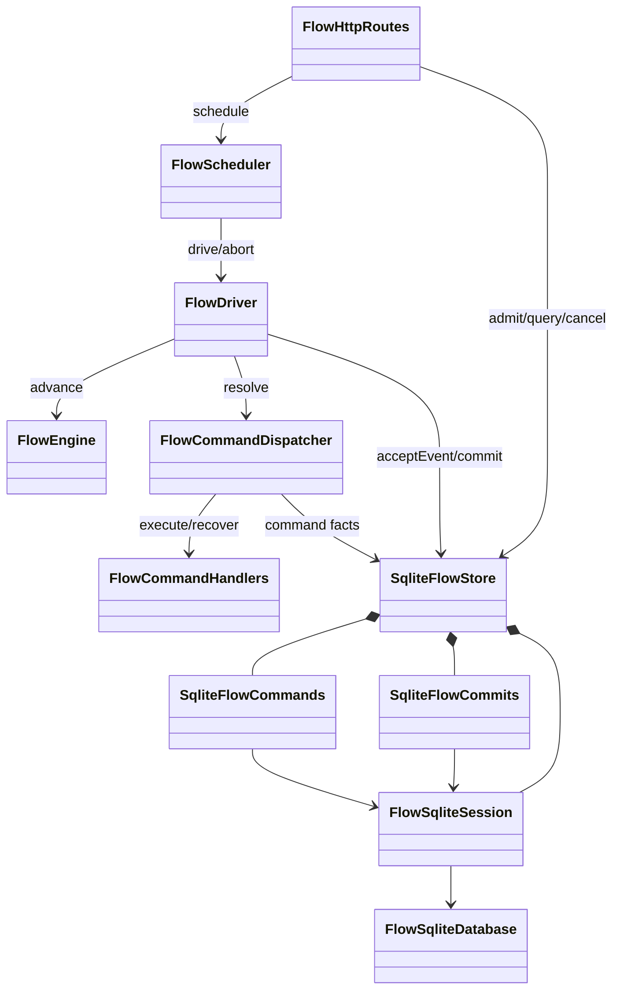

# Flow运行服务开发规范复查

历史阶段记录：本文先于系统四态重构。当前类关系和完整验证以[系统框架验证](flow-system-validation.md)为准，旧FlowEngine.advance现命名ReActFlowPolicy.advance。

日期：2026-09-07。范围：本次新增本地Flow运行服务、SQLite适配器、Pi耐久消息接入、部署与测试脚本。依据：`code-development` skill及仓库AGENTS.md。用户指出超大createServer后，暂停扩展，先按职责复查。

## 问题与修订

| 问题 | 原行为或风险 | 修订后的职责与证据 |
| --- | --- | --- |
| HTTP宿主包含路由、调度、恢复扫描、关闭逻辑 | 改鉴权可能触及后台执行，嵌套闭包掩盖状态所有权 | `flow-http-server.ts`保留传输与资源关闭；`FlowHttpRoutes`每个方法对应一个用例；`FlowScheduler`拥有队列、容量和扫描生命周期 |
| 服务装配函数混入各组件内部构建细节 | 147行函数同时维护存储、授权、模型、上下文和驱动 | 独立持久化、安全、工具、上下文、驱动装配函数，入口仅协调顺序；装配失败关闭已打开连接 |
| 派发函数混合新执行、恢复与事实接收 | 多层分支难以确认UNKNOWN是否会再次调用Provider | `FlowCommandDispatcher`独立处理已有结果、首次执行、恢复及结果保存；`FlowDriver`只接收事实并调用Core提交 |
| 未知结果映射用类型判断及`invalid`占位身份 | 类型表名义封闭，实际隐藏错误绑定 | 使用既有`createVariantMatcher`按payload类型穷尽映射，删除占位身份 |
| 存储提交方法110行、存储类同时管理命令生命周期 | 拆分不当可能破坏原子性 | `SqliteFlowCommits`管理完整事务；`SqliteFlowCommands`管理命令事实；共享`FlowSqliteSession`校验作用域及租约 |
| 重复drive立即返回 | 第二个等待者可能在任务完成前读取结果 | 加入同一Promise；AK-FE-029用显式屏障验证单次模型调用和完成时点 |
| 异步派发使用续期前的claim | 长调用结果写入可能拿过期快照 | 活动租约句柄保存续期后的claim，派发完成时读取最新资格；失去租约中止调用 |
| 首事件与驱动事件重复维护身份规则 | 摘要/序号规则可能漂移 | 共用`createFlowEvent`；原Core协议未改变 |
| 多个位置维护委派工具描述 | 已有Loop与新服务模型契约可能不一致 | 复用`createDelegationToolDescriptor`，保留已有Loop能力 |
| 受理和模型工厂位置参数过多 | 同类型字段容易误传 | 改用明确的FlowAdmissionRequest和ConfiguredFlowModelOptions |

## 规模触发项的人工判断

使用临时TypeScript AST扫描本次新增生产源码，核对函数物理行数、分支数和参数数量；分支计数是局部审查辅助，不宣称为标准化圈复杂度。没有新增全仓阈值或降低现有检查。

重构后仍触发审查的两处：`createFlowService`约56物理行，主要是依赖连接和返回对象，已无权限/持久化内部算法；`FlowDriver.#step`有11个条件/循环/三元节点，是接收事件、维护命令、期限和业务命令的驱动优先级，真正业务迁移仍唯一位于Core迁移表。保留它们是职责判断，不以压行、换名或继续分散生命周期制造数字达标。

本次做了重复职责与复用的人工搜索；没有量化重复率报告，不能声称重复率低于3%。新接口均通过公开注释检查，Pi原生类型和SQLite依赖不进入纯Core。

## 已执行的本地验证

- 根目录 `npm run check`：格式、Lint、依赖、TypeScript及浏览器加载检查通过。
- 包内 `node scripts/compile.mjs --typecheck`：通过。
- `check-public-contract-comments.mjs`、`check-source-boundaries.mjs`：通过。
- AK-FE-019～029：11个集成用例通过，已登记到`acceptance.json`，统一验收入口精确ID筛选通过。
- AK-FE-028通过SQLite触发器注入命令插入失败，确认Run快照、事件消费与回执全部回滚，修复后同一决定成功提交。
- AK-FE-025验证鉴权、幂等受理、异内容冲突、诊断隔离与终态取消保持原结果。

真实Docker验证报告位于 `.artifacts/flow-local`，操作见[部署与测试说明](../../deploy/flow-local/README.md)。真实模型、进程终止测试与上述离线验证分开记录，不将静态检查算作真实环境验证。

## 尚未关闭的设计范围

本次职责重构没有把本地运行服务提升为完整分布式实现。生产级首次启动PEP协议、异步人工审批、Provider权威查询后的恢复、外部告警后端仍是开放项。`acceptance.json`的相应planned项保持原状，不能用本地基础场景通过覆盖这些缺口。
